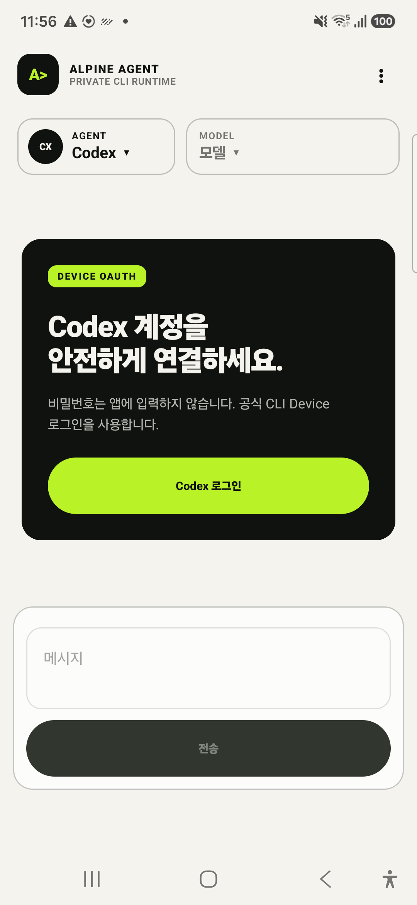
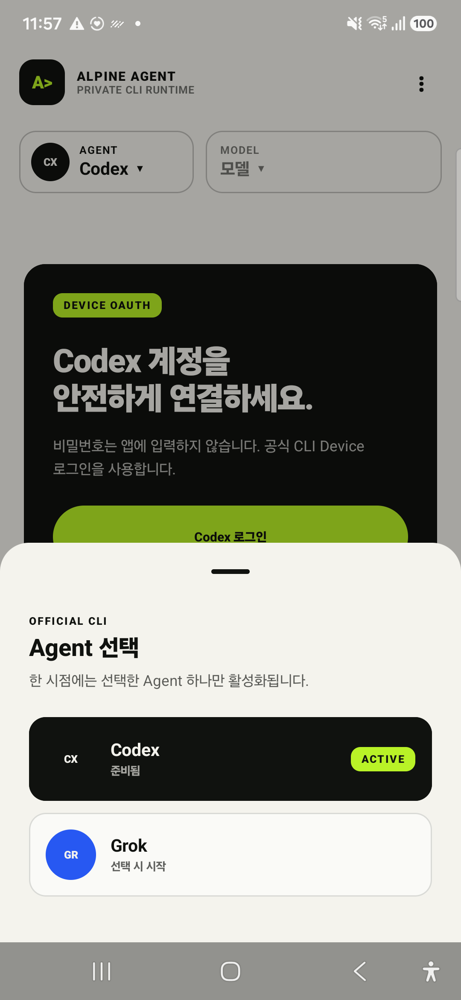
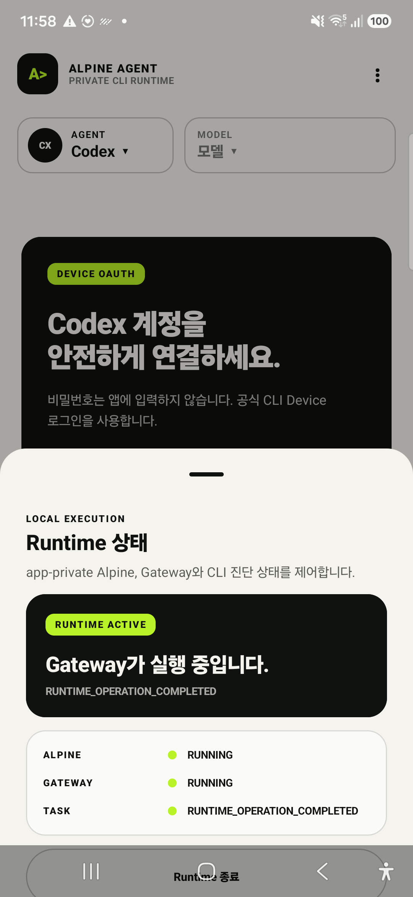

<div align="center">

# 🏔️ Alpine Agent CLI Client


### 공식 AI CLI를 Android 안에서 더 작고, 더 사적으로, 더 검증 가능하게

**KR** · 공식 **OpenAI Codex CLI**와 **xAI Grok CLI**를 app-private Alpine Runtime에서
실행하는 보안 중심 Android 멀티 Agent 클라이언트입니다. Android는 Provider API key를 저장하거나
Provider API를 직접 호출하지 않으며, 인증과 Provider 통신은 각 공식 CLI가 계속 소유합니다.

**EN** · A security-focused Android multi-agent client that runs the official **OpenAI Codex CLI**
and **xAI Grok CLI** inside an app-private Alpine Runtime. Android stores no provider API keys and
makes no direct provider API calls; authentication and provider traffic remain owned by each CLI.

<p>
  <code>android</code>
  <code>kotlin</code>
  <code>jetpack-compose</code>
  <code>codex</code>
  <code>grok</code>
  <code>oauth</code>
  <code>alpine-linux</code>
  <code>local-first</code>
  <code>offline-first</code>
  <code>security</code>
</p>

<p>
  <a href="app/build.gradle.kts"></a>
  <a href="gradle/libs.versions.toml"></a>
  <a href="app/src/main"></a>
  <a href="alpine-runtime-pack-bundled/runtime-lock.json"></a>
  <a href="docs/python-pack-preparation-20260816.md"></a>
</p>
<p>
  <a href="docs/codex-cli-notice.md"></a>
  <a href="docs/grok-cli-notice.md"></a>
  <a href="docs/security-model.md"></a>
  <a href="docs/architecture.md"></a>
  <a href="docs/runtime-supply-chain.md"></a>
</p>
<p>
  <a href="#-검증-상태"></a>
  <a href="docs/samsung-app-real-use-qa-20260816.md"></a>
  <a href="#-배포-상태"></a>
  <a href="https://github.com/coreline-ai/alpine-codex-cli-client/commits/main"></a>
  <a href="LICENSE"></a>
</p>

[프로젝트 개요](#-프로젝트-개요) · [핵심 기능](#-핵심-기능) · [Agent 지원](#-agent-지원-범위) · [동작 구조](#-동작-구조) · [빌드](#-빌드와-검증) · [배포](#-배포-상태) · [문서](#-문서)

</div>

> [!IMPORTANT]
> **API key 재사용 프로젝트가 아닙니다.** Android UI와 Python Gateway는 CLI credential 파일,
> token 또는 `auth.json`을 읽거나 복사하지 않습니다. Device OAuth, refresh와 Provider 통신은
> 공식 Codex/Grok CLI가 담당합니다.

> [!NOTE]
> **2026-08-16 기준:** production Python pack 준비, 별도 Samsung 신규 설치, PRoot/Python Gateway
> 기동, force-stop 복구, `debug`/`secureDebug` APK 감사가 완료됐습니다. 공개 배포용 signed APK에는
> 외부 release keystore와 예상 인증서 SHA-256만 남아 있습니다.

## 🔭 프로젝트 개요

Alpine Agent CLI Client는 Termux나 원격 Gateway 없이 Android APK 하나가 Alpine/PRoot, Python
Gateway와 두 공식 CLI의 실행 환경을 제공하도록 설계되었습니다. 앱은 계정·모델·대화·스트리밍·Stop을
하나의 Compose UI로 조정하지만 Provider 인증과 통신 규칙을 다시 구현하지 않습니다.

| 항목 | 현재 기준 |
|---|---|
| 📱 플랫폼 | Android API `26+`, target/compile API `36`, `arm64-v8a` |
| 🧩 앱 버전 | version code `2`, version name `0.2.0` |
| 🤖 Agent | Codex CLI `0.147.0`, Grok CLI `1.0.0` |
| 🔑 인증 | 공식 CLI Device OAuth; Android/Gateway credential 비접근 |
| 🏔️ Runtime | Alpine `3.21.3` + PRoot, app-private filesystem |
| 🐍 Python | `3.12.14-r0`, 21-package production lock/SPDX pack |
| 🔌 앱 내부 전송 | filesystem UDS + 양방향 peer UID + HMAC/timestamp/nonce |
| 💾 상태 저장 | versioned `noBackupFilesDir`, Keystore-wrapped secret/대화 envelope |
| 📦 배포 형태 | Play Store가 아닌 검증된 signed APK 직접 배포 |
| 📜 라이선스 | 프로젝트 코드 GPL-3.0; 번들 구성요소는 각 upstream license 적용 |

이 프로젝트는 범용 OpenAI/xAI REST SDK, API key 클라이언트, 원격 Agent 서비스 또는 범용 Linux
터미널이 아닙니다. Gateway는 앱 내부에서 두 CLI를 고정된 typed contract로 연결하는 최소 로컬
구성요소입니다.

## 📱 실행 화면

| Codex Device OAuth | Codex·Grok Agent 선택 | Local Runtime 상태 |
|:---:|:---:|:---:|
|  |  |  |

> [!NOTE]
> Samsung `SM-S931N` 실기기에서 촬영한 동일 Compose UI입니다. 제품 APK의
> `FLAG_SECURE`를 유지하기 위해 실제 계정·credential과 분리된 Lab variant를 사용했습니다.

## ✨ 핵심 기능

| 영역 | 구현 내용 |
|---|---|
| 🤖 **멀티 Agent** | Codex/Grok 선택, 계정 확인, CLI 기반 동적 모델, Agent별 대화 상태 |
| 🔐 **CLI-owned OAuth** | Device OAuth 시작·브라우저 handoff·앱 복귀 reconciliation; token 직접 접근 금지 |
| 💬 **Streaming chat** | normalized SSE, loading/streaming/terminal 상태, 정확히 한 번의 dispatch |
| ⏹️ **Stop** | 현재 turn만 cancel, duplicate Stop·late terminal·자동 replay 방지 |
| 🔄 **복구** | background/foreground와 force-stop 뒤 Runtime→Python→Gateway→Agent 순차 복구 |
| 🧱 **App-private Runtime** | Alpine rootfs, PRoot, workspace, CLI HOME과 Gateway UDS를 앱 sandbox에 유지 |
| 📦 **APK-contained Python** | lock된 Alpine `.apk`만 staging 후 `apk add --no-network`로 설치 |
| 🔌 **Private transport** | TCP loopback 제거, Unix domain socket peer UID 상호 확인, HMAC 요청 인증 |
| 🛡️ **데이터 보호** | backup/D2D 제외, `FLAG_SECURE`, AES-GCM 대화 envelope, 민감 로그 금지 |
| 🔍 **공급망 검증** | CLI/Runtime/Python hash lock, SPDX SBOM, component inventory, release artifact verifier |
| 🚫 **Fail closed** | 잘못된 lock/profile/method/asset/signing 입력은 fallback 없이 차단 |

## 🤖 Agent 지원 범위

| 항목 | OpenAI Codex | xAI Grok |
|---|---|---|
| 실행 파일 | 공식 Codex CLI `0.147.0` | 공식 Grok CLI `1.0.0` |
| 관리 프로토콜 | `codex app-server` JSONL | 고정 ACP JSONL |
| 인증 | CLI Device OAuth | CLI Device OAuth |
| 계정 상태 | app-server `account/read` | ACP auth/status projection |
| 모델 | CLI가 반환한 live 목록 | CLI가 반환한 live 목록 |
| 대화 | streaming turn, history, Stop | streaming turn, session binding, Stop |
| 실행 범위 | read-only / approval-never | chat-only profile |
| 복구 정책 | 사용자 prompt 자동 재전송 없음 | 출력 전 제한 auth recovery만 허용; 출력 뒤 retry 거부 |
| 금지 범위 | raw executable/argument/method 선택 금지 | tool/subagent/MCP/filesystem/terminal event fail-closed |

## 🧭 사용자 흐름

1. 앱을 실행하면 설정된 Runtime 상태를 검사합니다.
2. 필요한 경우 APK 내부 Alpine과 Python package pack을 준비합니다.
3. Python Gateway를 private UDS에서 시작하고 선택 Agent 하나만 활성화합니다.
4. 로그인이 필요하면 CLI가 Device OAuth를 만들고 Android가 공식 브라우저로 전달합니다.
5. 사용자가 브라우저에서 승인하면 앱 복귀 후 계정과 live model을 다시 확인합니다.
6. 사용자가 직접 보낸 prompt만 정확히 한 번 실행하고 SSE로 화면에 표시합니다.
7. Stop은 현재 요청만 취소하며 다른 Agent fallback이나 자동 replay를 수행하지 않습니다.

## 🏗️ 동작 구조


```text
┌──────────────────────── Android application UID ─────────────────────────┐
│                                                                          │
│  Compose UI / ViewModels                                                 │
│        │  HMAC HTTP + SSE                                                │
│        ▼                                                                 │
│  app-private Unix domain socket ── peer UID verification                 │
│        │                                                                 │
│        ▼                                                                 │
│  Python Agent Gateway ── single-flight router                            │
│        ├──────────────► official Codex app-server ──► OpenAI             │
│        └──────────────► official Grok ACP        ──► xAI                 │
│                                                                          │
│  Alpine / PRoot · separate CLI HOME binds · Keystore-wrapped state       │
└──────────────────────────────────────────────────────────────────────────┘
```

한 시점에는 Runtime/Gateway 하나와 선택된 Agent process 하나만 유지합니다. 로그인 또는 turn이
진행 중이면 Agent 전환을 거부하고, socket/executable/argument/ACP method는 고정하거나 엄격하게
검증합니다. 상세 계약은 [Architecture](docs/architecture.md)와
[Security model](docs/security-model.md)에 있습니다.

## 🔐 보안 경계

| 원칙 | 적용 방식 |
|---|---|
| Credential 최소 노출 | Android/Gateway의 CLI credential·token·`auth.json` 읽기/복사 금지 |
| Private carrier | TCP `8787` 제품 경로 제거, app-private filesystem UDS 사용 |
| Mutual identity | Android client와 Python server가 socket peer UID를 각각 검증 |
| Request authenticity | 세션 HMAC, timestamp window, nonce replay cache |
| Closed protocol | 고정 route/schema/method/executable/profile; raw 사용자 명령 전달 금지 |
| No implicit egress | OAuth와 사용자가 시작한 Agent traffic 외 analytics/sync/package download 없음 |
| No replay | process 복구가 prompt를 자동 retry하거나 다른 Agent로 fallback하지 않음 |
| No backup | credential/session/conversation을 `noBackupFilesDir`에 두고 cloud/D2D 제외 |
| Content-free audit | URL, code, account, model, prompt, response 대신 고정 enum/counter만 기록 |

> [!WARNING]
> Codex, Grok, Gateway와 PRoot child는 같은 Android application UID 안에서 실행됩니다. 분리된 HOME,
> bind와 protocol은 정상 동작 중 상태 오염을 막지만, 손상된 동일-UID native process를 막는 별도
> 커널 sandbox는 아닙니다. 이 잔여 위험은 공개 보안 문서에 명시되어 있습니다.

## 📦 APK-contained Runtime


설치된 앱은 Python 준비를 위해 Alpine repository, 별도 서버, `curl` 또는 `wget`을 호출하지
않습니다. 빌드 시 검토된 package bytes를 APK asset에 넣고, Android에서 hash를 다시 확인한 뒤
다음 고정 흐름만 실행합니다.

```text
APK asset
  -> lock/status/SHA-256 검증
  -> app-private atomic staging
  -> apk add --no-network --simulate <local .apk files>
  -> apk add --no-network <local .apk files>
  -> python3 --version
  -> import codex_gateway
```

| Runtime 구성 | 고정 값 |
|---|---|
| Alpine | `3.21.3`, `aarch64` |
| PRoot | OpenMinis revision `8cf13e9` |
| Python | `3.12.14-r0` |
| Python pack | production `true`, 21 packages, `17,675,368` package bytes |
| pack ID | `alpine-3.21.3-python3-3.12.14-r0` |
| package arch | `aarch64` 또는 Alpine `noarch`만 허용 |
| trust | 기존 Alpine keyring; `--allow-untrusted` 사용 금지 |

pack provenance와 실기기 최초 설치 결과는
[Production Python pack 준비 기록](docs/python-pack-preparation-20260816.md)에 있습니다.

## 🆕 최신 업데이트 — 2026-08-16

- ✅ Alpine `3.21.3` / Python `3.12.14-r0` production pack 21개와 SPDX 2.3/lock 준비
- ✅ Alpine `install_if`가 요구하는 pyc split package를 fresh-install QA에서 발견해 pack 보강
- ✅ `aarch64`와 `noarch`만 허용하고 foreign architecture를 거부하도록 pack 검증 강화
- ✅ `debug`와 non-debuggable `secureDebug` APK build/signature/clean-room audit 통과
- ✅ Samsung `SM-S931N`, Android 16에서 별도 `labdebug` 신규 설치와 Gateway 기동 통과
- ✅ force-stop 뒤 shell 약 `2.83s`, backend 약 `2.95s` 복구 및 자동 turn 증가 `0`
- ✅ Python 단위·통합·보안 회귀 `176` tests 통과
- ✅ release compile/lint/assets `356` tasks와 app release Python pack gate 통과
- ⏳ 공개 signed APK용 외부 release keystore와 예상 certificate SHA-256 대기

## 🚀 빌드와 검증

### 요구 환경

- macOS 또는 Linux
- JDK 17
- Android SDK 36
- Python 3
- Android API 26+, `arm64-v8a` 기기
- 최초 dependency/CLI asset 준비가 끝난 Gradle cache
- Runtime 실행과 공개 packaging에는 검증된 production Python package pack

현재 APK ABI는 `arm64-v8a`만 지원합니다.

### 1. 저장소 준비

```bash
git clone https://github.com/coreline-ai/alpine-codex-cli-client.git
cd alpine-codex-cli-client
export JAVA_HOME="/path/to/jdk-17"
export ANDROID_HOME="/path/to/android-sdk"
```

### 2. 공식 CLI asset 준비

Codex/Grok 실행 파일은 Git에 포함되지 않습니다. 완전한 offline build에서는 lock과 일치하는 로컬
파일을 지정합니다.

```bash
export CODEX_CLI_ARCHIVE_PATH=/absolute/path/to/codex-aarch64-unknown-linux-musl.tar.gz
export GROK_CLI_BINARY_PATH=/absolute/path/to/grok-1.0.0-linux-aarch64
```

명시적 파일과 Gradle user cache가 모두 없으면 build task가 lock에 고정된 공식 URL에서만 CLI를
받아 size, SHA-256과 AArch64 ELF를 검증합니다. 이는 APK 생성 시점의 준비이며 설치된 Android
Runtime은 CLI 또는 Python을 다운로드하지 않습니다.

### 3. Production Python pack 연결

```bash
export ALPINE_PYTHON_PACKAGE_DIR=/absolute/path/to/alpine-python-pack
```

```text
alpine-python-pack/
  python-pack.lock.json
  sbom.spdx.json
  packages/*.apk
```

현재 작업 환경은 Git-ignored 기본 경로
`alpine-python-pack-bundled/src/main/python-pack`도 사용할 수 있습니다. 새 checkout에는 pack byte가
자동으로 따라가지 않으며, 입력이 없으면 release packaging은 fail-closed합니다. 정확한 스키마는
[PACKAGING.md](alpine-python-pack-bundled/PACKAGING.md)를 참고하세요.

### 4. Credential-free 전체 gate

```bash
sh scripts/verify-secure-debug-milestone.sh
```

이 gate는 Python/Kotlin test, Android lint와 variant build, Codex/Grok protocol, private UDS,
backup 정책, CLI·Runtime·Python·Gradle 공급망, clean-room APK, release 정책, sensitive evidence와
reference drift를 검사합니다. 실제 OAuth나 유료 turn은 수행하지 않습니다.

### 5. 개발·실기기 APK

```bash
./gradlew :app:assembleDebug --offline --no-daemon --console=plain
./gradlew :app:assembleSecureDebug --offline --no-daemon --console=plain
```

`debug`는 실제 OAuth를 코드 수준에서 차단하는 credential-free variant입니다. 실제 계정 검증은
non-debuggable `secureDebug`와 [Samsung runbook](docs/samsung-grok-secure-debug-runbook.md)의 승인
경계를 따라야 합니다.

## 🚦 배포 상태

| Variant | Application ID | 디버거 | 실제 OAuth | signing | 목적 |
|---|---|---:|---:|---|---|
| `debug` | `dev.alpine.codexclient.labdebug` | 허용 | 차단 | debug | fresh-install·credential-free QA |
| `secureDebug` | `dev.alpine.codexclient.debug` | 차단 | 허용 | debug | 실제 계정 Samsung E2E |
| `release` | `dev.alpine.codexclient` | 차단 | 허용 | 외부 입력 필수 | 직접 배포 signed APK |

공개 release APK는 다음 입력을 모두 요구합니다.

```text
ALPINE_RELEASE_STORE_FILE
ALPINE_RELEASE_STORE_PASSWORD
ALPINE_RELEASE_KEY_ALIAS
ALPINE_RELEASE_KEY_PASSWORD
ALPINE_RELEASE_CERT_SHA256
```

서명된 APK 생성 후 예상 certificate SHA-256과 함께 `verify-release-artifact.py`를 통과해야 합니다.
저장소는 private signing key를 생성하거나 commit하지 않습니다. Play Store/AAB 제출은 현재 배포
범위가 아니며 검증된 APK 파일을 직접 배포합니다.

```bash
./gradlew :app:assembleRelease --offline --no-daemon --console=plain
python3 scripts/verify-release-artifact.py \
  --artifact app/build/outputs/apk/release/app-release.apk \
  --expected-certificate-sha256 "$ALPINE_RELEASE_CERT_SHA256"
```

전체 경계는 [공개 배포 가이드](docs/public-release.md)에 정의되어 있습니다.

## 🧩 모듈 구성

| 모듈 | 역할 |
|---|---|
| `app` | Compose UI, Runtime orchestration, Keystore, UDS transport, 상태 복구 |
| `codex-runtime-bridge` | Agent-neutral Gateway client, HMAC, strict JSON/SSE parser |
| `codex_gateway` | Python Gateway, Agent router/service, Codex/Grok adapter, ACP supervisor |
| `alpine-runtime-api` | Runtime artifact/session/state 공개 계약 |
| `alpine-runtime-android` | rootfs 설치, PRoot launch, bind 검증, 2-slot rollback |
| `alpine-runtime-host` | Runtime session과 command/terminal lifecycle |
| `alpine-runtime-background-android` | Android background Runtime service |
| `alpine-runtime-ui-compose` | Runtime 상태와 package action Compose UI |
| `alpine-runtime-pack-bundled` | Alpine rootfs, PRoot/loader, runtime lock와 SPDX |
| `alpine-python-pack-bundled` | local Python `.apk` pack 검증·asset 생성·atomic staging |
| `alpine-workspace-api` / `alpine-workspace-android` | app-private workspace 계약과 Android 구현 |
| `codex-cli-pack` | 고정 Codex CLI asset 생성과 검증 |
| `grok-cli-pack` | 고정 Grok CLI와 chat-only profile 생성과 검증 |
| `codex-gateway-pack-bundled` | Python Gateway source manifest와 APK asset |

## 🧪 검증 상태

| 검증 | 결과 |
|---|---|
| Python 단위·통합·보안 회귀 | ✅ PASS — `176 tests` |
| Production Python source/assets | ✅ PASS — `21 packages` |
| App release Python pack gate | ✅ PASS |
| `debug` APK build | ✅ PASS |
| `secureDebug` build/signature/non-debuggable/clean-room | ✅ PASS |
| Release compile/lint/assets | ✅ PASS — `356 tasks` |
| Samsung fresh offline install | ✅ PASS — `SM-S931N`, Android 16 |
| PRoot / Python Gateway | ✅ PASS — `1 / 1` |
| force-stop recovery | ✅ PASS — backend 약 `2.95s` |
| TCP `8787` listener | ✅ PASS — `0` |
| lifecycle 중 자동 turn | ✅ PASS — 증가 `0` |
| Signed release artifact | ⏳ BLOCKED — 외부 signing 입력 대기 |

날짜가 있는 evidence의 APK SHA-256과 test count는 해당 artifact에만 적용됩니다. 최신 상세 결과는
[Samsung 앱 실사용 QA](docs/samsung-app-real-use-qa-20260816.md)와
[Production Python pack 기록](docs/python-pack-preparation-20260816.md)을 참고하세요.

## 📚 문서

| 문서 | 내용 |
|---|---|
| [문서 인덱스](docs/README.md) | 전체 문서 탐색 시작점 |
| [프로젝트 개요](docs/project-overview.md) | 제품 목적, 모듈, 상태와 남은 작업 |
| [Architecture](docs/architecture.md) | Runtime topology, 저장소와 lifecycle invariant |
| [Security model](docs/security-model.md) | 위협 모델, 신뢰 경계, 통제와 잔여 위험 |
| [보안 전문가 검토](security_best_practices_report.md) | 발견 사항별 조치와 현재 판정 |
| [앱 실사용 QA](docs/app-real-use-qa.md) | module 검증과 분리된 full app QA 전략 |
| [Samsung QA evidence](docs/samsung-app-real-use-qa-20260816.md) | redacted 실기기 lifecycle/pack 결과 |
| [공개 배포](docs/public-release.md) | production pack, signing, artifact verification |
| [Runtime 공급망](docs/runtime-supply-chain.md) | Alpine/PRoot/Python lock, SPDX, rollback |
| [SBOM](docs/debug-sbom.md) | component inventory와 embedded SPDX |
| [AnyClaw 비교](docs/anyclaw-analysis.md) | Android Codex OAuth 구현과 보안 경계 비교 |

## 🧱 현재 제약

- 현재 production Python pack은 이 작업 환경의 Git-ignored local input이며 새 clone에는 포함되지 않습니다.
- 외부 release keystore와 예상 certificate fingerprint가 제공되기 전 signed APK는 만들지 않습니다.
- 동일 Android UID 안의 CLI HOME 분리는 논리적 격리이며 별도 커널 security boundary가 아닙니다.
- Gradle dependency lock은 적용됐지만 verification metadata와 wrapper ZIP checksum은 아직 미완료입니다.
- `secureDebug` current-source APK는 build/audit를 통과했지만 기존 실계정 앱 보존을 위해 아직 update-install하지 않았습니다.

## 🤝 기여와 보안 보고

- 변경 전 [CONTRIBUTING.md](CONTRIBUTING.md)의 공급망·민감정보·검증 규칙을 확인하세요.
- 취약점과 credential 노출 가능성은 공개 issue 대신 [SECURITY.md](SECURITY.md)의 비공개 절차로 보고하세요.
- OAuth URL/code, account, model, prompt, response, token 또는 broad logcat을 issue·PR·evidence에 포함하지 마세요.

## 📄 라이선스와 제3자 구성요소

프로젝트 자체 코드는 [GNU General Public License v3.0](LICENSE)으로 배포됩니다.

번들 또는 생성되는 Codex CLI, Grok CLI, Alpine packages, PRoot와 Maven 구성요소에는 각 upstream
라이선스가 적용됩니다. 자세한 내용은 [Codex CLI notice](docs/codex-cli-notice.md),
[Grok CLI notice](docs/grok-cli-notice.md), [SBOM 문서](docs/debug-sbom.md)와 APK 내부 component
inventory를 확인하세요.
