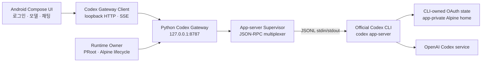
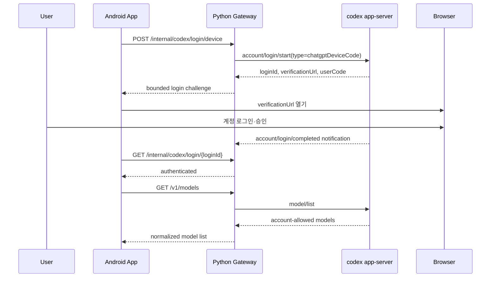
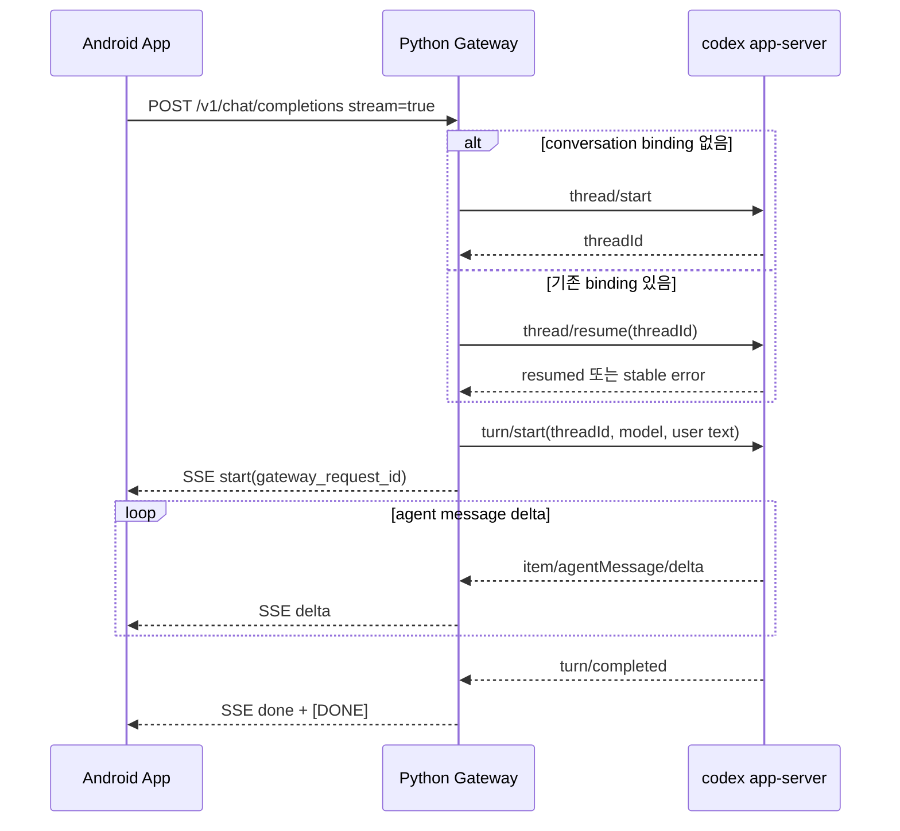

# Alpine Codex CLI Client 상세 개발 계획

작성 일시: `2026-08-11 13:31:23 KST`

문서 상태: `READY_FOR_IMPLEMENTATION`

대상 프로젝트: `/Volumes/ExternalSSD/projects_8/alpine-codex-cli-client`

참조 프로젝트: `/Volumes/ExternalSSD/projects_8/alpine-llm-gateway`

## 개발 목적

- 기존 `alpine-llm-gateway`를 변경하지 않고, 별도 Android debug 앱에서 공식 Codex CLI의
  OAuth와 `codex app-server`를 이용해 모델 조회와 스트리밍 채팅을 제공한다.
- 앱 자체 OAuth client ID, API key, 다른 앱의 CLI fingerprint 없이 공식 CLI가 소유하는
  `chatgptDeviceCode` 인증 흐름만 사용한다.
- Samsung arm64 실기기에서 `설치 → Alpine 시작 → Codex 로그인 → 모델 선택 → 1턴 응답 → Stop → 로그아웃`
  흐름을 실제로 검증할 수 있는 독립 프로젝트를 만든다.
- 검증된 Alpine Runtime, Python Gateway, 채팅 UI를 참조 프로젝트에서 선별 이식하되,
  Android 직접 Provider OAuth와 Host Provider 프록시 계층은 가져오지 않는다.

## 개발 범위

- 독립 Gradle 프로젝트와 독립 application ID를 사용한다.
- Android API 26+, Kotlin/JDK 17, arm64-v8a, debug build만 1차 지원한다.
- 앱 전용 PRoot Alpine 3.21.3 안에서 공식 `aarch64-unknown-linux-musl` Codex CLI를 실행한다.
- Python Gateway가 `codex app-server`의 JSONL stdio를 단독 소유한다.
- Android는 loopback HTTP/SSE API로 Gateway만 호출한다.
- Device Code OAuth 시작·상태 확인·취소·로그아웃을 지원한다.
- `model/list` 결과를 모델 선택 UI에 동적으로 반영한다.
- 대화 생성, 스트리밍 표시, 명시적 Stop, 새 대화, 앱 재진입 후 thread 복구를 지원한다.
- fake app-server 기반 단위·통합 테스트와 Samsung 실기기 E2E를 포함한다.
- 기존 앱과 신규 앱이 같은 기기에 동시에 설치될 수 있어야 한다.

## 제외 범위

- 기존 `/Volumes/ExternalSSD/projects_8/alpine-llm-gateway`의 코드·Git 상태·설치된 debug 앱 변경
- `CodexOAuthContract`, Android `OAuthManager`, Provider 직접 HTTPS adapter 재사용
- OpenAI API key 입력·저장·환경변수 전달 및 API key 기반 채팅
- 앱에 OAuth client ID, CLI fingerprint, consumer endpoint, private Provider endpoint 하드코딩
- Claude, Grok, Gemini 등 Codex 이외 Provider
- Play Store, release signing, release APK/AAB, 공개 배포
- x86_64 emulator/runtime, iOS, desktop
- Codex tool approval, shell command 승인, 파일 편집 diff UI, 이미지 입력, 음성 입력
- 임의 Linux terminal과 package manager UI의 제품 노출
- 여러 동시 turn, 백그라운드 장시간 generation, 자동 retry·자동 prompt replay

## 참조 문서

- [참조 프로젝트 README](/Volumes/ExternalSSD/projects_8/alpine-llm-gateway/README.md)
- [참조 프로젝트 핸드오프](/Volumes/ExternalSSD/projects_8/alpine-llm-gateway/HANDOFF.md)
- [OAuth client ID·CLI proxy 논의](/Volumes/ExternalSSD/projects_8/alpine-llm-gateway/dev-plan/handoff_20260811_111816_oauth_clientid_discussion.md)
- [Provider OAuth·inference 경계](/Volumes/ExternalSSD/projects_8/alpine-llm-gateway/docs/provider-oauth-adapters.md)
- [Samsung 메뉴별 실동작 검증](/Volumes/ExternalSSD/projects_8/alpine-llm-gateway/dev-plan/implement_20260811_102900.md)
- [OpenAI Codex 공식 저장소](https://github.com/openai/codex)
- [Codex app-server README](https://github.com/openai/codex/blob/main/codex-rs/app-server/README.md)
- [Codex 인증 문서](https://developers.openai.com/codex/auth/)

## 문서 기반 제약 사항

- 참조 프로젝트는 `main @ b81a7d8`이지만 현재 worktree가 dirty 상태다. 소스 이식 전 파일별
  원본 commit, working-tree 여부, SHA-256을 `docs/reference-source-map.md`에 기록한다.
- 기존 프로젝트의 Android 직접 OAuth는 앱 소유 client registration이 필요한 별도 경로다.
  신규 프로젝트에는 해당 계층을 포함하지 않는다.
- OAuth credential은 Codex CLI가 app-private Alpine home에서 관리한다. Android는 auth 파일을
  읽거나 복사하거나 JSON으로 파싱하지 않는다.
- Provider 요청은 공식 `codex app-server`만 수행한다. Python Gateway가 OpenAI endpoint를 직접
  호출하는 fallback은 두지 않는다.
- 첫 Provider dispatch 또는 첫 delta 이후에는 자동 재시도·새 thread 자동 재전송을 금지한다.
- 모든 서비스는 Android app-private 영역과 `127.0.0.1`에 한정한다.
- 구현과 테스트는 debug variant만 사용한다. store key나 release signing task를 호출하지 않는다.

## 공통 진행 규칙

- 각 Phase는 직전 Phase의 자체 테스트와 완료 조건을 통과한 뒤 진행한다.
- 새 프로젝트 파일만 수정한다. 참조 프로젝트는 읽기 전용 소스로 취급한다.
- 소스는 전체 디렉터리 복사가 아니라 승인된 파일·모듈만 이식한다.
- 생성물, Gradle cache, APK, rootfs 전개본, Codex 바이너리, OAuth 상태는 Git에 넣지 않는다.
- 비밀값, verification code, 계정 식별자, prompt·response 원문을 로그와 테스트 evidence에 남기지 않는다.
- 실제 OAuth 화면의 계정 입력과 동의는 사용자가 직접 완료한다.
- 실제 채팅은 테스트별 정확히 1회 전송하고 실패 시 자동 retry하지 않는다.
- protocol method와 payload는 고정 문자열을 UI·Android 여러 계층에 흩뿌리지 않고 Python adapter 한 곳에 둔다.
- Codex CLI 버전 변경은 manifest, checksum, protocol fixture, Samsung E2E를 한 변경으로 묶는다.
- 작업 중 발견한 이슈와 수정 결과는 해당 Phase의 `이슈 및 수정` 체크박스에 누적한다.

## 사전 기술 검증 결과

이 항목은 신규 프로젝트 구현 완료가 아니라, 참조 앱의 Alpine 환경에서 수행한 가능성 PoC 기록이다.

| 항목 | 확인 결과 |
|---|---|
| 대상 기기 | Samsung `SM-S931N`, Android arm64-v8a |
| Alpine | 3.21.3, aarch64, PRoot app-private runtime |
| Codex CLI | 공식 arm64-musl `codex-cli 0.147.0` 실행 성공 |
| app-server | 시작 및 `initialize` 성공 |
| 계정 조회 | `account/read` 성공, 미인증 상태에서 `requiresOpenaiAuth=true` 확인 |
| OAuth | `account/login/start` + `chatgptDeviceCode`로 verification URL/code 발급, cancel 성공 |
| 모델 | `model/list` 동적 목록 반환 성공 |
| 대화 | `thread/start`, `turn/start`, event stream 수신 성공 |
| 미완료 | OAuth 미완료 상태의 실제 turn은 예상대로 401 종료 |
| 정리 | 임시 CLI와 임시 `/root/.codex` 삭제, credential 잔존 없음 |

결론: 구조적 차단 요인은 확인되지 않았다. 신규 프로젝트의 핵심 위험은 OAuth 가능 여부가 아니라
app-server protocol drift, 200 MiB급 CLI staging, process lifecycle, turn/thread 상태 매핑이다.

## 목표 아키텍처



### 소유권 경계

| 상태/자원 | 단일 소유자 | 다른 계층에 허용되는 정보 |
|---|---|---|
| OAuth token·refresh | Codex CLI | `authenticated`, `authMode` 같은 축약 상태만 |
| Codex process | Python `CodexAppServerSupervisor` | lifecycle와 redacted error code |
| Alpine session | Android `CodexRuntimeController` | ready/running/failed 상태 |
| JSON-RPC request ID | Python supervisor | Android에 노출하지 않음 |
| thread ID | Gateway conversation registry | Android에는 opaque binding으로만 저장 |
| turn ID | Gateway active-turn registry | `gateway_request_id`로 간접 노출 |
| 모델 목록 | app-server `model/list` | ID, display name, 기본/지원 메타데이터 |
| 채팅 UI 상태 | Android ViewModel | draft, streaming text, stable error |

## 핵심 워크플로

### Device Code OAuth



### 채팅 1턴



## 목표 프로젝트 구조

```text
alpine-codex-cli-client/
├── app/                              # debug Android application
├── alpine-runtime-api/               # 선별 이식
├── alpine-runtime-android/           # 선별 이식
├── alpine-runtime-host/              # 선별 이식
├── alpine-runtime-background-android/# lifecycle/FGS 선별 이식
├── alpine-runtime-ui-compose/        # 설치·상태 UI 선별 이식
├── alpine-runtime-pack-bundled/      # rootfs/PRoot artifact
├── alpine-workspace-api/             # app-private workspace contract
├── alpine-workspace-android/         # Android workspace implementation
├── alpine-chat-routing/              # backend-neutral routing contract
├── alpine-chat-feature/              # 대화 저장·Compose UI 선별 이식
├── alpine-chat-backend-codex/        # 신규 Android chat backend
├── codex-runtime-bridge/             # 신규 Runtime/Gateway lifecycle + HTTP client
├── codex-cli-pack/                   # pinned CLI manifest와 debug asset provider
├── codex-gateway-pack-bundled/       # Python Gateway bundle
├── codex_gateway/                    # 신규 app-server adapter/gateway Python package
├── tests/                            # Python unit/integration tests
├── scripts/                          # artifact 준비·검증·Samsung smoke
├── docs/
│   ├── architecture.md
│   ├── reference-source-map.md
│   ├── codex-app-server-contract.md
│   └── samsung-debug-e2e.md
└── dev-plan/
    └── implement_20260811_133123.md
```

## 참조 소스 이식 기준

### 그대로 또는 최소 변경 후 이식 후보

| 참조 모듈 | 사용 목적 | 이식 조건 |
|---|---|---|
| `alpine-runtime-api` | Runtime lifecycle·session 계약 | package/API 유지, Provider 의존성 없음 확인 |
| `alpine-runtime-android` | PRoot·PTY·명령 실행 | arm64만 유지, debug test 재실행 |
| `alpine-runtime-host` | runtime manager 조립 | 기존 host factory의 Provider 결합 제거 |
| `alpine-runtime-background-android` | FGS lifecycle | 신규 app package/notification text 변경 |
| `alpine-runtime-ui-compose` | 설치·시작·상태 화면 | terminal/package UI는 MVP에서 숨김 |
| `alpine-runtime-pack-bundled` | Alpine rootfs·PRoot·loader | 기존 checksum/SBOM 검증 유지 |
| `alpine-workspace-api` | app-private path·quota | 그대로 이식 가능 여부 unit test로 확인 |
| `alpine-workspace-android` | workspace 구현 | SAF UI는 MVP에서 비노출 |
| `alpine-chat-routing` | single-dispatch·no replay | direct fallback 제거 후 유지 |
| `alpine-chat-feature` | 대화·모델·Compose UI | 현재 working-tree UI 변경을 명시 snapshot |

### 구조만 참조하고 신규 구현할 부분

| 참조 파일 | 재사용할 개념 | 신규 구현에서 제거·교체할 부분 |
|---|---|---|
| `AlpineLlmBridgeController.kt` | artifact staging, runtime/gateway lifecycle, health | Host Bridge·capability 파일·Provider session 제거 |
| `AlpineLlmGatewayClient.kt` | loopback 검증, bounded JSON/SSE | account/login/interrupt API와 Codex error mapping 추가 |
| `AlpineGatewayChatBackend.kt` | preparation/stream/cancel bridge | `CodexGatewayChatBackend`로 분리, direct fallback 없음 |
| `IntegratedAlpineLlmHost.kt` | lifecycle serialization, recovery generation | `ChatCompletionSession`과 Host Bridge factory 제거 |
| `alpine_llm/gateway.py` | bounded HTTP/SSE server | Provider adapter를 app-server adapter로 전면 교체 |
| `alpine-llm-gateway-pack-bundled` | tar asset·checksum pattern | 신규 `codex_gateway` bundle로 생성 |

### 복사 금지

- `android/` 전체, 특히 `CodexOAuthContract.kt`, `OAuthManager.kt`, Provider session
- `alpine-chat-provider-android`
- `alpine-chat-backend-direct`
- `integrated-app/src/debug/DebugIntegratedApplication.kt`
- OpenMinis compatibility registration, consumer OAuth endpoint, client ID, CLI fingerprint
- 기존 `config.py`의 `api_key`, `api_key_env`, `base_url` Provider 설정
- 기존 Host Bridge capability/token 전달 계층
- `build/`, `.gradle/`, APK, rootfs 전개 디렉터리, credential, capture, log
- store/release signing 설정

## 고정 기술 결정

| 항목 | 결정 |
|---|---|
| 앱 ID | `dev.alpine.codexclient`, debug는 `dev.alpine.codexclient.debug` |
| 앱 이름 | `Alpine Codex Client (Debug)` |
| 최소 SDK | 26 |
| 지원 ABI | 1차 `arm64-v8a`만 |
| Codex 실행 방식 | `codex app-server` JSONL stdio |
| OAuth 방식 | app-server `chatgptDeviceCode`만 |
| API key | 미지원, UI·config·env 모두 금지 |
| Gateway bind | `127.0.0.1:8787` |
| Gateway 구현 | Python 3 표준 라이브러리, Alpine 내부 실행 |
| CLI artifact | 공식 arm64-musl archive, version/SHA-256 pin |
| 바이너리 Git 저장 | 금지; 검증된 local cache 또는 공식 release에서 debug build 전 준비 |
| 동시성 | MVP는 active turn 1개, active login 1개 |
| 채팅 | text + streaming only |
| 실패 재전송 | 자동 retry/replay/fallback 없음 |
| 배포 | debug APK만 |

## Codex CLI artifact 공급 계약

- `codex-cli-pack/codex-cli.lock.json`에 `version`, `target`, `source_url`, `archive_sha256`,
  `binary_sha256`, `archive_size`, `binary_size`를 기록한다.
- 최초 기준은 PoC에 성공한 `0.147.0`, `aarch64-unknown-linux-musl`로 고정한다.
- `scripts/prepare-codex-cli-debug.*`는 다음 우선순위로 archive를 찾는다.
  1. `CODEX_CLI_ARCHIVE_PATH`로 지정된 local archive
  2. 프로젝트 외부 Gradle user cache
  3. lock에 기록된 공식 GitHub release URL
- checksum이 하나라도 다르면 build를 fail-closed 한다.
- 검증된 binary는 `codex-cli-pack/build/generated/debug/assets/`에만 둔다.
- `preDebugBuild`가 prepare/verify task에 의존하며 release source set/task는 만들지 않는다.
- Android asset에서 app-private staging directory로 atomic copy 후 executable mode를 설정한다.
- staging 완료 뒤 `codex --version`이 lock의 version과 일치해야 Gateway를 시작한다.
- 기존 버전이 존재해도 hash가 다르면 덮어쓰지 않고 격리 후 재설치한다.

## app-server protocol adapter 설계

### Process lifecycle

`CodexAppServerSupervisor` 상태는 다음으로 제한한다.

```text
STOPPED → STARTING → INITIALIZING → READY → STOPPING → STOPPED
                         │            │
                         └────────────┴────→ FAILED
```

- supervisor만 `subprocess.Popen`을 호출한다.
- stdout은 JSONL protocol 전용, stderr는 별도 bounded reader에서 redacted 상태 코드만 만든다.
- stdin write는 단일 lock/queue에서 직렬화한다.
- stdout reader는 request response와 notification을 분리해 pending request/active turn queue로 전달한다.
- process 시작 직후 공식 `initialize` request와 필수 response field 검증이 완료돼야 `READY`로 승격한다. (`rust-v0.147.0` schema에는 별도 `initialized` client notification이 없다.)
- active turn 중 process crash는 stable `codex_process_lost`로 끝내며 자동 turn 재전송하지 않는다.
- process restart는 active turn이 없을 때 사용자의 재시작 action 또는 lifecycle recovery에서만 수행한다.
- 정상 stop은 새 요청 차단 → active turn interrupt → bounded wait → stdin close → terminate 순서로 수행한다.

### JSONL parser/multiplexer 제한

- 한 JSON line 최대 1 MiB, stderr ring buffer 최대 64 KiB, pending request 최대 32개
- UTF-8 strict decode, object가 아닌 JSON·중복/잘못된 ID·알 수 없는 response는 protocol error
- 요청 ID는 process generation별 단조 증가 integer
- response timeout은 method별 분리: initialize/account/model 15초, login start 30초,
  thread start/resume 30초, turn start acknowledge 30초
- turn stream 전체에는 무한 read timeout을 주지 않고 10분 hard deadline을 적용한다.
- notification 순서가 어긋나거나 terminal event가 중복되면 첫 terminal event만 채택한다.

### 사용하는 app-server method

| 기능 | method/event | Gateway 책임 |
|---|---|---|
| 초기화 | `initialize` | client info 전송, protocol capability 기록 |
| 계정 조회 | `account/read` | auth 여부만 normalize |
| 로그인 시작 | `account/login/start` | `type=chatgptDeviceCode`, challenge 제한 검증 |
| 로그인 완료 | `account/login/completed` | login ID 상태 갱신 |
| 로그인 취소 | `account/login/cancel` | active login ID exact match 후 호출 |
| 로그아웃 | `account/logout` | active turn 없을 때만 호출 |
| 모델 목록 | `model/list` | pagination을 bounded 반복, 중복 ID 제거 |
| thread 생성 | `thread/start` | conversation ID와 opaque thread ID 결합 |
| thread 복구 | `thread/resume` | 저장 binding 검증, 실패 시 자동 history replay 금지 |
| turn 시작 | `turn/start` | text input 1개와 selected model 전달 |
| delta | `item/agentMessage/delta` | SSE `delta`로 normalize |
| 완료 | `turn/completed` | finish/error와 usage를 bounded mapping |
| 중단 | `turn/interrupt` | active gateway request ID와 exact turn만 중단 |

> method 이름이나 payload가 pinned CLI fixture와 달라지면 adapter test를 먼저 갱신하고,
> 실제 CLI transcript를 credential-free fixture로 재생성한다. Android API 계약은 함께 변경하지 않는다.

## Gateway HTTP/SSE 계약

모든 endpoint는 loopback에서만 열고 `Content-Length`, JSON depth, body/response size를 제한한다.

| Method | Path | 성공 응답 | 주요 실패 코드 |
|---|---|---|---|
| GET | `/healthz` | runtime/gateway/codex protocol 상태 | `codex_not_ready` |
| GET | `/internal/codex/account` | `authenticated`, `auth_mode` | `codex_not_ready` |
| POST | `/internal/codex/login/device` | login challenge | `login_already_active` |
| GET | `/internal/codex/login/{login_id}` | pending/authenticated/failed/cancelled | `login_not_found` |
| POST | `/internal/codex/login/{login_id}/cancel` | cancelled | `login_not_active` |
| POST | `/internal/codex/logout` | logged_out | `turn_active` |
| GET | `/v1/models` | normalized model catalog | `authentication_required` |
| POST | `/v1/chat/completions` | JSON 또는 SSE | `authentication_required`, `turn_active` |
| POST | `/internal/codex/turn/{gateway_request_id}/interrupt` | interrupted | `turn_not_found` |

### Login challenge 응답

```json
{
  "login_id": "opaque-id",
  "verification_url": "https://allowed-host/path",
  "user_code": "bounded-display-code",
  "expires_in_seconds": 900,
  "poll_interval_seconds": 2
}
```

- URL은 HTTPS, host allowlist, 길이 상한을 검사한다.
- user code는 UI 표시/복사용이며 log, analytics, screenshot evidence에 포함하지 않는다.
- Android poll은 서버가 반환한 최소 interval보다 빠르게 수행하지 않는다.

### Chat 요청 확장

기존 OpenAI-compatible shape를 유지하되 `metadata.alpine_conversation_id`를 필수로 둔다.

```json
{
  "model": "selected-model-id",
  "messages": [{"role": "user", "content": "..."}],
  "stream": true,
  "metadata": {"alpine_conversation_id": "local-opaque-id"}
}
```

- MVP는 한 요청에 마지막 `user` text를 turn input으로 사용하고, conversation context는 Codex thread가 소유한다.
- Android가 전체 과거 대화를 매번 재전송하지 않는다.
- model ID는 직전 `model/list` snapshot 안에 있어야 한다.
- 요청 시작 SSE에는 `gateway_request_id`를 반환하고 official thread/turn ID는 노출하지 않는다.
- client disconnect는 해당 active turn에 interrupt를 1회 전송한다.

### SSE mapping

| Gateway event | Android 동작 |
|---|---|
| `start` | active request ID 저장, Stop 활성화 |
| `delta` | 현재 assistant message에 text append |
| `done` | generation 완료, request ID 제거 |
| `error` | redacted stable error 표시, 자동 retry 금지 |
| `[DONE]` | stream 자원 종료 |

## Android 상태 모델

### Connection state

```text
RuntimeMissing
RuntimeReady
GatewayStarting
LoginRequired
LoginPending
Ready(account + models)
Generating(requestId)
StableError(code)
```

- ViewModel은 state별 가능한 action만 노출한다.
- `LoginPending` 중 로그인 중복 시작을 금지하고 cancel만 허용한다.
- `Generating` 중 모델 변경·로그아웃·runtime restart를 비활성화한다.
- process death 복구 시 `/healthz` → `/account` → `/models` 순서로 다시 조회한다.
- OAuth challenge는 process death 후 자동 재개하지 않고 Gateway의 active login 상태를 확인한 뒤
  같은 login ID가 유효할 때만 재표시한다.

### 대화/thread binding

```kotlin
data class CodexConversationBinding(
    val conversationId: String,
    val threadId: String,
    val modelId: String,
    val processGeneration: Long,
    val updatedAtEpochMillis: Long,
)
```

- app-private encrypted store에 저장하되 OAuth credential은 포함하지 않는다.
- 새 대화는 새 thread를 만든다.
- 모델 변경은 다음 turn부터 적용하며 이미 streaming 중인 turn에는 영향을 주지 않는다.
- `thread/resume` 실패 시 `THREAD_RESUME_FAILED`를 표시한다. 사용자가 `새 대화로 계속`을
  명시 선택하기 전에는 새로운 thread로 자동 전송하지 않는다.

## UI 범위

대화 영역을 우선하는 단일 화면으로 구현한다.

```text
┌──────────────────────────────────────┐
│ Alpine Codex       [상태] [⋮]        │
│ 계정 연결 상태 · 현재 모델           │
├──────────────────────────────────────┤
│                                      │
│            대화 메시지 영역          │
│                                      │
├──────────────────────────────────────┤
│ [모델 ▾]                             │
│ 메시지 입력...              [전송]   │
└──────────────────────────────────────┘
```

- 상단 고정 action은 상태와 overflow 두 개만 둔다.
- Runtime 설치/시작, 로그인/로그아웃, 재시작, 진단은 상태 sheet 또는 overflow에 둔다.
- 모델 선택은 동적 catalog dropdown/bottom sheet로 제공한다.
- 입력창은 IME와 system navigation bar 위에 유지한다.
- streaming 중 전송 버튼은 Stop으로 전환한다.
- verification URL/code는 로그인 sheet에만 표시하고 복사/브라우저 열기 action을 제공한다.
- 계정 이메일·이름·token 만료시각은 MVP UI에 표시하지 않는다.

## 구현 단계 요약

| 순서 | Phase | 선행 조건 | 핵심 산출물 | 완료 판정 |
|---:|---|---|---|---|
| 0 | 독립 프로젝트·이식 기준선 | 없음 | Gradle skeleton, source map | debug 빈 앱 build |
| 1 | Alpine Runtime 이식 | 0 | runtime modules, install/start | Samsung Alpine ready |
| 2 | Codex CLI artifact pack | 1 | lock, prepare, staging | 기기 `codex --version` |
| 3 | app-server supervisor | 2 | Python JSON-RPC adapter | fake + real initialize |
| 4 | Gateway API·stream mapping | 3 | account/model/chat endpoints | Python integration PASS |
| 5 | Android lifecycle·client | 4 | runtime bridge, HTTP/SSE client | Android unit PASS |
| 6 | OAuth·모델·채팅 UI | 5 | end-user flow | instrumentation PASS |
| 7 | 자동 회귀·artifact scan | 6 | test matrix, scanners | local full gate PASS |
| 8 | Samsung 실제 OAuth·1턴 | 7 | redacted E2E evidence | 실제 응답 1턴 PASS |
| 9 | 안정화·핸드오프 | 8 | docs, recovery runbook | debug milestone 종료 |

## Phase 상태 요약

- [x] Phase 0 독립 프로젝트·이식 기준선
- [x] Phase 1 Alpine Runtime·Workspace 이식
- [x] Phase 2 공식 Codex CLI artifact pack
- [x] Phase 3 app-server supervisor·JSON-RPC adapter
- [x] Phase 4 Gateway management API·chat stream
- [x] Phase 5 Android Runtime bridge·Gateway client
- [ ] Phase 6 Device OAuth·모델·채팅 UI
- [ ] Phase 7 자동 회귀·artifact 안전 검사
- [ ] Phase 8 Samsung 실제 OAuth·채팅 1턴
- [ ] Phase 9 안정화·문서화·핸드오프

## Phase 0. 독립 프로젝트 생성과 참조 기준선 고정

### 구현 태스크

- [x] 신규 폴더에서 독립 Git 저장소를 초기화하고 기본 branch를 `main`으로 둔다.
- [x] `settings.gradle.kts`, root `build.gradle.kts`, version catalog, Gradle wrapper를 만든다.
- [x] `:app` debug application skeleton을 생성한다.
- [x] `applicationId=dev.alpine.codexclient`, debug suffix `.debug`, ABI `arm64-v8a`를 고정한다.
- [x] release signing 설정과 store key reference가 없음을 확인한다.
- [x] 참조 저장소의 HEAD, branch, dirty file 목록을 `docs/reference-source-map.md`에 기록한다.
- [x] 이식 대상 파일별 source path, destination path, source SHA-256, working-tree 여부를 기록한다.
- [x] `.gitignore`에 build/cache/binary/rootfs/auth/log/capture 경로를 추가한다.
- [x] `README.md`에 debug-only, CLI-owned OAuth, API key 미지원 원칙을 먼저 명시한다.

### 자체 테스트

- [x] `./gradlew :app:assembleDebug` 성공
- [x] APK application ID가 `dev.alpine.codexclient.debug`임
- [x] `./gradlew tasks`에 release signing/store upload task를 별도로 추가하지 않음
- [x] 기존 `alpine-llm-gateway`의 `git status --short`가 작업 전과 동일함
- [x] source map의 모든 SHA-256을 검증 스크립트가 재계산해 일치함

### 이슈 및 수정

- [x] 첫 Compose compile에서 `TopAppBar` experimental API opt-in 누락을 발견했고, `ExperimentalMaterial3Api` opt-in을 추가해 해결했다.

### 완료 조건

- [x] 참조 프로젝트를 수정하지 않고 독립 debug 빈 앱이 빌드됨

## Phase 1. Alpine Runtime·Workspace 선별 이식

### 구현 태스크

- [x] runtime/workspace 8개 모듈을 source map 기준으로 이식한다.
- [x] rootfs, PRoot, loader, SBOM artifact와 기존 checksum 검증을 함께 이식한다.
- [x] 기존 package namespace를 우선 유지해 불필요한 대규모 rename을 피한다.
- [x] 신규 앱에 Runtime install/start/stop/status controller를 조립한다.
- [x] app-private workspace와 Codex 전용 home/staging 경로를 정의한다.
- [x] terminal/package UI는 화면에서 노출하지 않고 내부 smoke 실행 API만 유지한다.
- [x] 기존 앱과 신규 앱의 파일·port·notification ID가 충돌하지 않도록 분리한다.

### 자체 테스트

- [x] runtime/workspace JVM unit test PASS
- [x] `:alpine-runtime-android:assembleDebug :app:assembleDebug` PASS
- [x] bundled artifact SHA-256·ELF alignment verifier PASS
- [x] Samsung에서 신규 앱 Runtime 설치·시작·상태·종료 PASS
- [x] 기존 `dev.alpine.integrated.debug`와 신규 앱이 동시 설치됨
- [x] 한 앱 Runtime start/stop이 다른 앱 process/files에 영향을 주지 않음

### 이슈 및 수정

- [x] 초기 Runtime install은 `INTERNAL_ERROR`였다. 신규 APK에 rootfs asset `noCompress`와 native library legacy packaging이 빠져 있었고, 참조 앱과 같은 debug packaging을 추가한 뒤 Samsung install이 `READY`로 통과했다.
- [x] Alpine minirootfs에는 Python과 repository index가 없다. 범용 package installer의 index-less simulate는 fresh rootfs에서 실패하므로, 사용자 시작 `Gateway Python 준비·smoke`에만 exact `python3`의 `apk add --no-cache --simulate` 후 동일 exact install을 구현했다. 임의 package/terminal 입력과 guest output UI·로그 노출은 추가하지 않았다.
- [x] Alpine network bootstrap에 필요한 `INTERNET` permission이 skeleton Manifest에 누락돼 추가했다.
- [x] local Android SDK에 중복된 build-tools/CMake/platform-tools 경고가 남아 있으나 arm64 debug build·native compile·Samsung 검증은 통과했다. SDK 디렉터리는 본 작업 범위 밖이라 변경하지 않았다.

### 완료 조건

- [x] 신규 app-private Alpine에서 `uname -m`, Python 실행을 bounded smoke로 확인함

## Phase 2. 공식 Codex CLI artifact pack 구현

### 구현 태스크

- [x] `codex-cli.lock.json`을 PoC 버전 `0.147.0`과 공식 arm64-musl asset으로 작성한다.
- [x] local path/cache/official URL 우선순위의 debug prepare task를 구현한다.
- [x] archive와 binary의 크기·SHA-256·ELF architecture를 검증한다.
- [x] generated debug asset을 APK에 넣되 Git 추적 대상에서 제외한다.
- [x] `CodexCliArtifactProvider`와 atomic staging/version directory를 구현한다.
- [x] permission 설정, hash 재검증, `codex --version` smoke를 startup gate로 연결한다.
- [x] 실패한 partial staging과 이전 버전 정리 정책을 구현한다.
- [x] CLI license/notice와 source URL을 debug 앱 notice 문서에 기록한다.

### 자체 테스트

- [x] 올바른 local archive에서 prepare 성공
- [x] archive hash 1-bit 변경 시 prepare 실패
- [x] binary hash/size/ELF target 불일치 시 build 실패
- [x] network가 없어도 verified cache가 있으면 debug build 성공
- [x] Samsung Alpine에서 staged binary가 `codex-cli 0.147.0`을 반환
- [x] APK/source scan에서 untracked credential과 client ID가 없음

### 이슈 및 수정

- [x] Gradle buildscript classpath에는 Android의 `org.json`이 없어, lock은 외부 의존성 없는 고정 필드 parser로 읽도록 구현했다. 앱 runtime의 asset lock parser는 Android `org.json`을 사용한다.
- [x] AGP 8.10 library variant task는 script configuration 뒤에 생성되므로, 존재 시점에 실패하는 `tasks.named("preDebugBuild")` 대신 `mergeDebugAssets`를 `configureEach`로 연결했다. debug source set만 generated asset을 소비한다.
- [x] fail-closed 검증은 1-bit archive hash, binary SHA, binary size, AArch64 ELF machine field 각각의 의도적 불일치에서 build 실패로 확인했다. test-only lock/archive는 즉시 삭제·복구 대상이며 Git에 포함하지 않는다.

### 완료 조건

- [x] 공식 CLI가 재현 가능한 lock과 checksum을 통해 신규 앱 Alpine에서 실행됨

## Phase 3. Python app-server supervisor와 JSON-RPC adapter

### 구현 태스크

- [x] `codex_gateway/app_server/process.py`에 process lifecycle owner를 구현한다.
- [x] `jsonl.py`에 strict UTF-8, line size, JSON object validation parser를 구현한다.
- [x] `rpc.py`에 request ID, pending map, timeout, notification fan-out을 구현한다.
- [x] `protocol.py`에 account/login/model/thread/turn typed adapter를 구현한다.
- [x] `redaction.py`에 stderr/error 축약 정책을 구현한다.
- [x] initialize handshake와 protocol version/capability capture를 구현한다.
- [x] stop/crash/timeout 시 pending request와 active turn을 정확히 한 번 종료한다.
- [x] fake app-server executable fixture를 만들어 정상/오류/순서 뒤바뀜을 재현한다.

### 자체 테스트

- [x] split/coalesced JSONL, CRLF, EOF, invalid UTF-8, oversized line
- [x] out-of-order response, unknown/duplicate ID, request timeout
- [x] stderr flood가 memory 상한을 넘지 않고 credential-like text가 redacted됨
- [x] initialize success/failure/timeout/process exit
- [x] active turn 중 crash가 자동 replay 없이 한 번의 terminal error로 종료됨
- [x] Samsung의 실제 CLI `initialize`, `account/read` smoke PASS

### 이슈 및 수정

- [x] stderr redaction이 OS read chunk 경계에서 token-like text 일부를 남길 수 있어, incomplete line을 별도 bounded tail로 보관하고 newline 단위 redaction 후 ring buffer에 넣도록 수정했다.
- [x] Python debug asset manifest의 JSON quote escaping과 package staging 상대경로가 각각 잘못되어 Android가 fail-closed 했다. generated manifest JSON parser 검증과 Samsung 재설치 smoke로 수정 후 확인했다.
- [x] 공식 `rust-v0.147.0` generated protocol에는 `initialized` ClientNotification이 존재한다. `initialize → account/read`만으로도 Samsung smoke는 통과했지만, 모델·turn 전에 계약을 정확히 따르도록 필수 initialize response 검증 뒤 parameter 없는 이 notification을 전송하고 fake·Samsung smoke로 재검증했다.
- [x] supervisor가 부모 환경 전체를 상속하면 무관한 secret 변수가 CLI에 전달될 수 있어, `HOME` 등 명시 허용 key와 고정 `PATH`만 child에 전달하도록 변경했다. fake test와 이 변경본의 Samsung smoke를 모두 통과했다.

### 완료 조건

- [x] fake와 실제 CLI에서 supervisor가 `READY` 또는 stable failure로 결정적으로 수렴함

## Phase 4. Gateway management API와 chat stream 변환

### 구현 태스크

- [x] 기존 Python Gateway의 HTTP/SSE 구조만 참조해 direct Provider/config/API key 계층 없이 새 loopback gateway를 구현한다.
- [x] `/healthz`에 runtime/gateway/codex protocol check를 추가한다.
- [x] account/read, device login start/status/cancel, logout endpoint를 구현한다.
- [x] `model/list` pagination, normalize, deduplicate, bounded cache를 구현한다.
- [x] conversation↔thread와 gateway request↔turn registry를 구현한다.
- [x] thread start/resume과 turn start/interrupt를 구현한다.
- [x] agent delta/completion/error를 bounded SSE shape로 변환한다.
- [x] disconnect, timeout, process crash 시 interrupt/cleanup을 idempotent하게 처리한다.
- [x] active login/turn 1개 제한과 HTTP conflict 응답을 구현한다.
- [x] gateway bundle build와 checksum manifest를 구현한다.

### 자체 테스트

- [x] 미인증 account/model/chat의 status/error contract
- [x] login start→pending→completed, cancel, expiry, duplicate start
- [x] model pagination/duplicate/empty/malformed response
- [x] first conversation thread/start, existing conversation thread/resume
- [x] delta 0개/1개/다수, completed, failed, malformed notification
- [x] client disconnect와 explicit interrupt가 turn/interrupt를 최대 1회 호출
- [x] resume 실패 후 새 thread 자동 생성·prompt replay가 없음
- [x] request/message/stream size limit과 loopback-only bind PASS
- [x] API key/client ID/base URL config field가 package와 bundle에 없음

### 이슈 및 수정

- [x] Device Code test double이 완료 notification보다 먼저 인증 상태를 바꿔 duplicate login을 잘못 판정했다. 인증 상태 변경을 completion notification과 동일한 시점으로 이동해 실제 상태 순서를 검증했다.
- [x] malformed/timeout stream의 background interrupt가 active registry 해제와 경합할 수 있었다. terminal state에 interrupt 요청을 먼저 기록하고 stream finalizer가 같은 request에 한 번만 interrupt하도록 보강했다.

### 완료 조건

- [x] fake app-server를 통한 login/model/1-turn/stop Gateway integration test PASS

## Phase 5. Android Runtime bridge와 bounded Gateway client

### 구현 태스크

- [x] `CodexRuntimeController`에 runtime→CLI staging→Gateway start 순서의 lifecycle을 구현한다.
- [x] 상태를 `STOPPED/STARTING/RUNNING/STOPPING/FAILED`로 직렬화한다.
- [x] `CodexGatewayClient`에 health/account/login/model/chat/interrupt API를 구현한다.
- [x] URL은 exact loopback scheme/host/port만 허용한다.
- [x] JSON/SSE request/response/event/total size와 timeout을 제한한다.
- [x] Android coroutine cancellation을 HTTP disconnect와 Gateway interrupt로 연결한다.
- [x] foreground/background 전환과 app process recreation 뒤 health 재결합을 구현한다.
- [x] direct Provider backend 없는 `CodexGatewayChatBackend`를 routing contract에 연결한다.

### 자체 테스트

- [x] invalid endpoint, oversized body, malformed JSON/SSE, strict UTF-8
- [x] login/account/model response mapping과 stable error mapping
- [x] SSE start/delta/done/error/[DONE] state transition
- [x] Stop 1회가 HTTP cancel과 interrupt 최대 1회를 유발
- [x] runtime start 중복 tap과 start/stop race가 단일 stable state로 수렴
- [x] active turn 이후 자동 backend fallback·재전송 없음

### 이슈 및 수정

- [x] gateway ready marker가 terminal chunk의 끝 newline과 함께 전달될 때 정확 일치 검사에 실패했다. marker를 bounded overlap buffer에서 부분 문자열로 검사하고 Samsung start/stop으로 재검증했다.
- [x] start/stop 경쟁에서 늦은 Runtime 시작 callback이 중복 stop을 호출할 가능성이 있었다. stop이 정리를 단독 소유하도록 변경하고 delayed fake Runtime test로 단일 STOPPED 수렴을 확인했다.
- [x] coroutine 취소 중 blocking HTTP read가 stream EOF를 malformed 오류로 바꿀 수 있었다. Job cancellation에서 loopback connection을 즉시 disconnect하고 cancellation을 보존해 단일 interrupt 테스트로 확인했다.

### 완료 조건

- [x] Android fake Gateway test에서 lifecycle, OAuth 상태, model, 1턴 stream, Stop이 모두 PASS

## Phase 6. Device OAuth·모델·대화 중심 Compose UI

### 구현 태스크

- [ ] 앱 시작 시 Runtime/Gateway/account/model 상태를 순서대로 로드한다.
- [ ] Runtime 미설치·중지·시작 실패 상태 sheet와 복구 action을 구현한다.
- [ ] Device Code 로그인 sheet에 browser 열기, code 복사, 상태 확인, 취소를 구현한다.
- [ ] authenticated 뒤 모델 목록을 동적으로 표시하고 기본 모델을 선택한다.
- [ ] 대화 목록/새 대화/암호화 저장과 Codex thread binding을 연결한다.
- [ ] 채팅 입력, 1회 전송, stream 표시, Stop, stable error UI를 연결한다.
- [ ] 상단 action을 상태/overflow 두 개로 제한해 대화 viewport를 최대화한다.
- [ ] IME와 navigation bar inset 위에 입력창을 고정한다.
- [ ] 모델 선택, 로그인, Runtime 상태에 stable semantics/test tag를 부여한다.
- [ ] logout은 active turn이 없을 때 확인 dialog 뒤 실행한다.

### 자체 테스트

- [ ] 미설치→설치→시작→로그인 필요→로그인 중→ready 상태별 UI
- [ ] login 중 duplicate tap 차단, cancel/expiry/error 복구
- [ ] model 0/1/다수/현재 모델 제거 상황
- [ ] IME open, gesture/3-button navigation, landscape에서 composer 가시성
- [ ] streaming 중 model/logout/runtime restart 비활성화
- [ ] Stop 뒤 중복 assistant message·중복 완료 없음
- [ ] process recreation 뒤 credential을 읽지 않고 account state를 복구

### 이슈 및 수정

- [ ] 발견 이슈 없음

### 완료 조건

- [ ] instrumentation fake backend에서 로그인부터 1턴/Stop/로그아웃까지 메뉴별 테스트 PASS

## Phase 7. 자동 회귀·artifact 안전 검사

### 구현 태스크

- [ ] Python unit/integration suite를 단일 명령으로 구성한다.
- [ ] Android JVM unit, instrumentation APK, lint, debug APK build gate를 구성한다.
- [ ] pinned CLI protocol fixture와 current adapter method 목록을 검사한다.
- [ ] source/APK에서 client ID, CLI fingerprint, API key, private key, Provider direct endpoint를 검사한다.
- [ ] release signing/store key 참조와 release artifact 생성 경로 부재를 검사한다.
- [ ] generated CLI binary/rootfs/auth/log가 Git tracked 되지 않았는지 검사한다.
- [ ] dependency/license/SBOM 목록을 생성하고 debug artifact에 포함한다.
- [ ] `scripts/verify-debug-milestone.*`에 전체 로컬 gate 순서를 고정한다.

### 자체 테스트

- [ ] Python unit/integration 전체 PASS
- [ ] Android unit/lint/assembleDebug/assembleDebugAndroidTest 전체 PASS
- [ ] fake Gateway instrumentation 전체 PASS
- [ ] secret/OAuth registration/artifact clean-room scan PASS
- [ ] checksum/SBOM/reference source map verifier PASS
- [ ] `git diff --check` PASS

### 이슈 및 수정

- [ ] 발견 이슈 없음

### 완료 조건

- [ ] 실제 계정 없이 재현 가능한 모든 로컬 gate가 한 번의 명령으로 PASS

## Phase 8. Samsung 실제 OAuth와 채팅 1턴 E2E

대상 기기 serial은 실행 당일 `adb devices -l`로 다시 확인하고 문서에는 redacted alias만 남긴다.

### 상세 테스트 케이스

| ID | 조작 | 기대 결과 | 중단/원복 기준 |
|---|---|---|---|
| E2E-IN-01 | 기존 앱 설치 상태에서 신규 debug APK 설치 | 두 앱 공존 | 기존 앱 data/version 변경 시 중단 |
| E2E-RT-01 | 신규 앱 Runtime 설치·시작 | Alpine/Gateway READY | 실패 시 OAuth 진행 금지 |
| E2E-CLI-01 | CLI version/initialize smoke | pinned version/protocol PASS | mismatch면 build/lock 재검토 |
| E2E-OA-01 | Device 로그인 시작 | URL/code 표시·browser open | challenge 기록 금지 |
| E2E-OA-02 | 사용자 로그인·승인 | account authenticated | 자동화 credential 입력 금지 |
| E2E-MD-01 | 모델 selector 열기 | account 허용 모델 동적 표시 | 빈 목록이면 chat 진행 금지 |
| E2E-CH-01 | 고정 무민감 prompt 1회 전송 | delta와 최종 AI 응답 1개 | retry/fallback 금지 |
| E2E-ST-01 | 긴 응답 1회를 보내고 Stop | generation 안정 종료 | 같은 prompt 자동 재전송 금지 |
| E2E-LC-01 | background→foreground | account/model/conversation 유지 | 중복 process/turn 발생 시 실패 |
| E2E-LC-02 | 앱 force-stop→재실행 | health/account 재조회, thread resume 가능 | 자동 prompt replay 금지 |
| E2E-LO-01 | 확인 후 logout | account login-required | auth 원문 확인/저장 금지 |
| E2E-RT-02 | Gateway/Runtime 종료 | stopped 안정 상태 | credential 파일 수동 삭제 금지 |

### 구현 태스크

- [ ] 실기기 사전 상태와 두 앱 package/version을 redacted evidence로 기록한다.
- [ ] E2E-IN/RT/CLI/OA/MD/CH 순서로 실행한다.
- [ ] 실제 응답 성공은 prompt node, assistant answer node, error/streaming 부재로 판정한다.
- [ ] 별도 1회 요청에서 Stop을 검증하고 자동 retry가 없음을 확인한다.
- [ ] lifecycle/force-stop 복구와 thread resume을 검증한다.
- [ ] logout 후 account 상태만 확인하고 Runtime을 종료한다.
- [ ] 임시 screenshot/UI dump/logcat에서 challenge·계정·대화 원문을 삭제한다.

### 자체 테스트

- [ ] 실제 OAuth authenticated
- [ ] 실제 `model/list` 결과가 UI와 일치
- [ ] 실제 chat 1턴 응답 성공
- [ ] 실제 Stop 성공, 중복 비용 요청 없음
- [ ] force-stop 복구 뒤 자동 prompt replay 없음
- [ ] logout 뒤 account/read가 미인증 상태
- [ ] 기존 debug 앱 상태가 변경되지 않음

### 이슈 및 수정

- [ ] 발견 이슈 없음

### 완료 조건

- [ ] Samsung에서 CLI-owned OAuth와 실제 1턴을 성공하고 redacted 결과만 문서화함

## Phase 9. 안정화·문서화·핸드오프

### 구현 태스크

- [ ] `docs/architecture.md`에 최종 process/data/credential 경계를 반영한다.
- [ ] `docs/codex-app-server-contract.md`에 pinned method/event fixture와 upgrade 절차를 기록한다.
- [ ] `docs/samsung-debug-e2e.md`에 실행/원복/민감정보 삭제 절차를 기록한다.
- [ ] Runtime/Gateway/CLI/OAuth/thread 복구 runbook을 작성한다.
- [ ] README에 debug 설치·실행·제약·알려진 문제를 기록한다.
- [ ] 남은 외부 조건과 deferred 기능을 별도 backlog로 이동한다.
- [ ] 참조 프로젝트 source map과 최종 이식 hash를 재검증한다.
- [ ] 독립 프로젝트의 clean clone debug build 절차를 검증한다.

### 자체 테스트

- [ ] verified CLI cache가 있는 clean clone에서 debug APK build PASS
- [ ] cache가 없고 network가 차단된 경우 명확한 artifact 준비 오류를 출력
- [ ] docs 명령을 그대로 실행해 build/test/smoke가 재현됨
- [ ] README가 API key/client ID 입력을 요구하지 않음
- [ ] handoff가 실제 계정 E2E와 fake test 결과를 구분함

### 이슈 및 수정

- [ ] 발견 이슈 없음

### 완료 조건

- [ ] 다른 개발자가 문서만으로 debug build와 Samsung E2E를 재현할 수 있음

## QA 관점 체크리스트

### 정상 흐름

- [ ] Runtime 최초 설치와 재사용 설치 모두 동작한다.
- [ ] 미인증→device login→authenticated→model list→1턴이 이어진다.
- [ ] 새 대화와 기존 thread resume이 구분된다.
- [ ] stream delta, 완료, Stop이 UI 상태와 일치한다.

### 경계값

- [ ] 빈/과대 prompt, 최대 message 수, 과대 JSON/SSE line을 차단한다.
- [ ] 모델 목록 0개/1개/다수/pagination을 처리한다.
- [ ] login code 만료 직전·직후와 polling interval을 처리한다.
- [ ] CLI archive/binary size와 storage 부족을 명확히 구분한다.

### 적대적·오류 흐름

- [ ] malformed JSONL, unknown notification, duplicate terminal event를 안정 종료한다.
- [ ] app-server stdout/stderr flood와 갑작스러운 exit에서 memory가 bounded다.
- [ ] active turn 중 Gateway/Runtime stop, Android disconnect, force-stop을 처리한다.
- [ ] auth 만료/401 이후 원 turn을 자동 replay하지 않는다.
- [ ] thread resume 실패 뒤 사용자 승인 없이 새 thread를 만들지 않는다.
- [ ] loopback 외 bind/URL, redirect-like URL, path traversal을 거부한다.

### 회귀

- [ ] 기존 앱과 신규 앱의 package/data/port/notification이 충돌하지 않는다.
- [ ] 기존 Runtime checksum·ELF alignment·PTY smoke가 유지된다.
- [ ] 채팅 composer inset, 모델 selector, Stop, 대화 저장 회귀가 없다.
- [ ] client ID/API key/fingerprint/direct endpoint가 source/APK에 재유입되지 않는다.

## 위험 요소와 대응

| 위험 | 영향 | 조기 탐지 | 대응 |
|---|---|---|---|
| app-server protocol drift | 로그인/채팅 전체 중단 | pinned real CLI fixture | CLI/adapter 동시 upgrade, Android 계약 유지 |
| CLI binary 크기 | APK·설치 시간·저장공간 증가 | size gate, free-space preflight | debug generated asset, atomic staging, 명확한 용량 안내 |
| app-server crash | active turn 유실 | process generation·exit watcher | stable error, 자동 replay 금지, 수동 restart |
| OAuth challenge 만료 | 로그인 중단 | expiry/poll state test | 재시도는 사용자 action으로만 시작 |
| auth store 손상 | 로그인 상태 불일치 | account/read + CLI stderr code | logout/re-login 안내, auth 파일 직접 수정 금지 |
| PRoot sandbox 경고 | 기능 일부 제한 | startup stderr classification | 채팅 필수 기능과 비필수 tool capability 분리 |
| thread resume 실패 | 대화 연속성 상실 | force-stop E2E | 새 대화 전환을 명시 승인 받음 |
| dirty 참조 소스 | 재현 불가 | source map hash | 파일별 snapshot과 base commit 동시 기록 |
| UI 상태 경쟁 | 중복 로그인/turn | state-machine instrumentation | active login/turn 1개, action gating |

## 완료 정의

다음 항목이 모두 충족돼야 첫 debug milestone을 완료로 판정한다.

- [ ] 기존 프로젝트를 수정하지 않은 독립 Git 프로젝트다.
- [ ] `dev.alpine.codexclient.debug` APK가 store key 없이 빌드·설치된다.
- [ ] 공식 pinned Codex CLI가 Samsung app-private Alpine에서 실행된다.
- [ ] Android/Python 코드와 config에 OAuth client ID와 API key 입력 경로가 없다.
- [ ] `codex app-server` device code OAuth가 실제 계정에서 완료된다.
- [ ] account 기반 동적 모델 목록을 앱에서 선택할 수 있다.
- [ ] 선택 모델로 실제 stream 채팅 1턴이 성공한다.
- [ ] Stop이 실제 active turn을 중단하고 자동 retry/replay가 없다.
- [ ] 앱 재진입·force-stop 뒤 account/thread 상태가 안전하게 복구된다.
- [ ] logout 뒤 account가 미인증으로 전환된다.
- [ ] Python, Android unit, instrumentation, lint, artifact scan 전체가 PASS다.
- [ ] credential·verification code·계정·대화 원문 없는 redacted E2E 결과와 handoff가 있다.

## 구현 시작 시 첫 작업 묶음

1. Phase 0에서 Gradle skeleton과 `reference-source-map.md`를 먼저 만든다.
2. 참조 저장소의 dirty UI 4개 파일은 별도 항목으로 hash를 기록하고, 의도한 GUI 변경인지 diff review 후 이식한다.
3. Runtime 모듈을 먼저 빌드해 신규 application ID의 app-private Alpine을 확인한다.
4. PoC에 사용한 `0.147.0` 공식 CLI archive의 exact URL·size·SHA-256을 lock에 고정한다.
5. fake app-server로 supervisor를 완성한 뒤에만 실제 CLI process를 붙인다.
6. Python Gateway E2E가 통과한 뒤 Android UI를 연결한다.
7. 마지막에만 실제 OAuth와 1턴을 실행한다.

## 결정 기록

- `2026-08-11`: 신규 프로젝트는 기존 저장소 하위가 아니라 sibling
  `/Volumes/ExternalSSD/projects_8/alpine-codex-cli-client`에 둔다.
- `2026-08-11`: 기존 앱은 debug 상태로 보존하고 참조 소스로만 사용한다.
- `2026-08-11`: Android 직접 OAuth가 아니라 공식 CLI `chatgptDeviceCode` OAuth를 사용한다.
- `2026-08-11`: Provider 직접 HTTPS/API key fallback을 두지 않는다.
- `2026-08-11`: 첫 milestone은 Samsung 실제 OAuth·동적 모델·스트리밍 1턴·Stop·로그아웃이다.
- `2026-08-11`: Codex CLI binary는 Git에 commit하지 않고 pinned/verified debug asset으로 준비한다.
