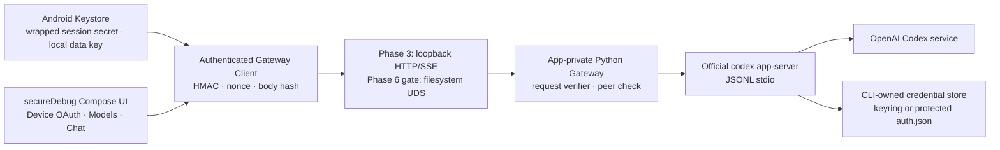

# implement_20260812_103938.md

작성 일시: `2026-08-12 10:39:38 KST`

문서 상태: `REVIEW_REQUIRED`

구현 승인 상태: `NOT_GRANTED` — 사용자 검토와 명시적 승인 전에는 코드·빌드·ADB·계정 상태를 변경하지 않는다.

대상 프로젝트: `/Volumes/ExternalSSD/projects_8/alpine-codex-cli-client`

작업 브랜치: `codex/implement-cli-client`

이 문서는 현재 성공한 CLI-owned OAuth와 채팅 경로를 유지하면서 보안 경계를 강화하기 위한 별도 작업 문서다. 기존 Phase 0~9 기능 계획을 대체하지 않으며, 보안 강화 구현과 검증 순서만 고정한다.

## 개발 목적

- 공식 Codex CLI의 `chatgptDeviceCode` OAuth, 동적 모델 조회, 스트리밍 채팅, Stop, force-stop 복구, 로그아웃 기능을 보존한다.
- 현재 `127.0.0.1:8787` Gateway가 같은 기기의 다른 앱과 브라우저 요청을 식별하지 못하는 문제를 우선 제거한다.
- 실계정이 들어 있는 앱을 일반 debuggable APK와 instrumentation test APK로부터 분리한다.
- OAuth credential은 계속 공식 Codex CLI가 소유하게 하면서 저장 위치·파일 권한·telemetry·history 설정을 최소 권한으로 고정한다.
- Android 로컬 대화와 Gateway session secret은 Android Keystore 기반의 버전형 암호화 envelope로 보호한다.
- filesystem Unix-domain socket과 peer credential 검증이 Android↔PRoot Python 경계에서 실제 동작하는지 PoC한 뒤, 통과할 때만 최종 transport로 전환한다.
- Samsung 실기기에서 기존 기능과 보안 완료 조건을 함께 검증한다.

## 개발 범위

- `labDebug` 성격의 일반 debuggable 빌드와 실계정용 `secureDebug` 성격의 debug-signed/non-debuggable 빌드 분리
- Android↔Python Gateway 전 endpoint에 session capability 기반 HMAC 인증 적용
- timestamp·nonce·body hash를 이용한 replay/tamper 방어와 strict HTTP origin/host/content-type 정책
- session secret 생성·Keystore wrapping·app-private one-time 전달·Runtime 재결합
- 공식 Codex config의 로그인 방식, credential store, history, analytics, feedback, OTEL 정책 고정
- official keyring 저장 방식의 Alpine/PRoot 실동작 PoC와 명시적 file fallback 결정
- Android Keystore AES-GCM 저장 envelope, StrongBox 선호/TEE fallback, 기존 대화 state 무손실 migration
- Device Code 화면·clipboard·recent screen·로그·테스트 증거의 민감정보 방어
- filesystem Unix-domain socket, 파일 권한, `SO_PEERCRED`/Android peer credential 검증 PoC
- Python/Kotlin/instrumentation/artifact/adversarial/Samsung E2E 회귀 gate
- 운영·복구·credential lifecycle·보안 검증 문서

## 제외 범위

- 사용자 검토 승인 전 구현, 빌드, APK 설치·삭제, ADB mutation, OAuth logout·재로그인
- `/Volumes/ExternalSSD/projects_8/alpine-llm-gateway` 코드·Git 상태·설치 앱 변경
- API key 입력·저장·환경변수 전달 또는 API key 인증
- 앱 자체 OAuth client ID, CLI fingerprint, consumer registration, Provider 직접 HTTPS fallback
- 공식 Codex CLI credential payload를 Android/Python에서 읽기·파싱·복사·재암호화하는 구현
- `auth.json`을 외부 wrapper가 투명하게 decrypt/re-encrypt하는 구현
- rooted device, kernel/system-server compromise, 동일 앱 process 내부 임의 코드 실행에 대한 완전 방어
- release signing, store key, release APK/AAB, Play Store 또는 공개 배포
- 범용 terminal/package UI, 다른 Provider, 여러 동시 turn, 자동 retry·자동 prompt replay
- 현재 DB가 없는 상태에서 SQLCipher 도입, deprecated `EncryptedSharedPreferences` 도입
- 목적 없는 암호화 라이브러리 추가; Tink 도입은 별도 ADR 승인 전까지 제외

## 참조 문서

- [기존 기능 개발 계획](/Volumes/ExternalSSD/projects_8/alpine-codex-cli-client/dev-plan/implement_20260811_133123.md)
- [Samsung debug E2E evidence](/Volumes/ExternalSSD/projects_8/alpine-codex-cli-client/docs/samsung-debug-e2e-evidence.md)
- [Reference source map](/Volumes/ExternalSSD/projects_8/alpine-codex-cli-client/docs/reference-source-map.md)
- [Runtime reference adaptations](/Volumes/ExternalSSD/projects_8/alpine-codex-cli-client/docs/reference-runtime-adaptations.md)
- [Codex 인증과 credential storage](https://learn.chatgpt.com/docs/auth#credential-storage)
- [Codex config reference](https://learn.chatgpt.com/docs/config-file/config-reference#configtoml)
- [Android Keystore](https://developer.android.com/privacy-and-security/keystore)
- [Android LocalSocket](https://developer.android.com/reference/android/net/LocalSocket)
- [Android screenshot 방어](https://developer.android.com/security/fraud-prevention/activities)
- [Android clipboard 보안](https://developer.android.com/privacy-and-security/risks/secure-clipboard-handling)

## 현재 기준선

| 항목 | 현재 확인 상태 | 보안 판단 |
|---|---|---|
| Git | `codex/implement-cli-client @ 7f69add` | 기존 미커밋 문서 2개는 사용자 상태로 보존 |
| 실기기 앱 | `dev.alpine.codexclient.debug` | 실계정 사용 앱이 `DEBUGGABLE` 상태 |
| instrumentation | `dev.alpine.codexclient.debug.test` 설치 확인 | 실계정 E2E 전 제거 필요 |
| Gateway | `127.0.0.1:8787`, HTTP/SSE | loopback bind만 있고 request authentication 없음 |
| OAuth | official `codex app-server`의 `chatgptDeviceCode` | 유지해야 하는 핵심 기능 |
| credential | CLI-owned app-private home | Android는 payload를 읽지 않는 현재 경계 유지 |
| 대화 저장 | AndroidKeyStore AES-GCM | envelope version/AAD/StrongBox/migration 보강 필요 |
| backup | `android:allowBackup="false"` | 유지 |
| 로그 | Gateway access log 억제, bounded redaction | secret/path/header negative test 추가 필요 |
| Samsung 기능 | OAuth authenticated는 축약 상태로 확인, 사용자가 첫 채팅 성공을 보고 | 모델/1턴 UI 판정·Stop·force-stop·logout은 redacted 독립 검증 필요 |
| 배포 | debug signing만 사용 | store/release 경로는 계속 금지 |

## 위협 모델과 보호 자산

### 보호 자산

- Codex access/refresh credential과 로그인 상태
- Device Code challenge, verification URL, 계정 식별 정보
- user prompt, assistant response, conversation/thread binding
- Gateway session capability와 signed request metadata
- 동적 모델 목록과 active request/turn 상태

### 우선 방어 대상

- 같은 Android 기기의 다른 일반 앱이 loopback endpoint를 직접 호출하는 경우
- 브라우저 또는 WebView JavaScript가 local endpoint에 요청하는 경우
- 서명된 요청을 캡처해 제한 시간 안에 재전송하는 경우
- ADB `run-as`, debuggable process attach, 남아 있는 test APK가 실계정 app data에 접근하는 경우
- screenshot, recents thumbnail, clipboard, logcat, test output, evidence 문서로 challenge/대화가 유출되는 경우
- app process 재생성·Runtime 재시작·key invalidation 때 보안 검사가 fail-open 되는 경우

### 방어 한계

- rooted/compromised OS, kernel, system service, 같은 UID 내부 임의 코드 실행은 완전 방어 범위 밖이다.
- Android Keystore는 key 추출을 어렵게 하지만, 이미 탈취된 앱 process가 key 사용 권한을 악용하는 경우까지 막지 못한다.
- loopback HMAC는 같은 기기 앱 격리 문제를 크게 줄이지만 process/UID 경계가 아니므로 UDS+peer credential 검증을 최종 강화 후보로 둔다.

## 고정 보안 원칙

- 실계정 기능은 debug key로 서명하되 `android:debuggable=false`인 별도 secure variant에서만 허용한다.
- 일반 debuggable variant는 fake/instrumentation 검증 전용의 다른 application ID를 사용한다.
- Gateway는 unsigned 요청을 허용하는 compatibility mode나 runtime fail-open fallback을 두지 않는다.
- session secret 값은 command line, environment, ready marker, log, exception, analytics에 넣지 않는다.
- OAuth credential은 Codex CLI만 읽고 갱신한다. Android와 Gateway는 `authenticated` 같은 축약 상태만 사용한다.
- credential store는 `auto`를 사용하지 않는다. keyring 검증 성공 시 `keyring`, 실패 시 `file`을 명시한다.
- `auth.json` file fallback은 기능상 필요한 공식 경로로 인정하되 password와 같은 민감도로 다룬다.
- 채팅 요청 실패 후 자동 retry, prompt replay, 새 backend fallback을 구현하지 않는다.
- UDS PoC가 실패하면 authenticated loopback을 명시적 최종안으로 유지하며 실행 중 자동 transport fallback은 금지한다.
- Android crypto 기본안은 표준 JCA `AES/GCM/NoPadding` + Android Keystore다. Tink는 key rotation/다중 envelope 요구가 실제로 생길 때만 별도 검토한다.

## 목표 아키텍처



## 권장 개발 순서

| 순서 | Phase | 먼저 하는 이유 | 완료 gate |
|---:|---|---|---|
| 0 | 검토 승인·기준선 | 구현 전 기능/보안/rollback 기준을 고정 | `R0` 사용자 구현 승인 |
| 1 | build variant·기기 격리 | 실계정의 가장 큰 즉시 노출면인 debuggable/test APK 제거 | secure APK `run-as` 실패 |
| 2 | session secret·서명 primitive | endpoint cutover 전에 key lifecycle과 canonical signing을 단위 검증 | Android/Python vector 일치 |
| 3 | Gateway 인증·HTTP 방어 | 현재 loopback 무인증 문제를 기능 변화 최소로 먼저 제거 | unsigned/replay/browser 거부, 정상 SSE/Stop 성공 |
| 4 | Codex credential·config | transport 안정화 후 credential 저장 방식을 공식 CLI lifecycle로 검증 | keyring 또는 명시적 file 결정 |
| 5 | 로컬 암호화·민감 UI | 기능 회귀와 credential 경계가 안정된 뒤 data/UI leakage 제거 | migration·clipboard·screenshot PASS |
| 6 | UDS PoC·전환 | HMAC loopback이 안전한 fallback으로 준비된 뒤 process boundary 강화 | `U1` 전환/유지 결정 |
| 7 | 자동 보안 gate | 수동 E2E 전 모든 공격/회귀를 fake 환경에서 차단 | 단일 debug-only gate PASS |
| 8 | Samsung migration·E2E | 마지막에만 실제 계정/기기를 변경 | OAuth·model·1턴·Stop·복구·logout PASS |
| 9 | 문서화·핸드오프 | 검증된 최종 transport/credential 결정을 문서에 고정 | 재현 가능한 handoff |

## 검토 시 승인할 핵심 결정

| ID | 권장안 | 대안/조건 | 승인 전 상태 |
|---|---|---|---|
| D1 | `secureDebug`: debug key 서명 + non-debuggable + 기존 `dev.alpine.codexclient.debug` 유지 | lab은 별도 `dev.alpine.codexclient.labdebug` | 미승인 |
| D2 | 32-byte session secret + HMAC-SHA256 + Keystore wrapping | bearer token 단독은 replay/body tamper 방어가 약해 비권장 | 미승인 |
| D3 | official keyring 완전 lifecycle PoC 우선 | 실패 시 `cli_auth_credentials_store="file"` 명시 | 미승인 |
| D4 | JCA AES-GCM + Android Keystore 유지/공통화 | Tink는 별도 ADR이 생길 때만 도입 | 미승인 |
| D5 | UDS PoC 통과 시 UDS+HMAC, 실패 시 HMAC loopback 유지 | runtime 자동 fallback 없음 | 미승인 |
| D6 | 실기기에서 기존 credential 보존 검증 후, 별도 사용자 승인으로 logout/re-login 검증 | clear-data/uninstall target app 금지 | 미승인 |

## 공통 진행 규칙

- 이 문서의 구현은 사용자가 `REVIEW_REQUIRED`를 해제하고 명시적으로 승인한 뒤 시작한다.
- 각 Phase는 앞선 Phase 자체 테스트와 완료 조건을 모두 통과한 뒤에만 진행한다.
- 체크박스는 실제 구현·실행 결과와 동시에 갱신한다. 계획 작성만으로 완료 처리하지 않는다.
- 발견한 이슈와 수정 결과는 해당 Phase의 `이슈 및 수정`에 즉시 기록한다.
- 기존 미커밋 변경, 로그인 credential, app data를 되돌리거나 덮어쓰지 않는다.
- ADB mutation 전 `adb devices -l`, exact serial, model, ABI, target application ID를 다시 확인한다.
- target 앱 uninstall, clear-data, auth 파일 삭제, credential copy는 어떤 Phase에서도 하지 않는다.
- instrumentation test는 lab package에서만 수행하고 실계정 secure package와 같은 process/data를 사용하지 않는다.
- 모든 빌드·검증은 debug signing 계열 task만 사용한다. store/release signing과 release APK/AAB를 만들지 않는다.
- secret/challenge/account/prompt/response 원문은 log, screenshot, UI dump, test output, 문서, Git에 남기지 않는다.
- 실제 OAuth 계정 입력과 브라우저 승인은 사용자가 직접 수행한다.
- 실제 채팅은 승인된 테스트마다 정확히 1회 전송하고 실패 시 자동 재전송하지 않는다.
- 보안 검사가 실패하면 해당 기능을 fail-closed 하고 사용자가 재시작/복구 action을 선택하게 한다.
- Phase별 검증 가능한 단위로 로컬 commit하되 remote push는 별도 요청 전까지 하지 않는다.

## 예상 변경 파일 / 책임 경계

| 책임 | 기존/예상 파일 | 경계 |
|---|---|---|
| variant·manifest | `app/build.gradle.kts`, `app/src/*/AndroidManifest.xml` | package ID, debuggable, test-only component 분리 |
| session key | 신규 `GatewaySessionSecretStore.kt`, `GatewayRequestSigner.kt` | Android key 생성/wrapping/signing만 소유 |
| Runtime handoff | `AlpineCodexApplication.kt`, `CodexRuntimePaths.kt`, `CodexRuntimeController.kt` | one-time secret file 경로만 launch에 전달 |
| Android transport | `CodexGatewayClient.kt` | 모든 HTTP/SSE 또는 UDS request 서명과 검증 결과 mapping |
| Gateway verifier | `codex_gateway/gateway.py`, 신규 `codex_gateway/security.py` | secret load/unlink, canonical verify, nonce cache, origin 정책 |
| Codex config | 신규 `CodexConfigProvisioner.kt` 또는 artifact staging unit | 고정 config template과 mode 검증; auth payload 비접근 |
| local crypto | `EncryptedConversationStore.kt`, 신규 `SecureEnvelopeStore.kt` | versioned envelope·AAD·atomic migration |
| 민감 UI | `MainActivity.kt`, `CodexChatViewModel.kt` | FLAG_SECURE, clipboard lifecycle, redacted state |
| UDS | 신규 transport interface/client/server adapter | HTTP/SSE contract는 유지하고 carrier만 교체 |
| 회귀 gate | `tests/`, `codex-runtime-bridge/src/test`, `app/src/androidTest`, `scripts/verify-*.sh` | 공격·기능·artifact 검증 자동화 |
| 문서 | `docs/architecture.md`, `docs/security-model.md`, E2E/runbook | 최종 결정과 redacted evidence |

## Phase 상태 요약

- [ ] Phase 0. 검토 승인·기준선 고정 완료
- [ ] Phase 1. build variant·실계정 기기 격리 완료
- [ ] Phase 2. session secret·HMAC primitive 완료
- [ ] Phase 3. Gateway 인증 cutover·HTTP 방어 완료
- [ ] Phase 4. Codex credential·config 강화 완료
- [ ] Phase 5. Android 보안 저장소·민감 UI 완료
- [ ] Phase 6. Unix-domain socket PoC·전환 결정 완료
- [ ] Phase 7. 자동 보안 회귀·artifact gate 완료
- [ ] Phase 8. Samsung 기능 보존 E2E·credential lifecycle 완료
- [ ] Phase 9. 문서화·핸드오프 완료

## Phase 0. 검토 승인·기준선 고정

### 목표

- 구현 전에 기능 보존선, 위협 모델, 기기/app data 보존선, rollback 조건을 재현 가능한 값으로 고정한다.

### 구현 태스크

- [ ] 사용자에게 D1~D6 결정과 Phase 순서를 리뷰받고 구현 승인을 기록한다.
- [ ] 시작 시점의 branch, HEAD, `git status --short`, 기존 미커밋 파일을 기록한다.
- [ ] 현재 known-good debug APK의 package, versionCode, signing certificate digest, APK SHA-256을 redacted manifest에 기록한다.
- [ ] Samsung exact serial은 로컬 실행 변수로만 확인하고 문서에는 redacted alias만 기록한다.
- [ ] 설치된 target/test/reference package와 version을 read-only로 확인한다.
- [ ] 현재 `run-as`, DEBUGGABLE flag, `allowBackup`, exported component, permission, port 기준선을 기록한다.
- [ ] 현재 OAuth/account/model/chat 원문 없이 `authenticated`와 기능 완료 여부만 기준선으로 기록한다.
- [ ] rollback은 data 삭제가 아닌 same-signature forward-fix APK 재설치로 한정한다.
- [ ] `docs/security-model.md` 초안에 자산·공격자·방어 한계를 기록한다.

### 자체 테스트

- [ ] 참조 프로젝트와 기존 설치 앱의 상태가 사전 snapshot과 동일하다.
- [ ] credential/challenge/prompt/response를 읽는 shell, UI dump, logcat 명령을 실행하지 않았다.
- [ ] 계획 승인 전 source code와 device/account state diff가 없다.
- [ ] `git diff --check`가 통과하고 기존 미커밋 변경이 그대로 보존된다.

### 이슈 및 수정

- [ ] 발견 이슈 없음

### 완료 조건

- [ ] `R0`: 사용자가 구현 시작과 D1~D6 권장안을 승인했다.
- [ ] 안전한 기준선과 중단/rollback 조건이 문서화됐다.
- [ ] 다음 Phase 진행 가능

## Phase 1. build variant·실계정 기기 격리

### 목표

- fake/instrumentation용 debuggable 앱과 실계정용 non-debuggable 앱을 분리하고 기존 credential/app data를 삭제 없이 보존한다.

### 구현 태스크

- [ ] 기존 built-in `debug`를 lab 전용으로 고정하고 application ID를 `dev.alpine.codexclient.labdebug`로 분리한다.
- [ ] `secureDebug` build type을 추가해 debug signing config를 사용하되 `isDebuggable=false`와 application ID `dev.alpine.codexclient.debug`를 고정한다.
- [ ] secure variant의 versionCode를 기존 설치본보다 높이고 동일 signing certificate인지 설치 전에 검증한다.
- [ ] `Phase6TestActivity`, Compose test manifest, tooling/test manifest 의존성이 secure APK에 포함되지 않게 source set을 분리한다.
- [ ] lab variant는 fake Gateway/instrumentation만 사용하고 실제 OAuth 진입 action을 compile-time 또는 manifest capability로 차단한다.
- [ ] secure variant에는 fake endpoint, test activity, diagnostic raw output, alternate backend를 포함하지 않는다.
- [ ] secure manifest에서 `allowBackup=false`, exported launcher 1개, 불필요 component 0개를 검증한다.
- [ ] lab tests 완료 뒤 exact serial/package를 재확인하고 `dev.alpine.codexclient.debug.test`만 제거한다.
- [ ] target `dev.alpine.codexclient.debug`는 uninstall/clear-data하지 않는다.
- [ ] Gradle aggregate gate를 `assembleDebug`(lab)와 `assembleSecureDebug`(secure)로 명시하고 release task를 호출하지 않게 한다.

### 자체 테스트

- [ ] lab APK는 `DEBUGGABLE`이고 별도 application ID로 설치된다.
- [ ] secure APK는 debug certificate로 서명됐지만 manifest/ApplicationInfo의 `DEBUGGABLE` flag가 없다.
- [ ] secure package에 `run-as dev.alpine.codexclient.debug`가 실패한다.
- [ ] secure APK에 test-only Activity, test runner, Compose tooling manifest가 없다.
- [ ] lab app data/OAuth 상태가 secure app data와 분리된다.
- [ ] target app upgrade 전후 signing digest가 같고 app data/CLI-owned credential이 보존된다.
- [ ] 실계정 E2E 시작 전에 `.debug.test` package가 설치되어 있지 않다.
- [ ] store key, release signing config, release APK/AAB 생성이 없다.

### 이슈 및 수정

- [ ] 발견 이슈 없음

### 완료 조건

- [ ] 실계정 package가 debug-signed/non-debuggable 상태로 실행된다.
- [ ] test APK와 실계정 data 경계가 분리됐다.
- [ ] 다음 Phase 진행 가능

## Phase 2. session secret·HMAC primitive

### 목표

- endpoint cutover 전에 Android와 Python이 동일하게 해석하는 session capability, canonical request, secret lifecycle을 단위 수준에서 완성한다.

### 고정 계약

```text
canonical-v1 =
  "v1\n" + METHOD + "\n" + EXACT_PATH + "\n" + UNIX_SECONDS + "\n" +
  BASE64URL_NONCE + "\n" + HEX_SHA256(BODY)

signature = BASE64URL_NO_PADDING(HMAC_SHA256(session_secret, canonical-v1))
```

필수 header:

- `X-Alpine-Auth-Version: 1`
- `X-Alpine-Timestamp: <unix seconds>`
- `X-Alpine-Nonce: <16 random bytes, base64url without padding>`
- `X-Alpine-Content-SHA256: <lowercase hex>`
- `X-Alpine-Signature: <base64url without padding>`

### 구현 태스크

- [ ] Android에서 `SecureRandom`으로 Runtime generation마다 32-byte session secret을 생성한다.
- [ ] `GatewayRequestSigner`를 pure Kotlin unit으로 분리하고 exact method/path/body bytes만 서명한다.
- [ ] Python `security.py`에 동일 canonicalization과 constant-time `hmac.compare_digest` 검증을 구현한다.
- [ ] GET/empty POST body는 SHA-256 empty digest를 사용하고 query string은 허용하지 않는다.
- [ ] timestamp 허용 창을 기본 ±30초로 고정하고 경계값을 fixture로 만든다.
- [ ] nonce cache는 TTL 120초, 최대 256개로 bounded하고 중복 nonce를 거부한다.
- [ ] session secret을 Android Keystore AES-GCM으로 wrap해 process recreation 시에만 재결합할 수 있게 한다.
- [ ] raw secret은 app-private one-time file에 mode `0600`으로 쓰고 parent는 `0700`을 검증한다.
- [ ] Gateway launch에는 secret 값이 아니라 `--capability-file <fixed-private-path>`만 전달한다.
- [ ] Python은 regular file, owner/mode, symlink 부재, exact 32-byte length를 검증해 읽은 뒤 즉시 unlink한다.
- [ ] Gateway 시작 실패/Runtime stop 때 one-time file과 wrapped session state를 정리한다.
- [ ] secret은 Runtime/Gateway restart마다 교체하고 active Gateway가 살아 있는 process recreation에서는 wrapped 값을 재사용한다.

### 자체 테스트

- [ ] Kotlin/Python golden vector의 body hash, canonical bytes, signature가 완전히 일치한다.
- [ ] method/path/body/timestamp/nonce/signature 1-bit 변경이 각각 실패한다.
- [ ] expired/future timestamp와 nonce replay가 stable unauthorized code로 실패한다.
- [ ] nonce cache가 상한을 넘지 않고 동시 request에서 race 없이 동작한다.
- [ ] one-time file이 argv/env/log/ready marker에 노출되지 않고 startup 뒤 삭제된다.
- [ ] symlink, wrong mode, wrong owner, short/long secret file을 fail-closed 한다.
- [ ] Android process recreation은 wrapped secret으로 health 요청을 다시 서명한다.
- [ ] Keystore key invalidation은 새 Gateway를 자동 신뢰하지 않고 명시적 Runtime restart를 요구한다.

### 이슈 및 수정

- [ ] 발견 이슈 없음

### 완료 조건

- [ ] session secret의 생성·전달·보관·폐기 경계가 단위 테스트로 고정됐다.
- [ ] 아직 unsigned Gateway cutover 없이 기존 기능 테스트가 유지된다.
- [ ] 다음 Phase 진행 가능

## Phase 3. Gateway 인증 cutover·HTTP 방어

### 목표

- 모든 loopback HTTP/SSE endpoint를 authenticated transport로 전환하고 unsigned·browser·replay 요청을 fail-closed 한다.

### 구현 태스크

- [ ] `/healthz`를 포함한 GET/POST 전 endpoint에 Phase 2 verifier를 공통 middleware로 적용한다.
- [ ] body를 최대 크기까지 정확히 한 번 읽고 검증 성공 뒤에만 JSON parsing/service dispatch를 수행한다.
- [ ] signature 실패 응답은 `401 gateway_auth_failed` 하나로 축약하고 원인을 외부/로그에 노출하지 않는다.
- [ ] 인증 실패가 login/model/chat/interrupt/logout service method를 호출하지 않음을 보장한다.
- [ ] `Host`를 exact loopback host/port로 제한하고 absolute-form URI, query, fragment, duplicate auth header를 거부한다.
- [ ] `Origin` header가 있는 요청은 모두 거부하고 CORS header를 반환하지 않는다.
- [ ] `OPTIONS`, unsupported method, chunked request, 잘못된 Content-Length, unexpected Content-Type을 거부한다.
- [ ] JSON POST는 exact `application/json`, empty management POST는 body 0만 허용한다.
- [ ] SSE는 최초 request 하나만 서명하고 stream event마다 secret/signature를 노출하지 않는다.
- [ ] Stop/interrupt도 별도 nonce로 서명하며 동일 request ID에 대한 idempotency를 유지한다.
- [ ] 고정 port `8787`은 이 Phase에서 compatibility를 위해 유지하되 보안 경계로 간주하지 않는다.
- [ ] unsigned compatibility switch와 자동 authenticated→unsigned fallback을 만들지 않는다.
- [ ] Android stable error mapping에 auth/session invalidation과 사용자 명시 Runtime restart action을 추가한다.

### 자체 테스트

- [ ] unsigned, wrong key, wrong body hash, expired, future, replay 요청이 모두 거부된다.
- [ ] browser-like Origin/CORS preflight, absolute URI, duplicate header, malformed Host가 거부된다.
- [ ] 올바른 signed health/account/login/model/logout 요청이 기존 contract와 동일하게 성공한다.
- [ ] signed 1-turn SSE가 `start→delta*→done→[DONE]`으로 완료된다.
- [ ] signed Stop이 `turn/interrupt`를 최대 1회 호출하고 prompt replay가 없다.
- [ ] Android cancellation/disconnect가 기존 idempotent cleanup을 유지한다.
- [ ] auth failure flood에서 response/time/memory가 bounded이고 secret/log leakage가 없다.
- [ ] 다른 local process가 key 없이 `127.0.0.1:8787`을 호출해도 account/model/chat에 접근하지 못한다.

### 이슈 및 수정

- [ ] 발견 이슈 없음

### 완료 조건

- [ ] unsigned loopback 요청으로 가능한 기능이 0개다.
- [ ] OAuth·model·stream·Stop 회귀 테스트가 authenticated path에서 통과한다.
- [ ] 다음 Phase 진행 가능

## Phase 4. Codex credential·config 강화

### 목표

- 공식 Codex CLI가 credential을 직접 갱신하는 구조를 유지하면서 저장소·로그·history·telemetry 설정을 명시적으로 고정한다.

### 구현 태스크

- [ ] pinned CLI `0.147.0`에서 사용할 config key와 값이 실제로 지원되는지 credential-free startup test로 확인한다.
- [ ] app-private `$CODEX_HOME/config.toml`을 fixed template, mode `0600`, parent `0700`, atomic replace로 provision한다.
- [ ] `forced_login_method="chatgpt"`를 적용해 API key 인증 경로를 차단한다.
- [ ] `cli_auth_credentials_store="keyring"`으로 Alpine/PRoot keyring PoC를 먼저 수행한다.
- [ ] keyring PoC는 login, account/read, app-server restart, Android process recreation, refresh가 필요한 정상 사용, logout 전체 lifecycle을 확인한다.
- [ ] keyring이 D-Bus/secret service 부재, 재시작 유실, refresh 실패 중 하나라도 보이면 `auto`가 아닌 `file`을 명시한다.
- [ ] file fallback에서는 `$CODEX_HOME/auth.json`의 존재/owner/mode만 검사하고 내용은 어떤 계층에서도 읽지 않는다.
- [ ] file fallback directory/file이 `0700/0600`이 아니면 active turn 전 fail-closed하고 사용자 복구 안내를 표시한다.
- [ ] `history.persistence="none"`을 적용해 `history.jsonl` transcript 저장을 끈다.
- [ ] `analytics.enabled=false`, `feedback.enabled=false`, OTEL exporter/trace/metrics `none`, `otel.log_user_prompt=false`를 pinned CLI 지원 범위에서 적용한다.
- [ ] plaintext TUI log를 opt-in시키는 `log_dir`를 설정하지 않는다.
- [ ] app-server child environment는 기존 HOME/PATH allowlist를 유지하고 KEY/SECRET/TOKEN/API 환경변수가 전달되지 않음을 검증한다.
- [ ] Android/Python이 `auth.json` JSON을 parse, copy, wrap, restore하는 코드를 추가하지 않는다.

### credential store 결정 gate

| 결과 | 결정 |
|---|---|
| keyring lifecycle 전체 PASS | `cli_auth_credentials_store="keyring"` 고정 |
| keyring 일부 실패 | `cli_auth_credentials_store="file"` 고정, protected auth.json 운영 |
| config key가 pinned CLI에서 미지원 | 해당 key만 제외하고 이유·CLI 버전·대체 방어 기록 |
| 어떤 store도 login/refresh/restart/logout 보존 실패 | Phase 중단, CLI upgrade 별도 계획 검토 |

### 자체 테스트

- [ ] unsupported/invalid config는 startup에서 명확한 stable error로 실패한다.
- [ ] ChatGPT Device Code 외 login method가 앱 경로에서 시작되지 않는다.
- [ ] 선택한 credential store에서 login→account→restart→logout이 동작한다.
- [ ] `history.jsonl`, plaintext TUI log, OTEL prompt export가 생성/활성화되지 않는다.
- [ ] auth payload가 Android/Python log, test fixture, screenshot, Git diff에 없다.
- [ ] credential 파일 권한 오류가 실제 turn dispatch 전에 차단된다.
- [ ] model/list, 1턴, Stop, force-stop thread resume 기능이 config 변경 뒤 유지된다.

### 이슈 및 수정

- [ ] 발견 이슈 없음

### 완료 조건

- [ ] `K1`: keyring 또는 명시적 file 저장 방식이 실제 lifecycle 결과로 결정됐다.
- [ ] CLI-owned credential 갱신을 깨뜨리는 외부 암호화 wrapper가 없다.
- [ ] 다음 Phase 진행 가능

## Phase 5. Android 보안 저장소·민감 UI

### 목표

- 로컬 대화·session state의 암호화 포맷을 versioned/atomic하게 만들고 Device Code가 화면·clipboard·recents에서 불필요하게 남지 않게 한다.

### 구현 태스크

- [ ] `SecureEnvelopeStore`를 AES-256-GCM, 12-byte random IV, 128-bit tag, versioned header로 구현한다.
- [ ] AAD에 application ID, store purpose, schema version을 포함해 다른 store/file 간 ciphertext 교환을 막는다.
- [ ] key 생성은 StrongBox 사용 가능 시 선호하고 미지원/일시 오류는 TEE-backed Android Keystore로 명시 fallback한다.
- [ ] StrongBox/TEE 보안 수준을 non-sensitive boolean/category로 진단 가능하게 하되 key material은 노출하지 않는다.
- [ ] 기존 `codex-chat-state.v1`을 read-only migration source로 읽고 v2 round-trip 성공 뒤에만 v2를 활성화한다.
- [ ] migration 실패 시 v1을 삭제하지 않고 stable error를 반환한다.
- [ ] write는 unique temp file, `fsync`, atomic rename, size limit, stale temp 안전 정리 순서를 따른다.
- [ ] conversation store에는 OAuth, Device Code, account identifier, official thread ID를 추가하지 않는다.
- [ ] Gateway wrapped session secret은 별도 purpose/AAD/key alias를 사용하고 대화 key와 분리한다.
- [ ] Device Login sheet 표시 동안 Activity에 `FLAG_SECURE`를 적용하고 sheet 종료 시 원래 상태로 복원한다.
- [ ] recents thumbnail이 Device Code/대화 원문을 남기지 않도록 secure variant 정책을 적용한다.
- [ ] code clipboard에 Android 지원 API의 sensitive marker를 설정한다.
- [ ] 복사 후 60초에 clipboard가 여전히 동일 clip일 때만 clear하고 사용자가 바꾼 clipboard는 지우지 않는다.
- [ ] verification URL은 HTTPS/allowlist 검증 후 explicit browser Intent로만 연다.
- [ ] screenshot/UI dump 기반 자동화는 Device Code sheet가 열린 동안 실행하지 않는다.
- [ ] Tink 도입이 필요하다는 새로운 요구가 생기면 dependency/SBOM/API migration ADR을 별도 승인받는다.

### 자체 테스트

- [ ] 같은 plaintext를 두 번 저장하면 IV/ciphertext가 다르고 둘 다 복호화된다.
- [ ] header/version/AAD/IV/ciphertext/tag tamper가 fail-closed 한다.
- [ ] v1→v2 migration 성공, write interruption, disk full, corrupt file, key invalidation을 검증한다.
- [ ] StrongBox 미지원 기기에서도 TEE fallback으로 기능이 유지된다.
- [ ] 대화 key와 session key alias/ciphertext를 서로 바꿔 복호화할 수 없다.
- [ ] Device Login sheet에서 screenshot/recents capture가 차단된다.
- [ ] clipboard는 sensitive로 표시되고 60초 뒤 조건부로 삭제된다.
- [ ] user clipboard 변경 후 예약 clear가 새 값을 삭제하지 않는다.
- [ ] process recreation 뒤 대화 state와 authenticated Gateway reconnect가 복구된다.

### 이슈 및 수정

- [ ] 발견 이슈 없음

### 완료 조건

- [ ] 기존 대화 state를 잃지 않고 v2 envelope로 전환된다.
- [ ] Device Code가 screenshot/recents/clipboard에 장기 잔존하지 않는다.
- [ ] 다음 Phase 진행 가능

## Phase 6. Unix-domain socket PoC·전환 결정

### 목표

- filesystem UDS와 peer UID 검증이 Android↔app-private PRoot Python 경계에서 안정적으로 동작하는지 먼저 증명하고, 통과할 때만 carrier를 교체한다.

### 구현 태스크

- [ ] app-private host/guest 양쪽에서 같은 inode를 가리키는 filesystem socket 경로를 정의한다.
- [ ] parent directory `0700`, socket file `0600`, symlink/비-socket 거부 정책을 구현한다.
- [ ] stale socket은 exact private path, owner, file type 확인 뒤에만 정리한다.
- [ ] Python server가 `SO_PEERCRED`로 client UID를 읽어 앱 UID와 다르면 연결을 거부한다.
- [ ] Android `LocalSocket` client가 filesystem namespace로 연결하고 server peer credential을 검증한다.
- [ ] 기존 JSON/HTTP/SSE framing, size limit, timeout, cancellation, Stop contract를 UDS 위에서 유지한다.
- [ ] HMAC request authentication은 UDS에서도 defense-in-depth로 유지한다.
- [ ] socket connect/read/write/EOF/cancel을 bounded coroutine adapter로 구현한다.
- [ ] lab fake server와 Samsung PRoot 실제 server에서 process recreation/restart를 검증한다.
- [ ] UDS와 loopback을 동시에 열지 않는다.
- [ ] UDS gate 실패 시 build-time transport 결정을 authenticated loopback으로 되돌리고 이유를 기록한다.

### 자체 테스트

- [ ] 정상 앱 UID의 signed health/account/model/SSE/Stop이 UDS에서 통과한다.
- [ ] 다른 UID, 잘못된 socket owner/mode/type, stale/symlink path가 거부된다.
- [ ] unsigned UDS request도 거부된다.
- [ ] stream 중 client disconnect가 interrupt 최대 1회와 bounded cleanup으로 끝난다.
- [ ] force-stop/relaunch 뒤 socket 상태가 fail-open 없이 복구된다.
- [ ] UDS mode에서 TCP `127.0.0.1:8787` listener가 존재하지 않는다.
- [ ] loopback 유지 결정 시 HMAC adversarial suite와 전체 기능 회귀가 다시 통과한다.

### 이슈 및 수정

- [ ] 발견 이슈 없음

### 완료 조건

- [ ] `U1`: `UDS+HMAC` 또는 `loopback+HMAC` 중 하나만 redacted evidence와 함께 고정됐다.
- [ ] 선택 transport에서 모델·1턴·Stop·복구 기능이 유지된다.
- [ ] 다음 Phase 진행 가능

## Phase 7. 자동 보안 회귀·artifact gate

### 목표

- 실제 계정 mutation 전에 기능·보안·artifact 조건을 한 번의 debug-only gate로 재현한다.

### 구현 태스크

- [ ] Python verifier에 HMAC vector, endpoint enforcement, replay, origin, nonce flood, UDS peer tests를 추가한다.
- [ ] Kotlin unit test에 signer, secret wrapping, config provisioning, envelope migration, key invalidation을 추가한다.
- [ ] lab instrumentation에 fake OAuth→model→1턴→Stop→force-stop state→logout 회귀를 유지한다.
- [ ] secure APK manifest/signature/component/debuggable 검사 script를 추가한다.
- [ ] source/APK scan에 API key/client ID/fingerprint/direct endpoint/private key/auth payload/session secret marker를 추가한다.
- [ ] CLI binary는 pinned exact path/size/SHA-256 검증 뒤에만 binary 문자열 오탐 제외를 유지한다.
- [ ] file mode/owner/symlink verifier는 secret 값이나 auth payload를 출력하지 않게 한다.
- [ ] release/store signing task와 artifact가 gate에 포함되지 않음을 검사한다.
- [ ] 신규 dependency가 생기면 SBOM/license inventory를 갱신한다.
- [ ] `scripts/verify-secure-debug-milestone.sh`에 clean-room 순서를 고정한다.

### 자체 테스트

- [ ] Python unit/integration/adversarial suite 전체 PASS
- [ ] Android JVM unit, `lintDebug`, lab debug build/test 전체 PASS
- [ ] `assembleSecureDebug`와 secure artifact inspection PASS
- [ ] lab instrumentation 전체 PASS, secure real package/test data 접근 없음
- [ ] unsigned/replay/browser/other-UID 공격 fixture 전체 PASS
- [ ] OAuth client ID/API key/fingerprint/direct fallback secret scan PASS
- [ ] release signing/store key/release APK/AAB 부재 검사 PASS
- [ ] `git diff --check`와 source map/checksum/SBOM verifier PASS

### 이슈 및 수정

- [ ] 발견 이슈 없음

### 완료 조건

- [ ] 실제 계정 없이 재현 가능한 보안·기능 gate가 단일 명령으로 통과한다.
- [ ] account device에 instrumentation package를 설치하지 않고 Phase 8로 진행할 수 있다.
- [ ] 다음 Phase 진행 가능

## Phase 8. Samsung 기능 보존 E2E·credential lifecycle

### 목표

- 기존 앱 data를 삭제하지 않고 secure variant로 이동한 뒤 실제 OAuth·모델·채팅·Stop·복구·로그아웃을 검증한다.

### 사전 중단 조건

- serial/model/ABI/application ID/signing digest 중 하나라도 예상과 다르면 설치·삭제를 중단한다.
- target app update가 data 삭제, signing mismatch, downgrade, uninstall을 요구하면 중단한다.
- secure APK가 debuggable이거나 test component를 포함하면 설치하지 않는다.
- credential/challenge/prompt/response 원문을 capture해야만 판정 가능한 테스트는 수행하지 않는다.

### 상세 테스트 순서

| ID | 조작 | 성공 판정 | 실패/원복 |
|---|---|---|---|
| SEC-IN-01 | exact device/package/cert 재확인 후 test APK만 제거 | `.debug.test` 없음, target data 유지 | package 불명확 시 중단 |
| SEC-IN-02 | same-signature secure APK update install | package 유지, install 성공 | clear-data/uninstall 금지 |
| SEC-BD-01 | manifest/package 검사와 `run-as` | non-debuggable, `run-as` 실패 | APK 수정 후 higher version forward-fix |
| SEC-RT-01 | Runtime/Gateway 시작 | 선택 transport ready, auth verifier active | OAuth/chat 진행 금지 |
| SEC-AC-01 | 기존 account 축약 조회 | authenticated boolean만 확인 | auth payload 열람 금지 |
| SEC-MD-01 | model selector | 동적 모델 1개 이상, 선택 가능 | 빈 목록이면 chat 금지 |
| SEC-CH-01 | 무민감 prompt 정확히 1회 | user node 1, assistant node 1, streaming/error 종료 | retry/replay 금지 |
| SEC-ST-01 | 별도 긴 요청 1회 후 Stop | 단일 interrupt, stable idle, 중복 turn 없음 | 자동 재전송 금지 |
| SEC-LC-01 | background/foreground | account/model/conversation 유지 | 중복 process/turn 실패 |
| SEC-LC-02 | force-stop/relaunch | signed reconnect, 자동 prompt replay 없음 | session invalid 시 명시 restart |
| SEC-OA-01 | 사용자 별도 승인 후 logout | account unauthenticated | auth 파일 수동 삭제 금지 |
| SEC-OA-02 | Device Code login과 브라우저 사용자 승인 | authenticated boolean | code/URL 기록 금지 |
| SEC-OA-03 | 재로그인 후 model/list | 동적 모델 정상 | 추가 실제 chat은 보내지 않음 |
| SEC-LO-01 | 최종 logout | account unauthenticated | credential payload 확인 금지 |
| SEC-RT-02 | Runtime 종료 | Gateway/CLI/socket/secret 정리 | app data clear 금지 |

### 구현 태스크

- [ ] SEC-IN-01 전에 사용자에게 test APK 제거와 target package 보존 범위를 확인받는다.
- [ ] known-good 기존 APK/cert/hash 정보는 보존하되 credential/app data backup·copy는 하지 않는다.
- [ ] secure APK를 update install하고 install 직후 non-debuggable을 다시 확인한다.
- [ ] 기존 credential으로 transport/model/1-turn/Stop/lifecycle을 먼저 검증한다.
- [ ] logout/re-login은 별도 사용자 승인을 받은 뒤에만 수행한다.
- [ ] Device Code 입력·브라우저 승인은 사용자가 직접 수행한다.
- [ ] real chat은 SEC-CH-01과 SEC-ST-01 각각 정확히 한 요청만 보내고 실패 시 재전송하지 않는다.
- [ ] final logout 뒤 selected credential store의 축약 상태와 Runtime stop만 확인한다.
- [ ] redacted evidence에는 boolean/state/error code만 남긴다.
- [ ] 임시 screenshot/UI dump/log가 생겼다면 민감정보 포함 여부를 읽지 않는 안전 절차로 폐기한다.

### 자체 테스트

- [ ] secure APK non-debuggable, test APK 없음, 기존 reference app 무변경
- [ ] authenticated Gateway transport 외 direct access 불가
- [ ] official Device Code OAuth login 성공
- [ ] actual dynamic `model/list` 표시·선택 성공
- [ ] actual streaming chat 1턴 성공
- [ ] separate Stop 성공, 중복 비용 요청·replay 없음
- [ ] force-stop 복구 뒤 자동 prompt replay 없음
- [ ] final logout 뒤 account/read 미인증
- [ ] Runtime stop 뒤 listener/socket/one-time secret 정리
- [ ] credential·verification code·계정·대화 원문이 evidence에 없음

### 이슈 및 수정

- [ ] 발견 이슈 없음

### 완료 조건

- [ ] Samsung에서 현재 기능과 보안 완료 조건이 함께 통과했다.
- [ ] target app data를 uninstall/clear-data하지 않았다.
- [ ] 다음 Phase 진행 가능

## Phase 9. 문서화·핸드오프

### 목표

- 최종 build/transport/credential/crypto 결정과 안전한 재현·복구 절차를 다른 개발자가 실행할 수 있게 고정한다.

### 구현 태스크

- [ ] `docs/architecture.md`에 secure/lab variant와 transport/credential/data flow를 반영한다.
- [ ] `docs/security-model.md`에 위협 모델, 방어 범위, 잔여 한계를 확정한다.
- [ ] `docs/codex-app-server-contract.md`에 config/credential store와 CLI upgrade 재검증 절차를 기록한다.
- [ ] `docs/samsung-secure-debug-e2e.md`에 exact 명령, 승인 시점, redaction, 중단/복구 절차를 기록한다.
- [ ] Runtime/Gateway/session key/Keystore/credential store별 stable error와 사용자 복구 runbook을 작성한다.
- [ ] README의 Phase 0 표시를 실제 상태와 secure debug build 명령으로 갱신한다.
- [ ] UDS gate 결과와 loopback fallback 여부를 ADR로 기록한다.
- [ ] keyring 성공/실패 근거와 file fallback 운영 책임을 기록한다.
- [ ] 새 dependency가 없다면 JCA 유지 결정을, 있다면 SBOM/license/ADR을 기록한다.
- [ ] reference source map과 final imported hash를 재검증한다.
- [ ] clean clone + verified CLI cache에서 lab/secure debug gate 재현을 확인한다.
- [ ] Phase별 local commit 목록과 미push 상태를 handoff에 기록한다.

### 자체 테스트

- [ ] 문서 명령만으로 lab tests와 secure APK build/inspection이 재현된다.
- [ ] cache/network 부재 시 secret을 출력하지 않는 명확한 artifact 오류가 난다.
- [ ] README가 API key, OAuth client ID, store key, release task를 요구하지 않는다.
- [ ] handoff가 fake test와 actual Samsung E2E를 구분한다.
- [ ] 모든 문서와 Git diff에 credential/challenge/account/prompt/response 원문이 없다.
- [ ] `git diff --check`와 최종 debug-only gate가 통과한다.

### 이슈 및 수정

- [ ] 발견 이슈 없음

### 완료 조건

- [ ] 다른 개발자가 문서만으로 안전한 debug-signed/non-debuggable 앱과 E2E를 재현할 수 있다.
- [ ] 기존 기능 계획의 Phase 8~9 완료 정의와 이 보안 계획 완료 정의가 함께 충족된다.

## QA 관점

### 정상 흐름

- [ ] secure install→Runtime→account→models→1턴→Stop→force-stop→logout이 이어진다.
- [ ] OAuth 로그인은 official Device Code 한 경로만 사용한다.
- [ ] process recreation은 wrapped session secret으로 재결합하고 새 prompt를 보내지 않는다.
- [ ] 선택 transport가 UDS든 loopback이든 Android public contract와 UI 동작은 동일하다.

### 적대적 흐름

- [ ] unsigned, wrong-key, tampered-body, stale/future timestamp, replay nonce가 거부된다.
- [ ] browser Origin/CORS, malformed Host, duplicate header, chunked/oversized request가 거부된다.
- [ ] 다른 app/UID가 account/model/chat/interrupt/logout을 실행하지 못한다.
- [ ] symlink/wrong-mode secret·socket file과 stale socket 공격을 거부한다.
- [ ] Keystore invalidation, corrupt envelope, disk full이 data 삭제나 fail-open으로 이어지지 않는다.
- [ ] auth/config permission 오류가 turn dispatch 전에 차단된다.

### 경계값

- [ ] timestamp ±30초 경계, nonce TTL/256개 상한, concurrent request를 검증한다.
- [ ] empty/max/oversized body, SSE max event/stream, zero-delta completion을 검증한다.
- [ ] clipboard 59/60/61초와 user-replaced clip을 검증한다.
- [ ] StrongBox available/unavailable, keyring available/unavailable 조합을 검증한다.
- [ ] Runtime start/stop/restart, Android process death, Gateway crash 중 secret lifecycle을 검증한다.

### 회귀

- [ ] 동적 모델 선택, user 1개/assistant 1개 판정, Stop one-shot이 유지된다.
- [ ] 자동 retry/replay/backend fallback이 재유입되지 않는다.
- [ ] encrypted conversation migration 뒤 대화 선택/UI/IME/nav inset이 유지된다.
- [ ] 기존 reference app package/data/Runtime/notification이 변경되지 않는다.
- [ ] client ID/API key/fingerprint/direct endpoint/release signing이 재유입되지 않는다.

## 위험과 대응

| 위험 | 영향 | 조기 탐지 | 대응/rollback |
|---|---|---|---|
| secure variant package/signature 오류 | 기존 app data 접근 불가 | 설치 전 manifest/cert 비교 | 설치 중단, target uninstall 금지 |
| HMAC canonical mismatch | 전체 Gateway 불통 | cross-language golden vector | Phase 2에서 수정 후 cutover |
| session key 유실 | process recreation 불가 | Keystore/reconnect test | fail-closed, 사용자 Runtime restart |
| keyring 미지원 | 로그인/refresh 유실 | full lifecycle PoC | explicit `file`, `auto` 금지 |
| auth.json 외부 암호화 | CLI refresh/atomic write 파손 | 계획 단계 금지 | 구현하지 않음 |
| history/telemetry key protocol drift | CLI startup 실패 | pinned CLI config test | 미지원 key만 제외하고 기록 |
| StrongBox 기기별 오류 | local state 저장 실패 | hardware matrix test | TEE-backed Keystore fallback |
| envelope migration 실패 | 대화 state 유실 | dual-read/atomic test | v1 보존, v2 활성화 금지 |
| UDS가 PRoot에서 불안정 | 전 기능 연결 실패 | PoC와 force-stop test | authenticated loopback 선택 |
| 실계정 E2E 실패 | credential lifecycle 불확실 | 기존 auth로 기능 먼저 검증 | 자동 retry/clear-data 금지, 사용자 재개 |

## Phase별 권장 commit 단위

| Phase | 권장 commit |
|---|---|
| 0 | `docs: lock secure debug hardening baseline` |
| 1 | `build: isolate lab and secure debug variants` |
| 2 | `feat: add gateway session signing primitives` |
| 3 | `feat: require authenticated gateway requests` |
| 4 | `security: harden codex credential configuration` |
| 5 | `security: version local crypto and protect device login UI` |
| 6 | `security: move gateway transport to verified local socket` 또는 loopback 유지 ADR |
| 7 | `test: add secure debug adversarial gates` |
| 8 | `docs: record redacted samsung secure e2e` |
| 9 | `docs: finalize secure debug handoff` |

각 commit 전 해당 Phase test를 통과한다. push는 별도 사용자 요청 전까지 금지한다.

## 최종 완료 정의

- [ ] debug key로 서명된 `dev.alpine.codexclient.debug`가 non-debuggable이고 `run-as`가 실패한다.
- [ ] 실계정 기기에 instrumentation test APK가 없다.
- [ ] Gateway 전 endpoint가 HMAC 인증을 요구하고 unsigned/replay/browser 요청을 거부한다.
- [ ] session secret이 argv/env/log/file 잔존 없이 Keystore wrapping과 one-time 전달로 관리된다.
- [ ] credential store가 keyring 또는 explicit file로 실동작 검증됐고 `auto`가 아니다.
- [ ] official CLI만 OAuth credential을 읽고 갱신하며 앱은 auth payload를 파싱하지 않는다.
- [ ] history/analytics/feedback/OTEL 최소화가 pinned CLI에서 검증됐다.
- [ ] 대화/session local state가 versioned AES-GCM envelope와 Android Keystore로 보호된다.
- [ ] Device Code가 screenshot/recents/clipboard/log/evidence에 장기 잔존하지 않는다.
- [ ] UDS+peer credential 또는 authenticated loopback 중 검증된 transport 하나만 활성화된다.
- [ ] Samsung에서 official OAuth, dynamic model, 실제 streaming 1턴, Stop, force-stop 복구, logout, Runtime stop이 성공한다.
- [ ] 자동 retry·prompt replay·Provider fallback·API key·앱 OAuth client ID·CLI fingerprint가 없다.
- [ ] release signing/store key/release APK/AAB를 사용하지 않았다.
- [ ] 기존 reference 프로젝트와 관련 없는 사용자 변경이 보존됐다.
- [ ] 전체 debug-only build/unit/integration/instrumentation/adversarial/artifact gate가 통과했다.
- [ ] redacted 문서와 branch/commit 목록으로 다른 개발자에게 handoff 가능하다.

## 계획 검토 결과 기록

- [ ] 사용자 검토 의견 반영
- [ ] D1~D6 승인/수정 결과 기록
- [ ] 문서 상태를 `READY_FOR_IMPLEMENTATION`으로 변경
- [ ] 구현 시작 승인 일시 기록
