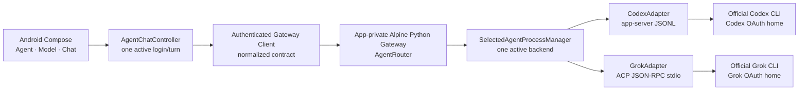

# implement_20260812_130217.md

작성 일시: `2026-08-12 13:02:17 KST`

문서 상태: `READY_FOR_IMPLEMENTATION`

구현 승인 상태: `GRANTED` — `2026-08-12 14:07:50 KST`에 첨부된 장기 Goal 프롬프트로 G1~G7과 Phase 0~9 구현이 승인됐다. 실제 OAuth와 브라우저 승인은 Phase 9 직전에 별도 사용자 승인을 받는다.

대상 프로젝트: `/Volumes/ExternalSSD/projects_8/alpine-codex-cli-client`

구현 시작 시 작업 브랜치: `codex/implement-grok-agent`

이 문서는 현재 Codex CLI-owned OAuth와 채팅 기능을 보존하면서 공식 Grok CLI의 Device Code OAuth, 동적 모델 조회, 스트리밍 채팅을 두 번째 Agent로 추가하기 위한 별도 작업 계획이다. 기존 Codex 기능 계획과 보안 강화 계획을 대체하거나 완료 처리하지 않는다.

## 개발 목적

- Android 앱에서 `Codex`와 `Grok` 중 사용할 Agent를 선택할 수 있게 한다.
- Grok 인증은 앱 자체 OAuth client ID나 API key 없이 공식 Grok CLI가 소유하는 Device Code OAuth만 사용한다.
- Grok 요청은 공식 Grok CLI의 ACP stdio 경로만 사용하고 xAI Provider endpoint를 Android 또는 Python이 직접 호출하지 않는다.
- Codex와 Grok credential, config, session/thread를 app-private 저장소에서 완전히 분리한다.
- Agent 선택, OAuth, 동적 모델, 정확히 1회 채팅, Stop, force-stop 복구, 로그아웃을 Samsung arm64 실기기에서 검증한다.
- 현재 성공한 Codex 로그인·동적 모델·채팅·Stop 경로가 Grok 추가 뒤에도 회귀하지 않게 한다.

## 개발 범위

- 공식 Grok CLI `1.0.0` Linux AArch64 static artifact의 debug-only 공급·검증·staging
- app-private Alpine에서 공식 `grok agent stdio` ACP 프로세스 관리
- 공통 Agent 식별·capability·account·model·conversation·turn 계약
- Codex app-server adapter와 Grok ACP adapter를 분리한 단일 Gateway routing
- `grok.com` Device Code OAuth 시작·URL 조회·상태·취소·로그아웃
- Grok API key 인증·token export·임의 ACP method의 fail-closed 차단
- Agent별 동적 모델 목록과 모델 선택
- Agent별 conversation/session binding, 스트리밍 delta, 완료, 오류, 명시적 Stop
- Agent 전환 중 login/turn/process lifecycle 충돌 방지
- chat-only tool/subagent/telemetry/auto-update 정책
- fake ACP 단위·통합 테스트와 Samsung 실제 OAuth·채팅 E2E
- Grok artifact·소스·adaptation·redacted E2E 문서화

## 제외 범위

- 앱 자체 xAI OAuth client ID, CLI fingerprint, consumer registration 또는 비공식 OAuth proxy
- API key 입력·저장·clipboard import·환경변수 전달·custom model의 API key/env key
- Android/Python의 xAI 직접 HTTPS 요청 또는 Grok CLI 장애 시 Provider fallback
- Grok credential, bearer token, OAuth URL/code, 이메일·계정 식별 정보의 읽기·복사·노출
- 공식 Grok CLI 바이너리 수정·fork·rebuild; 내부 retry를 완전히 제거해야 한다면 별도 계획으로 전환
- Grok CLI 자동 업데이트, 원격 바이너리 교체, build 중 무고지 latest 다운로드
- subagent, MCP, deep-research, terminal, package, filesystem mutation 기능의 UI 노출
- `--always-approve`, yolo 또는 permission bypass mode
- Codex와 Grok의 동시 generation, 다중 active login, 자동 Agent 전환
- 실패한 prompt의 Android/Gateway 자동 retry·자동 replay·다른 Agent fallback
- 기존 Python package·Android application ID·Git 저장소의 일괄 rename
- release signing, store key, release APK/AAB, Play Store 배포
- `/Volumes/ExternalSSD/projects_8/alpine-llm-gateway` 변경

## 참조 문서

- [Codex 기능 개발 계획](/Volumes/ExternalSSD/projects_8/alpine-codex-cli-client/dev-plan/implement_20260811_133123.md)
- [보안 강화 개발 계획](/Volumes/ExternalSSD/projects_8/alpine-codex-cli-client/dev-plan/implement_20260812_103938.md)
- [Samsung debug E2E evidence](/Volumes/ExternalSSD/projects_8/alpine-codex-cli-client/docs/samsung-debug-e2e-evidence.md)
- [Reference source map](/Volumes/ExternalSSD/projects_8/alpine-codex-cli-client/docs/reference-source-map.md)
- [공식 Grok Build source](https://github.com/xai-org/grok-build)
- [공식 Grok CLI installer](https://x.ai/cli/install.sh)
- [공식 Authentication guide](https://github.com/xai-org/grok-build/blob/main/crates/codegen/xai-grok-pager/docs/user-guide/02-authentication.md)
- [공식 Agent Mode guide](https://github.com/xai-org/grok-build/blob/main/crates/codegen/xai-grok-pager/docs/user-guide/15-agent-mode.md)
- [공식 Subagents guide](https://github.com/xai-org/grok-build/blob/main/crates/codegen/xai-grok-pager/docs/user-guide/16-subagents.md)
- [공식 Permissions and Safety guide](https://github.com/xai-org/grok-build/blob/main/crates/codegen/xai-grok-pager/docs/user-guide/22-permissions-and-safety.md)

## 공통 진행 규칙

- 각 Phase는 앞선 Phase의 자체 테스트와 완료 조건을 모두 통과한 뒤에만 진행한다.
- 체크박스는 실제 구현·실행 결과와 동시에 갱신하고 계획 작성만으로 완료 처리하지 않는다.
- 구현 중 발견한 이슈와 수정 결과는 해당 Phase의 `이슈 및 수정`에 즉시 기록한다.
- 구현 시작 전 `main` 최신 상태에서 `codex/implement-grok-agent` 브랜치를 만들고 Phase별 검증 단위로 로컬 commit한다.
- remote push는 별도 사용자 요청 전에는 하지 않는다.
- 기존 Codex 계획과 보안 계획의 미완료 체크박스를 이 계획에서 대신 완료 처리하지 않는다.
- 모든 빌드·artifact·설치 검증은 debug signing 계열에서만 수행한다. release/store 경로를 만들거나 사용하지 않는다.
- 기존 application ID `dev.alpine.codexclient.debug`는 유지하고 app/repository/package namespace rename은 하지 않는다.
- Grok 바이너리, unpack 결과, generated asset, OAuth state, credential, capture, APK는 Git에 commit하지 않는다.
- 실제 OAuth 계정 로그인과 브라우저 승인은 사용자가 직접 수행하며, 시작 직전에 별도 승인을 받는다.
- 실제 테스트 메시지는 승인된 테스트마다 정확히 1회만 전송한다. 실패해도 Android/Gateway는 자동 재전송하지 않는다.
- Agent 전환은 active login·active turn·process transition이 모두 없을 때만 허용한다.
- credential과 config는 공식 CLI만 읽고 갱신한다. Android와 Gateway는 `authenticated` 같은 축약 상태만 사용한다.
- account identifier, verification URL/code, token, prompt·response 원문은 log·문서·캡처·UI dump에 남기지 않는다.
- ADB mutation 전 `adb devices -l`, Samsung exact serial, model, ABI, target application ID를 다시 확인한다.
- target 앱 uninstall·clear-data·credential 파일 삭제·직접 수정은 금지한다.
- 참조 프로젝트와 관련 없는 기존 사용자 변경을 되돌리거나 덮어쓰지 않는다.
- 공통화는 Codex/Grok 중복을 줄이는 최소 책임에 한정하고 미래 Provider를 위한 일반화는 하지 않는다.

## 사전 기술 검증 결과

다음 항목은 구현 전 credential-free 사전 검토에서 실제 확인했다. OAuth `authenticate`, Device Code 발급, 브라우저 승인, credential 쓰기, 실제 Grok turn은 실행하지 않았다.

| 항목 | 결과 | 고정 근거 |
|---|---|---|
| 공식 stable version | PASS | `https://x.ai/cli/stable`에서 `1.0.0` 확인 |
| Linux AArch64 artifact | PASS | `grok-1.0.0-linux-aarch64`, `133745832` bytes |
| SHA-256 | PASS | `bb7c51116564a2219f6a49850815060f416918ac407f1f2ba82c53c0b0d4383f` |
| ELF 형식 | PASS | AArch64, dynamic interpreter 없음, static musl target 확인 |
| 공식 source snapshot | PASS | repository HEAD `be713136d2a69080743a3f6b3c72077057e5948f`, embedded source revision `5d08d7e4123092567ccd584cd9f99afa2972065c` |
| Samsung native 실행 | PASS | `SM-S931N`, arm64-v8a에서 `grok 1.0.0` 종료 코드 0 |
| app-private Alpine/PRoot | PASS | 현재 설치된 debug 앱의 동일 PRoot/rootfs 경로에서 version smoke 성공 |
| ACP initialize | PASS | protocolVersion 1, auth/model/session capability 응답 확인 |
| OAuth-only advertisement | PASS | `GROK_DISABLE_API_KEY_AUTH=1`에서 `grok.com`만 노출되고 `xai.api_key` 미노출 |
| 동적 모델 계약 | PASS | credential-free initialize에서 model state와 available model 확인 |
| Stop/close/logout 계약 | PASS | `session/cancel`, `session/close`, `x.ai/auth/logout` 공식 구현 확인 |
| idle memory | 참고 | Grok ACP 약 29 MiB RSS; 선택 Agent lazy start 필요 |
| 실제 OAuth·1턴 | NOT RUN | 이 계획의 Phase 9에서 사용자 승인 후 검증 |

## 선행 결정과 승인 Gate

| ID | 권장 결정 | 대안·영향 | 상태 |
|---|---|---|---|
| G1 | Android/Gateway 재전송은 0회로 고정하고, 공식 CLI 내부의 **첫 사용자 가시 delta 전 인증 복구**와 그에 따른 Provider 중복 가능성은 잔여 위험으로 수용 | CLI 내부 재제출·Provider 중복 가능성도 0이어야 하면 공식 바이너리 사용을 중단하고 upstream 옵션 또는 fork 별도 계획 필요 | 승인 |
| G2 | 실제 Grok credential 생성 전 보안 계획의 secure variant·authenticated Gateway·민감 UI gate를 먼저 적용 | 현재 debuggable/unsigned loopback 상태에서 실계정 로그인하면 노출면이 확대됨 | 승인 |
| G3 | Runtime은 하나, Gateway도 하나, backend process는 선택 Agent 하나만 실행 | Codex/Grok 동시 process는 메모리·상태 충돌·공격면 증가 | 승인 |
| G4 | Grok은 `get_url`이 반환한 complete HTTPS URL만 브라우저로 열고 stderr/code parsing을 하지 않음 | 별도 code UI는 민감정보 처리 범위 증가 | 승인 |
| G5 | Grok stdio는 project-owned chat-only profile, subagent off, mutating tool fail-closed | always-approve 또는 전체 도구 허용은 제외 범위 위반 | 승인 |
| G6 | upstream signed checksum 부재를 잔여 supply-chain risk로 문서화하고 version·size·SHA-256을 lock에 고정 | 매 build latest 다운로드는 재현성과 검증 불가 | 승인 |
| G7 | Codex/Grok HOME·config·conversation binding을 분리하고 Agent switch는 logout을 유발하지 않음 | 공용 HOME은 credential/config/session 오염 위험 | 승인 |

G1~G7은 승인됐다. G2의 기능 구현과 fake test는 병행할 수 있지만 Phase 9 실제 Grok OAuth는 보안 선행 gate가 완료돼야 시작한다.

### 기존 계획 의존성

| 계획 | 현재 미완료 범위 | 이 계획의 처리 경계 |
|---|---|---|
| Codex 기능 계획 Phase 8 | 동적 모델·독립 관찰 1턴·Stop·lifecycle·logout redacted 판정 | Grok 구현 전후 fake 회귀를 수행하고 Phase 9에서 account/model/readiness를 보존한다. 추가 실제 Codex turn은 별도 승인 없이는 보내지 않는다. |
| Codex 기능 계획 Phase 9 | architecture/contract/E2E/runbook/clean-clone handoff | Grok Phase 9 문서화와 함께 갱신하되 기존 계획 체크박스는 실제 검증 뒤에만 별도로 완료한다. |
| 보안 계획 Phase 0~7 | secure variant, HMAC capability, credential/config, 민감 UI, UDS PoC, 자동 gate | G2에 따라 Grok Phase 8 전에 필요한 보안 구현·fake 검증을 완료한다. UDS PoC 실패 시 authenticated loopback만 사용한다. |
| 보안 계획 Phase 8~9 | Samsung credential lifecycle·handoff | Grok Phase 9 실제 OAuth 전에 secure/non-debuggable·authenticated transport·민감 UI gate를 통과하고, logout은 별도 승인을 받는다. |

### Phase 0 기준선

| 항목 | 고정 결과 |
|---|---|
| Git 시작점 | `main @ 65362c4b0382d672265c7c5ff963846bf09a93f2`; 예상된 미커밋 파일은 이 Grok 계획 1개뿐 |
| 작업 브랜치 | `codex/implement-grok-agent` |
| 원격 | `origin=https://github.com/coreline-ai/alpine-codex-cli-client.git`; push하지 않음 |
| 참조 저장소 | `main @ b81a7d8ee12af72ff95180bfeadabe68e5be950e`; 기존 dirty fingerprint `00d2edeb3efc7dbfd82309e182d7e792721b4009604f8ef1954e0b6350d26fb1` 보존 |
| Codex debug milestone | Python 21 tests, Android/Kotlin unit, lint, debug APK/test APK, protocol fixture, clean-room, reference hash 전체 PASS |
| offline 재현 | 최초 local cache miss를 공개 debug dependency 준비로 해결한 뒤 `scripts/verify-debug-milestone.sh` offline PASS |
| Samsung alias | `SAMSUNG_TARGET`; `SM-S931N`, `arm64-v8a`, Android 16/API 36 |
| 설치 대상 | `dev.alpine.codexclient.debug`, `0.1.0-debug`, versionCode 1, 현재 `DEBUGGABLE` — 실제 Grok OAuth 전에 G2 secure gate 필수 |
| 설치·빌드 APK | SHA-256 `5bed0c1aba3ff2c0a384a078f87b71e6b308be6aaae483ff3c9eaaf87c7ba11f` 일치 |
| signing certificate | Android Debug certificate SHA-256 `6bfd1a305ea7958397ca2d4c0a4917ea90b6b6fe75ea8b38b56001c05b4a1092` |
| reference app | `dev.alpine.integrated.debug 0.3.0-debug`; read-only 확인, 변경 없음 |
| Grok auth | OAuth·Device Code·브라우저·credential·실제 turn 모두 시작하지 않음 |

## 목표 아키텍처



### 소유권 경계

| 자산·기능 | 소유자 | Android/Gateway에 허용되는 값 |
|---|---|---|
| Grok access/refresh credential | 공식 Grok CLI | `authenticated: Boolean`, `authMethod: grok.com` |
| OAuth complete URL | 공식 Grok CLI → Android browser launcher | 메모리 내 bounded URL; 저장·로그 금지 |
| API key/bearer token | 사용하지 않음 | ACP method와 env 모두 차단 |
| 모델 catalog | 선택된 공식 CLI | bounded ID, display name, default/current metadata |
| Codex thread | Codex app-server | Agent-tagged opaque binding |
| Grok session | Grok ACP agent | Agent-tagged opaque binding |
| user/assistant display text | Android encrypted local store | 현재 UI에 필요한 bounded text만 |
| process lifecycle | Gateway process manager | redacted Agent readiness/error code |

## 고정 Runtime·프로세스 계약

Grok guest path는 Codex path와 겹치지 않게 고정한다.

```text
/workspace/.alpine-agents/grok/home
/workspace/.alpine-agents/grok/staging
/workspace/.alpine-agents/grok/profile/chat-only.md
```

실행 명령의 argument 순서는 실제 smoke와 동일하게 유지한다.

```text
grok --no-auto-update agent --no-leader --agent-profile <fixed-chat-only-profile> stdio
```

허용 환경변수는 다음 allowlist만 사용한다.

```text
HOME=<grok-home>
GROK_HOME=<grok-home>
GROK_LOGIN_DEVICE_FLOW=1
GROK_DISABLE_API_KEY_AUTH=1
GROK_DISABLE_AUTOUPDATER=1
GROK_SUBAGENTS=0
GROK_TELEMETRY_ENABLED=0
GROK_TELEMETRY_TRACE_UPLOAD=0
GROK_EXTERNAL_OTEL=0
```

- launch 전 host·guest directory mode `0700`, process `umask 077`, 생성 파일 `0600`을 검증한다.
- `RUST_LOG`, `GROK_LOG_FILE`, `GROK_LOG_SAMPLING`, API key 관련 env는 전달하지 않는다.
- process stdout은 ACP protocol 전용이고 stderr는 credential-safe redacted ring buffer만 사용한다.
- selected Agent process crash는 active turn을 stable error로 종료하고 자동 재시작·prompt replay하지 않는다.
- 사용자 명시 재연결 또는 idle Agent 전환에서만 backend process를 시작한다.

## Grok ACP 허용 계약

Gateway는 임의 JSON-RPC proxy가 아니며 method allowlist 밖 요청을 만들거나 전달하지 않는다.

| 기능 | 허용 method | 추가 제한 |
|---|---|---|
| 초기화 | `initialize` | protocolVersion·authMethods·capability bounded 검증 |
| OAuth 시작 | `authenticate` | method ID exact `grok.com`; 단일 flight |
| OAuth URL | `x.ai/auth/get_url` | `mode=device`, HTTPS, xAI 허용 host, bounded complete URL |
| OAuth 취소 | `x.ai/auth/cancel` | current request sequence만; idempotent |
| auth 상태 | `x.ai/auth/info` 또는 initialize/account 상태 | 이메일·profile 폐기, Boolean만 반환 |
| 로그아웃 | `x.ai/auth/logout` | active turn 없음; email 필드 폐기 |
| 모델 조회 | `x.ai/models/list`, initialize modelState | bounded catalog, hardcoded fallback 없음 |
| 모델 변경 | ACP session model setter | catalog에 존재하는 ID만 |
| session | `session/new`, `session/resume`, `session/close` | Agent-tagged binding과 generation 확인 |
| turn | `session/prompt` | 마지막 user text 정확히 1회 |
| Stop | `session/cancel` | active request/session exact match, 최대 1회 |

명시적 차단 method:

- `x.ai/getApiKey`
- `x.ai/setApiKey`
- `x.ai/auth/getBearerToken`
- 임의 filesystem, terminal, Git, package, MCP extension
- allowlist에 없는 향후 `x.ai/*` method

`authenticate`는 승인 완료까지 장시간 pending일 수 있으므로 전용 비동기 request로 유지한다. 같은 process에서 `x.ai/auth/get_url`을 병행 호출해 complete URL을 얻고, request sequence로 중복 login·취소 race를 제어한다.

## 공통 Agent 상태 모델

```text
RuntimeStopped
GatewayStarting
AgentStarting(agentId)
LoginRequired(agentId)
LoginPending(agentId, requestId)
Ready(agentId, models)
Generating(agentId, requestId)
Switching(from, to)
StableError(agentId?, code)
```

- Agent 선택은 `LoginPending`, `Generating`, `Switching`에서 비활성화한다.
- Agent switch는 현재 backend를 bounded close한 후 target backend를 initialize한다.
- switch 실패 시 prompt를 보내지 않고 이전 Agent 자동 복귀도 하지 않는다. 사용자가 재시도 또는 이전 Agent 선택을 명시한다.
- conversation binding은 `agentId`, `backendSessionId`, `modelId`, `processGeneration`을 포함한다.
- 다른 Agent의 binding을 resume하거나 전체 history를 자동 replay하지 않는다.
- logout은 선택 Agent에만 적용하며 다른 Agent credential을 변경하지 않는다.

## Gateway·Android 정규화 계약

기존 Codex endpoint를 즉시 삭제하지 않고 공통 Agent 계약을 추가한 뒤 compatibility test를 유지한다.

| Method | Path | 목적 |
|---|---|---|
| GET | `/v1/agents` | 지원 Agent와 현재 선택 상태 |
| POST | `/internal/agents/select` | idle 상태에서 Agent 전환 |
| GET | `/internal/agents/{agent_id}/account` | 축약 auth 상태 |
| POST | `/internal/agents/{agent_id}/login/device` | 공식 CLI-owned Device OAuth 시작 |
| GET | `/internal/agents/{agent_id}/login/{request_id}` | pending/authenticated/failed/cancelled |
| POST | `/internal/agents/{agent_id}/login/{request_id}/cancel` | exact pending login 취소 |
| POST | `/internal/agents/{agent_id}/logout` | 선택 Agent 로그아웃 |
| GET | `/v1/models?agent_id=<id>` | 선택 Agent 동적 모델 catalog |
| POST | `/v1/chat/completions` | `agent_id`, model, user text, stream |
| POST | `/internal/agents/{agent_id}/turn/{request_id}/interrupt` | 선택 Agent active turn Stop |

- security plan이 정한 HMAC/UDS transport 계약을 모든 신규 endpoint에 동일하게 적용한다.
- body·response·SSE limit은 기존 Android/Gateway limit보다 느슨하게 확장하지 않는다.
- `agent_id`는 `codex|grok` exact enum이고 임의 executable/path/config로 변환하지 않는다.
- 기존 Codex client migration 기간에는 `agent_id` 누락을 `codex`로만 해석하고, 새 UI cutover 뒤 필수화 여부를 별도 결정한다.

## 예상 변경 파일 / 책임 경계

| 책임 | 예상 파일 | 경계 |
|---|---|---|
| artifact lock | 신규 `grok-cli-pack/grok-cli.lock.json` | version·URL·size·SHA·source revision |
| debug asset | 신규 `grok-cli-pack/build.gradle.kts`, artifact provider | generated debug asset만; binary Git 제외 |
| Runtime paths | `CodexRuntimePaths.kt` 또는 신규 `AgentRuntimePaths.kt` | Codex/Grok home·staging·profile 분리 |
| app composition | `AlpineCodexApplication.kt`, `AndroidGatewayRuntimeHost.kt` | 두 artifact 공급자와 allowlisted launch spec |
| 공통 Android 계약 | `codex-runtime-bridge` 신규 Agent models/client interface | Agent/account/model/chat/Stop 정규화 |
| UI state | `CodexChatViewModel.kt`의 최소 Agent-aware refactor 또는 신규 `AgentChatViewModel.kt` | 선택·전환·login·turn 상태 단일 소유 |
| Compose UI | `MainActivity.kt` | 상단 최소 Agent selector, 상태 sheet 상세 |
| Python router | `codex_gateway/gateway.py`, 신규 `codex_gateway/agents/` | one selected backend·one login·one turn |
| Grok ACP | 신규 `grok_acp/process.py`, `rpc.py`, `protocol.py`, `policy.py` | bounded stdio·allowlist·redaction |
| profile | 신규 text template + lock/hash | chat-only, subagent/tool 제한 |
| tests | `tests/fake_grok_acp.py`, Python/Kotlin/instrumentation test | OAuth race·model·stream·Stop·retry·회귀 |
| verifiers | 신규 `scripts/prepare/verify-grok-cli-*`, 기존 milestone 확장 | artifact·API key·method·env·binary exclusion |
| 문서 | 신규 `docs/grok-cli-notice.md`, source map, redacted E2E | 공급 근거·잔여 위험·검증 결과 |

## Phase 상태 요약

- [x] Phase 0. 결정 승인·기준선 고정 완료
- [x] Phase 1. 공통 Agent 계약·Codex 회귀 fixture 완료
- [x] Phase 2. Grok CLI artifact pack 완료
- [x] Phase 3. Grok Runtime 격리·launch policy 완료
- [x] Phase 4. Grok ACP supervisor·allowlist 완료
- [x] Phase 5. Grok OAuth·model·session Gateway 완료
- [x] Phase 6. Agent-aware Android client·UI 완료
- [x] Phase 7. Grok stream·Stop·retry 정책 완료
- [ ] Phase 8. 보안·자동 회귀·artifact gate 완료
- [ ] Phase 9. Samsung 실제 OAuth·1턴·복구·핸드오프 완료

## QA 관점

### 정상 흐름

- [ ] Codex 선택→기존 로그인 상태→모델→정확히 1턴이 유지된다.
- [ ] idle에서 Grok 선택→로그인→모델→정확히 1턴이 이어진다.
- [ ] Codex↔Grok 전환 후 각 Agent conversation/session이 섞이지 않는다.
- [ ] 각 Agent의 Stop·logout이 다른 Agent 상태를 변경하지 않는다.

### 실패·경계 흐름

- [ ] Grok binary hash/version/size 하나라도 다르면 staging 전 fail-closed 한다.
- [ ] initialize 지연·crash·malformed JSON·oversized line·unknown response가 bounded error로 끝난다.
- [ ] OAuth URL 미준비·만료·취소·브라우저 미승인·동시 시작 race가 중복 login 없이 끝난다.
- [ ] 모델 0/1/다수, 현재 모델 제거, duplicate ID, catalog refresh 실패를 처리한다.
- [ ] Agent switch 중 process 종료 실패와 target initialize 실패가 prompt 전송 없이 끝난다.
- [ ] Stop 전 request ID 미수신, Stop 중 process crash, terminal event 중복을 idempotent하게 처리한다.
- [ ] app process recreation과 Android force-stop 뒤 자동 prompt replay 없이 상태를 재구성한다.

### 적대적 흐름

- [ ] API key env/config/custom model을 주입해도 auth method나 모델로 노출되지 않는다.
- [ ] 차단 ACP method와 미래 unknown method가 CLI에 전달되지 않는다.
- [ ] OAuth URL/code/token/email이 stdout·stderr·logcat·exception·evidence에 남지 않는다.
- [ ] 다른 local app/browser가 신규 Agent endpoint를 호출하지 못한다.
- [ ] symlink·world-readable HOME/profile/config가 발견되면 Grok process를 시작하지 않는다.
- [ ] partial delta 뒤 401/retry가 발생해도 두 번째 assistant message나 Gateway replay가 생기지 않는다.

### 회귀 위험

- [ ] Codex app-server protocol fixture와 기존 Gateway API가 유지된다.
- [ ] 기존 encrypted conversation migration이 Agent ID 추가 뒤 무손실로 동작한다.
- [ ] chat composer inset, 모델 selector, Stop, 대화 목록 크기가 회귀하지 않는다.
- [ ] Runtime foreground service와 gateway reconnect가 중복 backend process를 만들지 않는다.

## Phase 0. 결정 승인·기준선 고정

### 목표

- G1~G7, 보안 선행 조건, 기존 Codex 완료 상태와 Git/기기 기준선을 구현 전에 고정한다.

### 구현 태스크

- [x] 사용자에게 G1~G7을 리뷰받고 승인·수정 결과를 이 문서에 기록한다.
- [x] 구현 시작 승인을 기록하고 문서 상태를 `READY_FOR_IMPLEMENTATION`으로 변경한다.
- [x] `main`, HEAD, remote, clean status를 기록한 뒤 `codex/implement-grok-agent`를 생성한다.
- [x] 기존 Codex 계획 Phase 8~9와 보안 계획의 미완료 항목을 dependency 표로 연결한다.
- [x] known-good Codex unit/integration/debug build 결과를 baseline으로 기록한다.
- [x] Samsung target serial·model·ABI·application ID·version·signing digest를 redacted alias로 고정한다.
- [x] Grok 사전 검증 명령·결과를 credential 없는 `docs/grok-preflight.md`로 정리한다.
- [x] 공식 source·artifact URL, commit, source revision, size, SHA-256을 source map에 추가한다.

### 자체 테스트

- [x] `git status --short`에 계획 밖 변경이 없다.
- [x] reference 프로젝트와 설치된 reference app이 변경되지 않았다.
- [x] Grok OAuth·credential·브라우저 승인을 시작하지 않았다.
- [x] Codex known-good fake test와 debug assemble이 통과한다.
- [x] G1 strict 정책은 선택하지 않았으며, strict 전환 시 공식 바이너리 사용을 중단하는 조건이 문서화됐다.

### 이슈 및 수정

- [x] 최초 offline Gradle 실행에서 `androidx.lifecycle:lifecycle-service:2.6.2` cache miss를 발견했다. 동일 debug-only task를 online으로 한 번 실행해 공개 dependency를 준비한 뒤 전체 offline milestone을 재실행해 PASS했다. 코드·release·ADB·계정 변경은 없었다.

### 완료 조건

- [x] 사용자 결정·구현 승인·baseline이 기록됐다.
- [x] 실제 Grok OAuth에 필요한 보안 선행 gate가 명확하다.
- [x] 다음 Phase 진행 가능

## Phase 1. 공통 Agent 계약·Codex 회귀 fixture

### 목표

- Grok 구현 전에 Agent 공통 책임을 최소 계약으로 분리하고 Codex 동작을 그대로 보존한다.

### 구현 태스크

- [x] `AgentId(CODEX, GROK)`, capability, account, model, login, conversation, turn event 계약을 정의한다.
- [x] conversation 저장 형식에 version과 `agentId`를 추가하고 기존 record는 `CODEX`로 안전 migration한다.
- [x] AgentRouter가 selected Agent, active login, active turn을 단일 lock/state machine으로 소유하게 한다.
- [x] Codex 기존 protocol/service를 `CodexAgentAdapter` 경계로 감싸되 method/payload를 변경하지 않는다.
- [x] Agent switch precondition과 stable error code를 고정한다.
- [x] health와 gateway readiness를 backend readiness에서 분리한다.
- [x] public API에서 executable path, env, raw method를 입력받지 않게 한다.

### 자체 테스트

- [x] 기존 Codex Python/Kotlin test가 변경 전과 동일하게 통과한다.
- [x] old encrypted record가 Codex conversation으로 migration되고 원문 손실이 없다.
- [x] Agent ID 누락·unknown·case 변형이 임의 backend 실행으로 이어지지 않는다.
- [x] login/turn 중 switch가 거부되고 backend method가 호출되지 않는다.
- [x] idle switch 실패가 prompt replay·자동 rollback을 만들지 않는다.

### 이슈 및 수정

- [x] 첫 focused Gateway 실행은 sandbox loopback bind 제한으로 실행되지 않아 동일 test를 허용된 local loopback 환경에서 재실행했다. legacy binding fixture의 thread ID가 fake server event ID와 달라 timeout이 발생한 부분은 fixture를 실제 protocol ID와 일치시켰고, Python focused 18 tests 및 전체 milestone Python 28 tests PASS로 재검증했다.

### 완료 조건

- [x] 공통 계약 도입 뒤 Codex 기능과 fixture가 유지된다.
- [x] Grok-specific protocol이 Android UI에 노출되지 않는다.
- [x] 다음 Phase 진행 가능

## Phase 2. Grok CLI artifact pack

### 목표

- 공식 Grok CLI를 version·size·hash로 고정한 debug-only artifact로 재현 가능하게 공급한다.

### 구현 태스크

- [x] `grok-cli-pack` module과 `grok-cli.lock.json`을 추가한다.
- [x] lock에 version `1.0.0`, source URL, `133745832` bytes, 고정 SHA-256과 source revisions를 기록한다.
- [x] local path→외부 Gradle cache→고정 official URL 순서의 prepare task를 구현한다.
- [x] upstream URL 사용 시 HTTPS·exact filename·expected size·SHA-256을 모두 검증한다.
- [x] ELF AArch64, dynamic interpreter 부재, `grok --version` 출력을 검증한다.
- [x] generated debug asset만 APK에 포함하고 release source set/task는 만들지 않는다.
- [x] app-private staging은 temp copy→fsync 가능 범위→mode→atomic rename→rehash 순으로 구현한다.
- [x] 기존 hash mismatch binary는 실행하지 않고 stable artifact error를 반환한다.
- [x] 공식 license/notice와 upstream checksum 미제공 잔여 위험을 문서화한다.

### 자체 테스트

- [x] wrong version/size/SHA/ELF/ABI가 각각 build 또는 staging에서 실패한다.
- [x] offline cache hit build가 network 없이 재현된다.
- [x] binary가 Git index/history에 없고 generated output이 ignore된다.
- [x] debug APK의 Grok asset hash가 lock과 일치한다.
- [x] release signing/store key/release artifact가 생성되지 않는다.

### 이슈 및 수정

- [x] upstream은 signed SHA-256을 제공하지 않고 HTTP `ETag`/MD5/CRC32C만 제공한다. 이를 신뢰 근거로 승격하지 않고 reviewed project SHA-256 lock으로만 고정했으며, official URL이 redirect 없는 `200`, `Content-Length: 133745832`임을 read-only HEAD로 재확인했다. 전체 debug milestone Python 32 tests, Gradle debug build/lint/androidTest assemble, clean-room, APK hash/inventory gate가 PASS했다.

### 완료 조건

- [x] pinned Grok artifact 공급과 fail-closed 검증이 자동화됐다.
- [x] SBOM/notice/source map이 갱신됐다.
- [x] 다음 Phase 진행 가능

## Phase 3. Grok Runtime 격리·launch policy

### 목표

- Codex credential/config와 분리된 app-private Grok HOME에서 고정 환경·권한으로 CLI를 실행한다.

### 구현 태스크

- [x] Agent runtime path object에 Grok home/staging/profile guest·host path를 추가한다.
- [x] directory creation 시 canonical app-private path, symlink 부재, mode `0700`을 검증한다.
- [x] process `umask 077`과 생성 credential/config mode `0600` 검증 probe를 구현한다.
- [x] 고정 launch command와 환경 allowlist builder를 구현한다.
- [x] API key·logging·auto-update·subagent 관련 금지 env를 검사한다.
- [x] project-owned chat-only Agent profile을 hash-locked template로 stage한다.
- [x] profile의 mutating tool·subagent·MCP 제거를 pinned upstream source와 profile verifier로 검증한다. 공식 CLI가 인증 전 `session/new`을 거부하므로 authenticated 실제 session event 0개 검증은 G2 이후 Phase 9 gate로 이관한다.
- [x] selected Agent process만 실행하고 switch/stop 시 bounded shutdown한다.

### 자체 테스트

- [x] Codex와 Grok HOME/config/session 경로가 겹치지 않는다.
- [x] wrong permission·symlink·profile hash mismatch에서 process가 시작되지 않는다.
- [x] environment snapshot에는 allowlist key만 있고 secret/API key가 없다.
- [x] `--no-auto-update`, telemetry off, subagent off가 fixture와 real credential-free smoke에서 확인된다.
- [x] Samsung app-private Alpine에서 version과 ACP initialize smoke가 재현된다.
- [x] Runtime stop 뒤 Grok/PRoot child process가 남지 않는다.

### 이슈 및 수정

- [x] Android의 app-private 절대 경로가 `/data/user/0`이고 canonical 경로가 `/data/data`인 alias 때문에 최초 startup path 검사가 실패했다. 허용 루트 기준 상대 경로를 먼저 고정하고 두 root 표현 중 하나 아래인 경우에만 canonical root에 재결합하도록 수정했으며 이후 Samsung smoke가 PASS했다.
- [x] 공식 CLI raw initialize는 profile 적용 전 generic MCP/filesystem/session capability를 넓게 광고한다. 이를 effective capability로 신뢰하지 않고 Phase 4의 method allowlist와 disabled reverse client capability로 차단한다.
- [x] credential-free initialize 뒤 `session/new`을 시도했으나 공식 CLI가 인증 전 단계에서 거부했다. OAuth를 조기 시작하지 않고 실제 fixed-profile session/no-tool event 검증을 보안 gate 이후 Phase 9로 이관했다.

### 완료 조건

- [x] Grok process 경계·권한·환경이 Codex와 독립적으로 고정됐다.
- [x] credential 없는 Samsung initialize smoke가 통과했다.
- [x] 다음 Phase 진행 가능

### 검증 결과

- [x] `2026-08-12 KST` 전체 debug milestone PASS: Python 39 tests, 전체 Kotlin/Android unit,
  `lintDebug`, debug APK, debug instrumentation APK, Codex fixture, clean-room, Grok CLI/profile
  artifact, reference source map/runtime manifest.
- [x] `SAMSUNG_TARGET`에서 동일 debug 서명·application ID를 재확인하고 데이터 보존
  update-install 후 `GrokRuntimeSmokeInstrumentedTest` 1/1 PASS.
- [x] 실기기 smoke 종료 후 Grok/PRoot/app matching process 0, 점검 대상 디렉터리·실행파일
  `0700`, profile `0600`; OAuth/authenticate/browser/model/prompt/logout 실행 0.

## Phase 4. Grok ACP supervisor·allowlist

### 목표

- bounded JSON-RPC stdio multiplexer와 명시적 method allowlist로 공식 Grok ACP만 사용한다.

### 구현 태스크

- [x] Grok ACP process lifecycle `STOPPED→STARTING→INITIALIZING→READY→STOPPING/FAILED`를 구현한다.
- [x] stdin write serialization, monotonic request ID, max pending request, method별 timeout을 구현한다.
- [x] stdout strict UTF-8·object-only·1 MiB line limit·unknown response handling을 적용한다.
- [x] stderr는 OAuth/token/account/prompt 패턴을 폐기하는 bounded redaction만 유지한다.
- [x] initialize response의 protocolVersion, `grok.com`, modelState, session capability를 bounded parse한다.
- [x] 허용 ACP method wrapper만 public으로 노출하고 raw `request(method, params)`를 service 경계 밖에 노출하지 않는다.
- [x] forbidden method 목록을 verifier와 test fixture에 고정한다.
- [x] notification reorder·duplicate terminal·late response·process generation mismatch를 처리한다.

### 자체 테스트

- [x] fragmented/combined/malformed/oversized JSON line을 검증한다.
- [x] duplicate/unknown ID, timeout, max pending, process crash가 bounded error로 끝난다.
- [x] `getApiKey`, `setApiKey`, `getBearerToken`, unknown `x.ai/*`가 write 함수에 도달하지 않는다.
- [x] stderr chunk boundary를 가로지르는 token·URL·email 패턴이 저장되지 않는다.
- [x] initialize fixture reorder에도 capability가 동일하게 normalize된다.
- [x] shutdown이 active request를 완료 또는 취소하고 child process를 회수한다.

### 이슈 및 수정

- [x] 공식 initialize가 chat-only profile 적용 전에도 MCP·filesystem·terminal 관련 광범위 capability를 광고함 — Gateway 상태에는 protocol/auth/model/load·resume·close Boolean만 bounded normalize하고 나머지를 폐기했으며, agent→client reverse request는 세대 전체를 fail-closed 처리했다.
- [x] OAuth URL·account·prompt·credential 문자열은 pipe read 경계를 가로지를 수 있어 패턴 기반 stderr 보관만으로 미래 형식을 완전히 막기 어려움 — stderr 원문을 0 byte 보관하고 bounded byte count·truncation bit만 노출하는 더 강한 content-free diagnostic으로 구현했다.
- [x] request timeout 뒤 늦은 response가 도착하면 이후 요청과 transport 상태가 모호해질 수 있음 — timeout 즉시 process generation을 FAILED로 폐기하고 자동 restart/replay 없이 child를 종료하도록 수정했으며 late ID fixture도 별도로 검증했다.
- [x] 전체 Python 회귀는 관리형 sandbox의 loopback bind 제한으로 첫 실행이 거부됨 — 동일 명령을 승인된 로컬 test 환경에서 실행해 50/50 PASS를 확인했으며 제품 코드 변경은 필요하지 않았다.

### 완료 조건

- [x] Grok ACP transport와 allowlist가 fake fixture에서 완성됐다.
- [x] 임의 ACP proxy/API key 경로가 없다.
- [x] 다음 Phase 진행 가능

## Phase 5. Grok OAuth·model·session Gateway

### 목표

- Device Code OAuth, 동적 model, session lifecycle을 공통 Gateway API로 정규화한다.

### 구현 태스크

- [x] `authenticate(grok.com)`을 전용 async task와 request sequence로 single-flight 실행한다.
- [x] `x.ai/auth/get_url`을 병행 호출해 `mode=device` complete URL만 검증·반환한다.
- [x] URL은 HTTPS, allowlisted xAI host, length·scheme·userinfo·fragment 정책을 통과해야 한다.
- [x] Android/Gateway가 user code나 stderr를 파싱·저장하지 않게 한다.
- [x] login status는 pending/authenticated/failed/cancelled/expired stable state만 노출한다.
- [x] cancel은 current request sequence만 최대 1회 취소하고 late authenticate response를 폐기한다.
- [x] auth info/logout 응답의 email/profile/token 필드를 즉시 폐기하고 Boolean만 반환한다.
- [x] modelState와 `x.ai/models/list`를 bounded normalize하고 hardcoded fallback을 두지 않는다.
- [x] session new/resume/model change/close를 Agent-tagged binding에 연결한다.
- [x] Gateway normalized endpoint와 security middleware를 연결한다.

### 자체 테스트

- [x] get_url-before-ready, authenticate-before-get_url, cancel race, late success를 재현한다.
- [x] duplicate login click이 authenticate를 두 번 호출하지 않는다.
- [x] invalid/oversized/non-HTTPS URL이 Android로 전달되지 않는다.
- [x] account/logout 응답에 email·profile·token이 존재해도 외부 JSON과 log에 남지 않는다.
- [x] API key disabled initialize에서 `grok.com`만 표시된다.
- [x] 모델 0/1/다수/duplicate/removal/malformed catalog를 처리한다.
- [x] session binding의 Agent/generation mismatch가 resume/prompt 전에 거부된다.

### 이슈 및 수정

- [x] 공식 `AuthRequestMeta.use_oauth=true`는 이름과 달리 loopback을 강제함 — 해당 필드를 전송하지 않고 Phase 3의 고정 Device 환경만 사용하며, cancel scope용 `_meta.request_seq`만 전송하도록 공식 소스와 fake ACP test로 고정했다.
- [x] 첫 전체 milestone에서 인접한 정상/중복 initialize 응답의 reader scheduling에 따라 `start()` 반환과 generation 폐기 순서가 바뀌는 기존 test race가 1회 재현됨 — 중복 관찰 즉시 `FAILED`가 되는 실제 fail-closed 불변식으로 test를 수정하고 10회 연속 및 전체 회귀를 통과했다.
- [x] 실제 HMAC/session capability 구현은 보안 계획 Phase 8 선행 항목임 — Phase 5 handler는 verifier 주입 없이는 생성되지 않고 unsigned default가 없도록 연결했으며, 11개 normalized route 모두 adapter/body 처리 전에 authorizer가 호출됨을 검증했다.

### 완료 조건

- [x] fake ACP에서 Grok OAuth→model→session lifecycle이 통과한다.
- [x] credential·API key·계정정보 비노출 gate가 통과한다.
- [x] 다음 Phase 진행 가능

검증 기록: `2026-08-12 KST` focused OAuth/Gateway/ACP 24 tests PASS. 전체 debug
milestone은 Python 63 tests, 전체 Kotlin/Android debug unit, `lintDebug`, debug APK와 debug
instrumentation APK, Codex fixture, clean-room, Grok artifact/profile/ACP, reference source map을
모두 PASS했다. release/store signing, ADB, 실제 OAuth, account/browser mutation은 수행하지 않았다.

## Phase 6. Agent-aware Android client·UI

### 목표

- 채팅 공간을 유지하면서 Codex/Grok 선택과 각 Agent 로그인·모델 상태를 명확하게 제공한다.

### 구현 태스크

- [x] Gateway client에 agents/select/account/login/model/chat/interrupt/logout typed API를 추가한다.
- [x] ViewModel을 Agent-aware state로 migration하고 한 active login/turn invariant를 유지한다.
- [x] 상단에는 compact Agent selector와 model selector만 두고 세부 상태·login/logout/runtime는 sheet/overflow에 둔다.
- [x] application ID는 유지하되 debug app 표시 이름을 Codex 전용으로 오해하지 않는 중립 이름으로 변경한다.
- [x] Agent switch confirmation은 unsent draft·active conversation 영향만 설명하고 자동 logout하지 않는다.
- [x] Grok login은 complete URL을 ACTION_VIEW로 열고 URL/code를 Compose semantics·clipboard·saved state에 보관하지 않는다.
- [x] 민감 인증 화면에 security plan의 FLAG_SECURE·recents·clipboard 정책을 적용한다.
- [x] conversation store에 Agent ID를 저장하고 Agent별 목록·새 대화·resume을 분리한다.
- [x] Generating/LoginPending/Switching 중 selector와 위험 action을 비활성화한다.
- [x] stable error에는 재전송 없는 `상태 다시 확인`, `Agent 다시 시작` 같은 명시 action만 제공한다.

### 자체 테스트

- [x] Agent 1/2개, 모델 0/1/다수에서 selector와 채팅 높이가 유지된다.
- [x] login pending/streaming/switching 중 중복 click이 backend 호출을 늘리지 않는다.
- [x] Codex/Grok conversation과 selected model이 섞이지 않는다.
- [x] process recreation 뒤 prompt 자동 전송 없이 selected Agent와 축약 상태만 복구한다.
- [x] OAuth URL/code가 saved state, semantics dump, screenshot evidence, clipboard에 남지 않는다.
- [x] 기존 composer navigation inset, Stop, 대화 목록 instrumentation이 회귀하지 않는다.

### 이슈 및 수정

- [x] `startDeviceLogin` 성공 응답의 URL·Codex code가 malformed일 때 공식 CLI pending login이 남을 수 있었다. bounded request/code와 allowlisted HTTPS URL을 검증하고, 실패 시 해당 공식 login request를 한 번 취소한 뒤 `login_challenge_invalid` stable error로 종료하도록 수정했다.
- [x] 작은 화면에서 모델 다수와 Codex `브라우저 열기`가 접힌 BottomSheet 아래로 밀렸다. Agent/model sheet를 scrollable로 만들고 Codex 브라우저·민감 코드 복사를 한 행의 즉시 보이는 action으로 재배치했다.
- [x] 첫 전체 milestone의 lint가 `LocalContext`→`Activity` cast를 거부했다. `LocalActivity`로 교체하고 문서화된 sensitive clipboard extra String을 사용해 minSdk에서도 안전하게 marker를 기록하도록 수정했다.
- [x] 계측 테스트가 기존 encrypted conversation 파일을 삭제할 수 있는 위험을 발견했다. 테스트 전 파일을 app cache로 원자 보관하고 각 테스트 종료 후 원상 복구하도록 변경했다.
- [x] 서로 다른 Agent가 같은 opaque conversation ID를 반환하면 저장소 parser가 한쪽을 중복으로 제거했다. 중복 키를 `(agentId, conversationId)`로 변경하고 encrypted round-trip fixture를 추가했다.
- [x] Android에 ACTION_VIEW handler가 없거나 실행이 실패하면 OAuth pending 상태가 방치될 수 있었다. URL을 저장하지 않은 채 해당 공식 login request를 취소하고 `browser_launch_failed` stable error로 복구하도록 수정했다.
- [x] Python focused Gateway test의 loopback bind가 관리형 sandbox에서 거부됐다. 동일 test를 허용된 local loopback 환경에서 재실행해 5/5 PASS했고 제품 코드는 변경하지 않았다.

### 완료 조건

- [x] fake backend에서 Codex/Grok 선택→login→model→chat→Stop→logout 메뉴별 테스트가 통과한다.
- [x] 채팅 영역 중심 GUI와 접근성 기준이 유지된다.
- [x] 다음 Phase 진행 가능

검증 기록: `2026-08-12 KST` 전체 debug milestone PASS — Python 64 tests, 전체
Kotlin/Android unit, `lintDebug`, debug APK·debug instrumentation APK, Codex fixture,
clean-room, Grok artifact/profile/ACP, reference source map/runtime manifest. `SAMSUNG_TARGET`
`SM-S931N`에서 credential-free Agent workflow/UI instrumentation 9/9 PASS: Agent 1/2,
모델 0/1/다수, Codex/Grok login→model→fixture chat, Stop 1회, Agent별 logout·conversation·model
격리와 동일 opaque ID round-trip, process recreation 무자동 prompt, invalid challenge와 browser
launch failure cancel, landscape composer/navigation inset, `FLAG_SECURE` set/restore를 검증했다. 실제 OAuth·브라우저 승인·account credential·실제
prompt는 시작하지 않았고 reference 프로젝트/app은 변경하지 않았다.

## Phase 7. Grok stream·Stop·retry 정책

### 목표

- Grok ACP stream을 기존 SSE 계약으로 변환하고 G1 retry 정책을 실행 가능한 테스트로 고정한다.

### 구현 태스크

- [x] `session/prompt`를 user text 정확히 1회로 dispatch하고 request/session/generation을 결합한다.
- [x] ACP content update를 `start→delta*→done/error→[DONE]`으로 normalize한다.
- [x] terminal event 첫 1개만 채택하고 late/duplicate delta를 폐기한다.
- [x] Stop을 current session/request의 `session/cancel` 최대 1회에 연결한다.
- [x] client disconnect·Runtime stop·Agent switch cleanup의 cancel 우선순위를 고정한다.
- [x] CLI retry notification을 관찰해 pre-output/post-output 상태와 시도 횟수를 redacted metric으로만 분류한다.
- [x] Android/Gateway dispatch count를 항상 1로 검증한다.
- [x] partial delta 뒤 retry/auth recovery는 stable failure로 종료하고 assistant node를 새로 만들지 않는다.
- [x] G1 strict 선택 시 retry 발견 즉시 Grok turn을 차단하고 공식 binary limitation을 보고한다.

### 자체 테스트

- [x] normal delta, empty delta, large delta, malformed update, duplicate terminal을 검증한다.
- [x] Stop before start ACK, during delta, after done가 idempotent하다.
- [x] 401 before output과 after partial output fixture에서 허용 정책과 dispatch count가 일치한다.
- [x] CLI retry exhaustion이 prompt 자동 replay나 다른 Agent fallback을 만들지 않는다.
- [x] user node 1개, assistant node 1개, terminal state 1개 판정이 유지된다.
- [x] process crash와 timeout 뒤 사용자가 명시 재전송하기 전 추가 turn이 없다.

### 이슈 및 수정

- [x] Phase 4 inbound notification allowlist에 공식 Grok `RetryState`의 실제 live carrier인 `x.ai/session_notification`이 빠져 retry를 관찰할 수 없었다. 공식 `grok-build` 1.0.0의 `send_xai_notification`과 snake_case payload를 재확인하고, 해당 inbound notification만 fixture/allowlist에 추가했다. request method나 임의 proxy surface는 늘리지 않았다.
- [x] Grok stream의 첫 `start` yield가 `try/finally` 밖에 있어 client가 start 직후 연결을 닫으면 exact session cancel cleanup이 생략될 수 있었다. start를 cleanup 범위 안으로 옮기고 active turn별 cancel reservation을 최대 1회로 고정했다.
- [x] Android SSE client가 request ID 변경, delta-before-start, terminal 중복, terminal 없는 `[DONE]`을 허용했고 완료 뒤 Stop이 불필요한 interrupt를 보낼 수 있었다. request identity와 `start→delta*→terminal→[DONE]` 상태기계를 추가하고 terminal 이후 Stop을 no-op으로 고정했다.
- [x] 첫 Samsung request-ID mismatch 계측은 공통 bridge가 ViewModel보다 먼저 차단한다는 실제 경계를 반영하지 않아 예상 코드가 달랐다. 제품 동작은 유지하고 테스트를 bridge의 안정 코드 `MALFORMED_RESPONSE`로 수정한 뒤 재실행했다.
- [x] targeted JVM 검증에서 Android variant용 task 이름을 사용해 task lookup이 1회 실패했다. JVM module의 실제 `:codex-runtime-bridge:test`로 교정해 PASS했고 전체 milestone에서도 같은 task를 재검증했다.

### 완료 조건

- [x] 스트리밍·Stop·retry 경계가 G1 결정과 테스트로 고정됐다.
- [x] Android/Gateway 자동 retry·replay·fallback이 0회다.
- [x] 다음 Phase 진행 가능

검증 기록: `2026-08-12 KST` 전체 debug milestone PASS — Python 73 tests, 전체
Kotlin/Android unit, `lintDebug`, debug APK·debug instrumentation APK, Codex fixture,
clean-room, Grok artifact/profile/ACP, reference source map/runtime manifest. Grok fixture에서
normal/empty/large/malformed/duplicate terminal, pre-output retry 허용, post-output·auth·exhaustion
stable failure, strict retry 차단, prompt dispatch 1회, cancel 최대 1회, process loss·timeout 무재전송을
검증했다. `SAMSUNG_TARGET` `R3CY40PXCAP / SM-S931N`을 매 install 전 재확인하고
`dev.alpine.codexclient.debug` debug APK만 update-install해 credential-free Agent workflow/UI
instrumentation 12/12 PASS: Stop-before-start ACK queue, partial failure의 user 1개·assistant 1개,
request ID mismatch fail-closed, recreation 무자동 prompt, 기존 Agent/model/login/Stop/layout·민감 UI
회귀를 검증했다. 다른 연결 기기와 reference app은 변경하지 않았고 실제 OAuth·계정·실제 prompt는
시작하지 않았다.

## Phase 8. 보안·자동 회귀·artifact gate

### 목표

- 실제 Grok 계정 로그인 전에 신규 경로의 transport·credential·artifact·Codex 회귀를 자동 검증한다.

### 구현 태스크

- [ ] 보안 계획의 secure variant와 authenticated Gateway를 Grok endpoint에도 적용한다.
- [ ] Grok HOME/profile/config permission과 symlink 검사를 artifact gate에 추가한다.
- [ ] source/APK/env/profile에서 API key path, OAuth client ID, CLI fingerprint, direct xAI endpoint, auto-update를 검사한다.
- [ ] ACP forbidden-method negative fixture를 milestone verifier에 추가한다.
- [ ] Grok binary version·size·hash·ELF·Git exclusion을 검증한다.
- [ ] Python/Kotlin/unit/integration/instrumentation test를 하나의 debug-only gate로 묶는다.
- [ ] Codex 기존 로그인·model·1-turn·Stop·logout fake regression을 같은 gate에서 실행한다.
- [ ] logcat/evidence scanner에 Grok URL/code/token/email/prompt/response 패턴을 추가한다.

### 자체 테스트

- [ ] unsigned/replay/browser request가 Codex/Grok 모든 endpoint에서 거부된다.
- [ ] lab debuggable app에서는 실제 OAuth action이 차단된다.
- [ ] secure app에는 instrumentation test package가 결합되지 않는다.
- [ ] 전체 fake OAuth→model→1-turn→Stop→force-stop state→logout이 두 Agent에서 통과한다.
- [ ] API key/client ID/fingerprint/direct fallback/forbidden ACP method scan이 통과한다.
- [ ] debug APK audit inventory와 lock/hash가 일치하고 release artifact가 없다.

### 이슈 및 수정

- [ ] 발견 이슈 없음

### 완료 조건

- [ ] 실제 Grok OAuth를 시작해도 되는 보안·회귀 gate가 모두 통과했다.
- [ ] Samsung E2E 실행 승인 요청에 필요한 redacted manifest가 준비됐다.
- [ ] 다음 Phase 진행 가능

## Phase 9. Samsung 실제 OAuth·1턴·복구·핸드오프

### 목표

- Samsung 실기기에서 공식 Grok Device OAuth와 실제 스트리밍 1턴을 검증하고 Codex 회귀와 lifecycle을 마무리한다.

### 사전 중단 조건

- exact Samsung serial/model/ABI/application ID/signing digest가 하나라도 다르면 mutation을 중단한다.
- target app uninstall·clear-data 또는 기존 Codex credential 삭제가 필요하면 중단하고 별도 승인을 요청한다.
- 보안 Phase 8 또는 G1~G7 중 하나라도 미완료면 실제 OAuth를 시작하지 않는다.
- credential, URL/code, 계정 정보, prompt·response 원문을 캡처해야만 진행 가능한 경우 중단한다.

### 상세 테스트 순서

| ID | 작업 | 성공 판정 | 실패 시 |
|---|---|---|---|
| GR-E2E-IN-01 | debug-signed secure APK 설치 | target package/version/signing 일치 | 설치 중단 |
| GR-E2E-RT-01 | Runtime/Gateway 시작 | authenticated transport ready | OAuth 금지 |
| GR-E2E-AG-01 | Grok 선택 | Codex backend idle close, Grok ACP ready | prompt 금지 |
| GR-E2E-OA-01 | 사용자 승인 후 Device OAuth | `authenticated=true`만 관찰 | 자동 재시작 금지 |
| GR-E2E-MD-01 | 동적 model 표시·선택 | catalog 1개 이상, selected ID 일치 | chat 금지 |
| GR-E2E-CH-01 | 고정 무민감 prompt 정확히 1회 | user 1, assistant 1, stream/error 종료 | 자동 재전송 금지 |
| GR-E2E-ST-01 | 별도 긴 요청 1회 후 Stop | cancel 최대 1, stable idle | 자동 replay 금지 |
| GR-E2E-LC-01 | background/foreground | auth/model/conversation 유지 | 중복 process 실패 |
| GR-E2E-FS-01 | force-stop 후 재실행 | prompt replay 없이 state 복구 | credential 직접 수정 금지 |
| GR-E2E-SW-01 | Codex 선택·회귀 확인 | 기존 auth/model 상태와 fake-free readiness | Grok 자동 fallback 금지 |
| GR-E2E-CX-01 | Grok 재선택 | session/account 축약 상태 복구 | 자동 chat 금지 |
| GR-E2E-LO-01 | 사용자 승인 후 Grok logout | Grok unauthenticated, Codex 불변 | 파일 직접 삭제 금지 |
| GR-E2E-END-01 | Runtime 종료 | Gateway·Codex·Grok·PRoot child 0 | bounded cleanup 분석 |

### 구현 태스크

- [ ] 실행 직전 연결 기기와 package identity를 다시 확인한다.
- [ ] 사용자 승인 시 Device OAuth를 정확히 1회 시작하고 브라우저 승인을 기다린다.
- [ ] account는 Boolean만, model은 ID/display metadata만 관찰한다.
- [ ] 최초 authenticated fixed-profile session에서 tool·subagent·MCP·filesystem·terminal event가 모두 0인지 확인하고 하나라도 관찰되면 prompt 전에 중단한다.
- [ ] 고정 무민감 메시지를 정확히 1회 전송하고 원문 없이 node/event count만 기록한다.
- [ ] 별도 요청에서 Stop을 검증하고 dispatch/cancel/retry count를 기록한다.
- [ ] force-stop과 Agent 전환 뒤 자동 prompt replay·중복 process가 없는지 확인한다.
- [ ] Codex 회귀는 추가 유료 turn 없이 account/model/readiness 중심으로 먼저 검증하고, 실제 Codex turn이 필요하면 별도 승인을 받는다.
- [ ] Grok logout은 별도 사용자 승인 뒤 official method로만 실행한다.
- [ ] Runtime 종료 뒤 process/storage/permission 상태를 redacted evidence에 기록한다.
- [ ] README, architecture, security model, source map, SBOM, runbook, branch/commit 목록을 갱신한다.

### 자체 테스트

- [ ] official Grok Device OAuth 성공
- [ ] actual dynamic Grok model 표시·선택 성공
- [ ] 실제 Grok streaming 1턴이 user 1/assistant 1/terminal 1로 성공
- [ ] 별도 Stop 성공, Android/Gateway dispatch 1회, cancel 최대 1회
- [ ] force-stop 후 자동 prompt replay 없이 안전 복구
- [ ] Grok logout 뒤 unauthenticated, Codex account 상태 불변
- [ ] Runtime 종료 뒤 관련 child process 0
- [ ] redacted evidence에 credential·URL/code·계정·prompt/response 원문 0
- [ ] 전체 Codex/Grok debug-only regression gate PASS

### 이슈 및 수정

- [ ] 발견 이슈 없음

### 완료 조건

- [ ] Samsung에서 Grok CLI-owned OAuth와 실제 1턴, Stop, force-stop 복구, logout이 성공했다.
- [ ] Codex 기존 기능과 credential이 보존됐다.
- [ ] 보안·artifact·문서·Git handoff 완료 정의가 충족됐다.

## 위험과 대응

| 위험 | 영향 | 예방·탐지 | 대응 |
|---|---|---|---|
| 공식 CLI 내부 401 재제출 | 중복 요청·비용 우려 | pre/post-output retry fixture, dispatch count | G1 범위 밖이면 turn 실패 또는 구현 중단 |
| upstream checksum 서명 부재 | 공급망 신뢰 한계 | version·size·SHA·source revision lock | upgrade마다 별도 source review·수동 lock 갱신 |
| ACP protocol drift | login/model/chat 중단 | pinned fixture·initialize capability 검증 | binary upgrade 금지, 별도 upgrade 계획 |
| API key method 재노출 | 인증 경계 위반 | env kill switch·method allowlist·APK scan | startup fail-closed |
| tool/subagent 기본 활성화 | 기기 파일·명령 위험 | chat-only profile·capability test | session 시작 금지 |
| OAuth URL/code 노출 | 계정 탈취 가능성 | complete URL memory-only·FLAG_SECURE·redaction | login 취소·사용자 재로그인 안내 |
| 외부 브라우저 history에 complete URL 잔존 | 만료 전 challenge 재노출 | short-lived Device Flow, 앱 저장·clipboard 금지, 완료 즉시 in-memory URL 폐기 | 브라우저 저장은 앱 방어 한계로 문서화 |
| Agent session 혼합 | 잘못된 계정/문맥 사용 | Agent-tagged binding·generation check | resume 차단, 사용자 새 대화 선택 |
| process 동시 실행 | 메모리·상태 충돌 | selected process invariant·PID tests | bounded stop 후 stable error |
| 대형 Grok asset | APK/storage 증가 | size budget·free-space preflight | 설치 전 중단·명시 안내 |
| Codex 회귀 | 기존 핵심 기능 손상 | Phase마다 Codex fixture 실행 | 해당 Phase에서 수정 후 진행 |

## Phase별 권장 commit 단위

| Phase | 권장 commit |
|---|---|
| 0 | `docs: approve Grok agent integration baseline` |
| 1 | `refactor: introduce agent-neutral gateway contracts` |
| 2 | `feat: add pinned Grok CLI debug pack` |
| 3 | `feat: isolate Grok runtime launch policy` |
| 4 | `feat: add bounded Grok ACP supervisor` |
| 5 | `feat: add Grok device OAuth and model gateway` |
| 6 | `feat: add Codex and Grok agent selection UI` |
| 7 | `feat: map Grok streaming stop and retry policy` |
| 8 | `test: add Grok security and regression gates` |
| 9 | `docs: record Samsung Grok E2E handoff` |

## 최종 완료 정의

- [ ] 공식 Grok CLI artifact가 version·size·SHA-256·ELF로 고정되고 binary는 Git에 없다.
- [ ] Grok CLI는 app-private Alpine에서 auto-update·telemetry·subagent·API key auth가 비활성화된다.
- [ ] Android/Python에 xAI OAuth client ID, API key 입력·저장·전달, direct Provider fallback이 없다.
- [ ] Grok ACP method allowlist가 API key/token export와 임의 tool method를 차단한다.
- [ ] Codex와 Grok HOME·credential·config·session/conversation이 분리된다.
- [ ] Agent switch는 one active process/login/turn invariant를 유지한다.
- [ ] actual model catalog가 동적으로 표시되고 hardcoded fallback이 없다.
- [ ] Samsung에서 official Grok Device OAuth가 성공한다.
- [ ] 실제 Grok streaming 1턴이 user 1개, assistant 1개, terminal state 1개로 완료된다.
- [ ] 별도 Stop, force-stop 복구, Grok logout, Runtime stop이 성공한다.
- [ ] Android/Gateway 자동 retry·prompt replay·Agent fallback이 없다.
- [ ] G1이 허용한 범위를 제외한 CLI retry가 테스트와 실제 로그의 redacted count에서 발견되지 않는다.
- [ ] 기존 Codex OAuth·model·chat·Stop·conversation 기능이 회귀하지 않는다.
- [ ] application ID `dev.alpine.codexclient.debug`가 유지되고 표시 이름만 Agent 중립적으로 갱신된다.
- [ ] secure variant·authenticated transport·민감 UI·permission gate가 신규 Grok 경로에도 적용된다.
- [ ] credential·verification URL/code·계정 정보·prompt/response 원문이 로그·문서·캡처·Git에 없다.
- [ ] release signing/store key/release APK/AAB를 사용하지 않았다.
- [ ] 전체 debug-only build/unit/integration/instrumentation/adversarial/artifact gate가 통과했다.
- [ ] redacted 문서와 branch/commit 목록으로 다른 개발자가 재현·인계할 수 있다.

## 계획 검토 결과 기록

- [x] 사용자 검토 의견 반영
- [x] G1~G7 승인·수정 결과 기록
- [x] 보안 계획과 구현 순서 승인
- [x] 문서 상태를 `READY_FOR_IMPLEMENTATION`으로 변경
- [x] 구현 시작 승인 일시 기록
