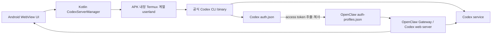

# AnyClaw Android Codex OAuth 분석 및 프로젝트 비교

작성일: `2026-08-12 KST`

## 1. 결론

AnyClaw는 **실제 Android APK 안에서 OpenAI Codex CLI를 실행하고 ChatGPT OAuth로 로그인한 뒤,
Codex를 로컬 에이전트/Gateway처럼 사용하는 오픈소스 프로젝트**다.

따라서 다음과 같은 기존 판단은 사실과 다르다.

> Android에서 ChatGPT OAuth로 Codex를 사용하고 로컬 에이전트/API처럼 다루는 공개 프로젝트가 없다.

정정된 판단은 다음과 같다.

- AnyClaw는 위 기능을 이미 구현한 직접 비교 대상이다.
- 제품 완성도, 기능 범위, 즉시 사용 가능성은 현재 Alpine Codex CLI Client보다 앞선다.
- 다만 OAuth 이후 Codex credential을 직접 읽고 복사하며, OpenClaw Gateway 인증을 비활성화하는
  구현은 현재 프로젝트가 목표로 하는 credential 비노출 경계와 다르다.
- 그러므로 현재 프로젝트의 차별점은 “최초 Android 구현”이 아니라
  **공식 `codex app-server` 관리형 인증, 최소 credential 노출, 최신 Android 정책을 지키는
  좁고 검증 가능한 Codex 전용 클라이언트**에 있다.

## 2. 감사 범위

| 항목 | 기준 |
|---|---|
| AnyClaw 저장소 | <https://github.com/OpenClawAndroid/openclaw-android-assistant> |
| AnyClaw 감사 revision | `5b9d5920e8a3fa8ac95fde24d0d58e88e3d2853f` |
| 현재 프로젝트 revision | `65362c4b0382d672265c7c5ff963846bf09a93f2` |
| 비교 기준일 | `2026-08-12 KST` |
| 방법 | GitHub 검색, shallow clone, Android/인증/Gateway 소스 정적 감사 |
| 제외 | 실제 AnyClaw APK 설치, 실제 계정 로그인, 동적 네트워크 트래픽 캡처 |

AnyClaw 저장소는 GitHub 메타데이터상 `2026-02-23`에 생성된 `openclaw/openclaw`의 fork다.
Android URL OAuth 관련 커밋은 `2026-02-21`부터 확인된다.

## 3. AnyClaw는 Android 프로젝트인가

**그렇다.** Termux에서 웹 서버만 실행하는 프로젝트가 아니라 APK를 생성하는 네이티브 Android
프로젝트다.

확인된 구성은 다음과 같다.

- `android/app/build.gradle.kts`
- `android/app/src/main/AndroidManifest.xml`
- Kotlin `MainActivity`
- Kotlin `CodexServerManager`
- Android WebView
- foreground service
- APK asset으로 포함되는 Termux 계열 bootstrap과 웹 서버 bundle
- 앱 전용 저장소에서 실행되는 Node.js, Codex CLI, OpenClaw

[AnyClaw README](https://github.com/OpenClawAndroid/openclaw-android-assistant/blob/5b9d5920e8a3fa8ac95fde24d0d58e88e3d2853f/README.md)는
이를 “Three AI agents. One APK”라고 설명하며 APK 빌드와 설치 명령도 제공한다.

참고로 이전 비교 대상이었던 `friuns2/codex-mobile`은 Android에서 Termux로 실행할 수 있는
Node/Vue 웹 애플리케이션이지, Android Gradle/Kotlin APK 프로젝트는 아니다. 따라서 AnyClaw와 달리
직접 Android 구현 비교군이 아니라 인접 사례로 분류해야 한다.

## 4. AnyClaw 동작 구조

AnyClaw는 단순한 OAuth 예제보다 훨씬 넓은 제품이다.

1. APK에서 Linux userland를 app-private storage에 푼다.
2. Node.js, Python, OpenClaw와 Codex CLI를 준비한다.
3. Android DNS 차이를 우회하기 위한 로컬 CONNECT proxy를 실행한다.
4. 공식 Codex CLI의 `codex login`을 실행한다.
5. CLI stdout에서 로그인 URL을 찾아 Android 브라우저로 연다.
6. 로그인 완료 후 Codex 상태를 확인한다.
7. `~/.codex/auth.json`의 access token을 OpenClaw profile로 복사한다.
8. OpenClaw Gateway와 Codex 웹 서버를 실행해 WebView UI에 연결한다.

## 5. OAuth와 “API처럼 사용”의 정확한 의미

### 5.1 최초 로그인

최초 로그인은 AnyClaw가 OpenAI OAuth HTTP 계약을 직접 재구현하는 방식이 아니다.

[CodexServerManager의 `loginWithUrl`](https://github.com/OpenClawAndroid/openclaw-android-assistant/blob/5b9d5920e8a3fa8ac95fde24d0d58e88e3d2853f/android/app/src/main/java/com/codex/mobile/CodexServerManager.kt)
구현은 공식 Codex binary에 `login` 인수를 넘겨 실행하고, stdout의 URL을 Android UI로 전달한다.
따라서 **OAuth 획득 단계는 공식 `codex login`이 소유한다.**

### 5.2 로그인 이후

로그인 이후에는 경계가 달라진다. 같은 파일의 `configureOpenClawAuth()`는 다음 작업을 수행한다.

- `$HOME/.codex/auth.json` 직접 읽기
- `tokens.access_token` 추출
- `$HOME/.openclaw/auth-profiles.json`에 복사
- agent-specific `auth-profiles.json`에도 동일 credential 복사
- `openai-codex:codex-cli`와 `openai:codex` profile 구성

즉, 공식 CLI가 만든 credential을 OpenClaw가 별도 provider credential로 재사용한다.

### 5.3 “API처럼”의 범위

AnyClaw가 Codex OAuth를 **API처럼 사용한다**는 표현은 기능적으로 맞지만 다음과 같이 한정해야 한다.

- OpenClaw Gateway와 로컬 웹 서버를 통해 UI/agent가 프로그램 방식으로 요청한다.
- OpenClaw의 `openai-codex` provider가 ChatGPT/Codex credential을 사용한다.
- 사용자는 Codex CLI TUI만 조작하지 않고 채팅 UI와 agent 기능으로 모델을 사용할 수 있다.

그러나 다음 의미는 아니다.

- 일반 OpenAI API key를 발급하거나 대체하지 않는다.
- 공식 공개 `/v1/responses` 호환 API를 제공한다고 보장할 수 없다.
- OpenAI가 AnyClaw의 credential 재사용 방식을 공식 통합으로 승인했다는 근거는 아니다.

가장 정확한 표현은 다음과 같다.

> AnyClaw는 공식 Codex CLI로 ChatGPT OAuth credential을 획득하고, 그 credential을 OpenClaw의
> 로컬 provider/Gateway에 재사용해 Codex를 프로그램 방식의 에이전트 backend처럼 이용한다.

## 6. AnyClaw가 현재 더 나은 프로젝트인 영역

현재 사용 가능한 **제품**을 기준으로 평가하면 AnyClaw가 우위다.

| 항목 | AnyClaw | Alpine Codex CLI Client |
|---|---|---|
| Android APK 프로젝트 | 예 | 예 |
| 설치·사용 경로 | APK 및 배포 링크 제공 | debug 개발 프로젝트 |
| ChatGPT OAuth | 동작 코드 및 제품 흐름 존재 | 공식 Device Code 경로 구현, 보안 완료 gate 진행 전 |
| ChatGPT 구독 Codex | 지원 | 지원 구조 구현 |
| 로컬 agent/Gateway | OpenClaw와 Codex 웹 서버 | Codex 전용 Python Gateway |
| UI | WebView 기반 제품 UI | Compose Codex 채팅 UI |
| 기능 범위 | Codex, OpenClaw, OpenClaude, tools, skills, multi-agent | Codex 채팅 중심 |
| 백그라운드 | foreground service 제공 | runtime background 모듈 보유, 최종 secure E2E 전 |
| 사용자 즉시 가치 | 높음 | 개발·검증 중심 |

사용자의 목표가 “Android에서 지금 Codex OAuth와 에이전트를 사용”이라면 AnyClaw를 우선 검토하는
것이 합리적이다. 현재 프로젝트를 새로 만들기 전에 다음 선택지를 비교했어야 한다.

1. AnyClaw를 그대로 사용한다.
2. AnyClaw를 fork해 credential/Gateway 문제만 강화한다.
3. Codex 전용 최소 클라이언트를 새로 만든다.

## 7. AnyClaw의 기술적 위험과 trade-off

AnyClaw의 제품 우위가 보안·유지보수의 모든 우위를 뜻하지는 않는다.

### 7.1 credential 복제

`auth.json` access token을 OpenClaw global/agent profile로 복사하므로 credential 존재 위치와 접근
주체가 늘어난다. 공식 CLI만 credential을 읽고 갱신하는 경계가 유지되지 않는다.

### 7.2 Gateway 인증 비활성화

`configureOpenClawAuth()`가 생성하는 설정에는 다음 값이 포함된다.

- `gateway.auth.mode = "none"`
- `allowInsecureAuth = true`
- `dangerouslyDisableDeviceAuth = true`

소스 주석도 local client가 인증 없이 연결할 수 있게 하기 위한 설정임을 설명한다. loopback 또는
WebView만 사용한다는 가정과 실제 listener 노출 범위를 별도로 검증해야 한다.

### 7.3 오래된 target SDK를 이용한 실행 정책 우회

[AnyClaw Android build 설정](https://github.com/OpenClawAndroid/openclaw-android-assistant/blob/5b9d5920e8a3fa8ac95fde24d0d58e88e3d2853f/android/app/build.gradle.kts)은
app data directory에서 binary를 실행하기 위해 `targetSdk = 28`을 사용한다고 명시한다.
이는 동작 범위를 넓히는 실용적 선택이지만 최신 Android 보안·배포 정책과 장기 호환성 측면에서
부담이 된다.

### 7.4 큰 runtime과 공급망 범위

Termux userland, Node.js, Python, OpenClaw, Codex CLI, OpenClaude, 웹 frontend를 함께 다루므로 기능은
풍부하지만 다음 비용이 증가한다.

- APK/설치 크기
- first-run 설치 시간
- dependency 및 license 감사 범위
- upstream OpenClaw 대형 fork와의 merge 부담
- 패치와 runtime 조합의 회귀 가능성

### 7.5 광범위한 실행 권한

README는 full auto-approval 및 `danger-full-access` 사용을 기능으로 제시한다. 즉시 사용성과 agent
자동화에는 유리하지만, 최소 권한 Codex 클라이언트를 목표로 할 때는 다른 threat model이다.

## 8. 현재 프로젝트의 실제 차별점과 한계

### 8.1 현재 구현에서 확인되는 차별점

- 공식 Codex CLI `0.147.0`의 `codex app-server` JSONL interface 사용
- `account/login/start`의 `chatgptDeviceCode` 사용
- OAuth 저장·refresh를 공식 Codex가 소유
- Android/Python에서 `auth.json` payload를 읽거나 복사하지 않음
- account 응답에서 최소 boolean 상태만 유지
- 공식 aarch64-musl artifact의 version, size, SHA-256 고정
- `compileSdk/targetSdk = 36`
- Codex에 한정된 상대적으로 작은 기능·공격 표면

공식 Codex `0.147.0` 문서는 ChatGPT managed auth를 권장하며, Codex가 OAuth flow, token 저장과
refresh를 소유한다고 명시한다.

- <https://github.com/openai/codex/blob/rust-v0.147.0/codex-rs/app-server/README.md#authentication-modes>

### 8.2 현재 한계

현재 프로젝트가 목표 보안을 모두 구현했다고 평가해서는 안 된다.

- debug 전용이며 release 배포가 범위에 없다.
- 현재 `127.0.0.1:8787` Gateway에는 request authentication이 없다.
- HMAC session capability와 UDS/peer credential 검증은 개발 계획에 있으나 아직 완료 표시가 없다.
- secure/non-debuggable variant, credential store 결정, 민감 UI, adversarial gate, Samsung 최종 E2E가
  계획상 남아 있다.
- 제품 기능과 배포 경험은 AnyClaw보다 좁고 초기 단계다.

따라서 공정한 비교는 **AnyClaw의 현재 구현**과 **현재 프로젝트의 미래 계획**을 대조해서는 안 된다.
현재 구현 기준으로 확정 가능한 가장 큰 우위는 OAuth credential 비노출 경계와 공식 app-server
계약 사용이다.

## 9. 의사결정 매트릭스

| 우선 목표 | 더 적합한 선택 | 이유 |
|---|---|---|
| 즉시 Android에서 여러 에이전트 사용 | AnyClaw | 이미 넓은 제품 기능과 APK 흐름 제공 |
| OpenClaw 생태계·skills·multi-agent | AnyClaw | 제품 핵심 범위에 포함 |
| 개발 비용 최소화 | AnyClaw 사용 또는 fork | 기존 runtime/UI/Gateway 재사용 가능 |
| Codex 전용 최소 클라이언트 | 현재 프로젝트 | 범위와 dependency가 좁음 |
| 앱에서 OAuth token을 전혀 읽지 않기 | 현재 프로젝트 | app-server managed auth boundary |
| 최신 Android SDK 정책 유지 | 현재 프로젝트 | target SDK 36 |
| 공개 배포 가능한 보안 제품 | 현재 어느 쪽도 즉시 확정 불가 | AnyClaw hardening 또는 현재 계획 완료 필요 |

## 10. 권장 전략

현재 목표를 먼저 확정해야 한다.

### 전략 A: 제품 기능과 출시 속도 우선

AnyClaw fork를 기준으로 다음을 강화한다.

1. `auth.json` token 복사를 제거하고 가능하면 공식 app-server account/session 경계로 전환한다.
2. OpenClaw Gateway `auth.mode=none`과 위험한 device-auth bypass를 제거한다.
3. listener bind 범위와 WebView origin을 제한한다.
4. Codex/OpenClaw 실행 permission과 approval 기본값을 축소한다.
5. target SDK 28 의존성과 실행 binary packaging 대안을 검증한다.

장점은 기존 UI, agent, foreground service, 설치 흐름을 활용할 수 있다는 점이다. 단점은 대형 fork와
OpenClaw architecture에 맞춰 보안 경계를 재설계해야 한다는 점이다.

### 전략 B: credential 비노출과 Codex 전용 구조 우선

현재 프로젝트를 계속하되 제품 우위를 과장하지 않고 계획된 보안 gate를 실제 구현·검증한다.

1. loopback HMAC cutover를 먼저 완료한다.
2. keyring/file credential lifecycle gate를 완료한다.
3. UDS PoC 결과로 transport를 하나만 고정한다.
4. secure/non-debuggable variant와 실제 기기 E2E를 완료한다.
5. README의 오래된 상태 문구를 실제 구현 상태와 동기화한다.

### 전략 C: 병행 PoC 후 결정

AnyClaw hardening 비용과 현재 프로젝트 제품화 비용을 같은 acceptance test로 측정한다.

- 설치 후 OAuth 완료 시간
- 첫 응답까지 걸리는 시간
- APK 및 runtime 크기
- background 복구율
- unsigned local request 차단
- token 중복 파일 수
- target SDK/Android 버전 호환성
- 신규 upstream merge 비용

이 비교 없이 “새 프로젝트가 더 안전하다” 또는 “AnyClaw가 모든 면에서 낫다”고 단정하지 않는다.

## 11. 이전 검색 판단이 잘못된 이유

AnyClaw를 발견하지 못하고 “그런 프로젝트가 없다”고 답한 것은 검색과 분류 오류였다.

### 원인

- `Codex Android`, `app-server`, `chatgptDeviceCode` 중심으로 검색 범위를 너무 좁혔다.
- 저장소 이름이 `openclaw-android-assistant`이고 OpenClaw 대형 저장소의 fork라는 점을 놓쳤다.
- Android 구현이 저장소 root가 아닌 `android/` 아래 있다는 점을 충분히 탐색하지 않았다.
- `codex login` 기반 구현을 공식 app-server 관리형 인증이 아니라는 이유로 비교 대상에서 제외했다.
- “기능이 존재하는가”와 “원하는 보안 아키텍처인가”를 분리하지 않았다.

### 바로잡아야 할 보고 방식

앞으로는 검색 결과를 다음 세 단계로 분리한다.

1. **존재:** 요구 기능을 실제로 수행하는 프로젝트가 있는가.
2. **적합성:** Android APK, OAuth 방식, UI, 배포 상태가 사용 목적에 맞는가.
3. **품질·위험:** credential, Gateway, SDK, 유지보수 trade-off는 무엇인가.

AnyClaw는 1단계와 제품 중심 2단계를 통과한다. 3단계에서 credential/Gateway/SDK trade-off가
발견됐다고 해서 “존재하지 않는다”고 분류해서는 안 된다.

## 12. 최종 판단

- AnyClaw는 사용자가 처음 찾던 성격의 Android 오픈소스가 맞다.
- “그런 프로젝트가 없어서 현재 프로젝트를 새로 만들어야 한다”는 전제는 잘못됐다.
- 현재 제품 가치와 기능 범위는 AnyClaw가 더 높다고 평가하는 것이 타당하다.
- 현재 프로젝트의 유효한 존재 이유는 최초 구현 여부가 아니라 공식 관리형 OAuth와 credential
  비노출을 핵심으로 한 Codex 전용 최소 구조다.
- 다음 개발 투자 결정은 AnyClaw fork hardening과 현재 프로젝트 완성을 동일 기준으로 비교한 후
  내려야 한다.
