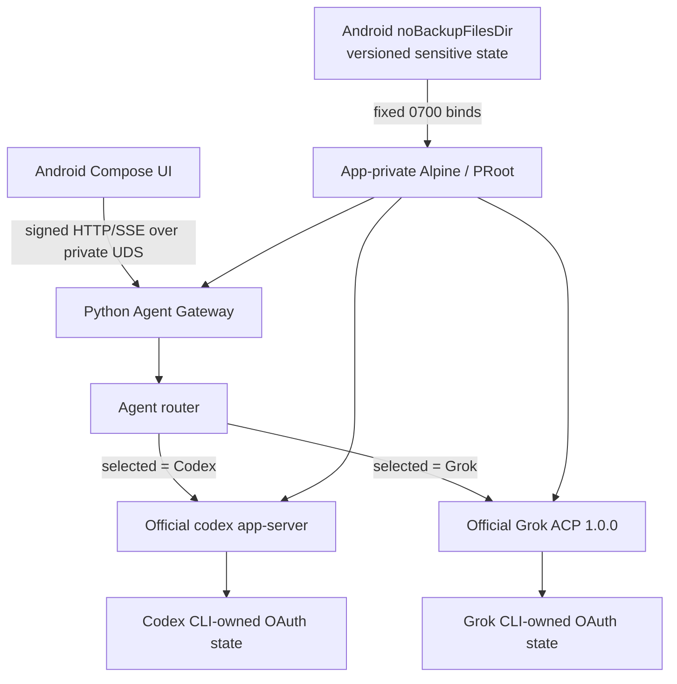

# Architecture

Date: `2026-08-15 KST`

## Runtime topology



Android never calls an OpenAI or xAI inference endpoint. It sends a normalized request over an
app-private Unix domain socket. Android and Python both verify the kernel-reported peer UID; the
Gateway additionally verifies per-request HMAC/timestamp/nonce authentication. The Gateway owns one
selected typed adapter, and that adapter writes only the
closed protocol methods of the selected official CLI process.

External communication is confined to the official Codex/Grok CLI-owned OAuth and authenticated
Agent traffic. The app, Gateway, and verification workflow do not call unrelated backup, device
transfer, sync, analytics, telemetry, or cloud-storage services.

## Module ownership

| Layer | Primary locations | Responsibility |
|---|---|---|
| Compose app | `app/src/main` | Runtime actions, Agent/model selection, OAuth browser handoff, chat and Stop UI |
| Android bridge | `codex-runtime-bridge/src/main`, `app/src/main/.../UnixDomainSocketGatewayTransport.kt` | signed UDS HTTP client, peer UID check, strict JSON/SSE state machine, one-shot Stop control |
| Agent Gateway | `codex_gateway/agents` | Agent-neutral contract, single-flight router/service, normalized HTTP/SSE |
| Codex adapter | `codex_gateway/agents/codex.py` | existing app-server account/model/turn mapping |
| Grok adapter | `codex_gateway/agents/grok.py` | Device OAuth, dynamic model/session binding, stream/retry/Stop mapping |
| Grok ACP | `codex_gateway/grok_acp` | pinned launch policy, strict JSONL, method allowlist, profile-event audit |
| Binary packs | `codex-cli-pack`, `grok-cli-pack` | debug-generated locked official binaries; binaries are not tracked by Git |
| Runtime packs | `alpine-runtime-*` | app-private Alpine installation, bounded lifecycle, deterministic APK-package SPDX and locked artifact integrity |

## Storage topology

| Host storage | Guest mapping | Contents |
|---|---|---|
| `noBackupFilesDir/alpine-codex-home-v1` | `/workspace/.alpine-codex/home` | official Codex CLI config/OAuth state |
| `noBackupFilesDir/alpine-grok-home-v1` | `/workspace/.alpine-grok/home` | official Grok CLI OAuth/session state |
| `noBackupFilesDir/alpine-gateway-handoff-v1` | `/workspace/.alpine-codex/security` | one-time Gateway capability handoff |
| `noBackupFilesDir/alpine-gateway-wrapped-v1` | Android-only | Keystore-wrapped active Gateway secret |
| `noBackupFilesDir/alpine-conversation-state-v1` | Android-only | AES-GCM conversation envelope |
| `filesDir/alpine-codex-runtime/rootfs` | Guest `/` | 현재 활성 rootfs 세대 |
| `filesDir/alpine-codex-runtime/rootfs.previous` | 미마운트 | 직전 검증 rootfs 세대; 명시적 rollback용 |
| `filesDir/alpine-codex-runtime/workspace` | `/workspace` | cache, staging, Gateway code, work and private UDS |

The bind contract accepts at most four fixed `noBackupFilesDir` direct children and fixed
`/workspace/...` targets. Android validates canonical parent, symlink status, UID/GID/type and
`0700` mode; PRoot refuses to mount over a non-empty legacy directory.

## Lifecycle and invariants

```text
Runtime stopped
  -> Alpine started
  -> APK-contained Python pack staged and installed with apk --no-network
  -> Python/Gateway import verified
  -> authenticated Gateway started
  -> selected Agent process ready
  -> OAuth/account/model/turn operations
  -> selected Agent stopped
  -> Gateway and Runtime stopped
```

- One Runtime, one Gateway, and at most one selected Agent process are active.
- Login and turn are independently single-flight and block Agent switching.
- Conversation bindings include Agent ID, backend session ID, model ID, and process generation.
- Resume fails before backend I/O when the Agent or process generation does not match.
- Android/Gateway do not retry or replay a prompt and do not fall back to the other Agent.
- Rootfs update는 staging smoke 뒤 active/previous 2-slot과 대응 marker를 원자적으로 교체한다.
  직전 세대는 다음 검증 설치 전까지 보존되며 rollback 중 process death도 pending marker로
  원래 세대 또는 완전한 swap 중 하나로 복구한다. Workspace와 no-backup 민감 상태는 이동하지 않는다.
- Gateway accepts at most 8 concurrent UDS connections with backlog 8, a 5-second absolute
  pre-auth deadline, 4 KiB request-line/16 KiB aggregate-header bounds, and the existing 32 KiB body
  bound. Authenticated long SSE turns retain their service-level timeout and are not killed by the
  pre-auth timer.
- Grok's permitted pre-output CLI-internal auth recovery is observed, not initiated by Android.
  Any retry after visible output fails the turn.

## OAuth challenge handoff

Codex와 Grok 모두 공식 CLI가 로그인 challenge를 소유한다. Gateway는 complete HTTPS URL을
메모리에서 Android로 한 번 전달하고 저장하지 않는다. Grok은 `auth.x.ai` OAuth issuer와
`accounts.x.ai` production account UI의 exact 두 host만 허용하며, Android가 같은 allowlist를
다시 검증한 뒤 브라우저 handoff를 발생시킨다.

Grok 로그인 클릭 직후 Android는 challenge 요청이 끝날 때까지 `LOGIN STARTING` 진행 상태를
표시한다. 성공하면 URL은 UI state에 보존하지 않은 채 브라우저를 열고 `LOGIN_PENDING`으로
전환한다. 실패하면 stable content-free error만 표시하며 자동으로 authenticate를 재시작하지 않는다.

## Terminal evidence flow

For Grok only, the adapter attaches a content-free `diagnostics` object to the existing authenticated
terminal SSE event. The Android parser accepts only fixed integer fields and a small retry enum.
`AgentTurnAudit` emits one content-free log line with dispatch, delta, terminal, cancel, retry, and
forbidden-profile counts. Request IDs, conversation IDs, model IDs, URLs, account fields, prompts,
and responses are absent.
