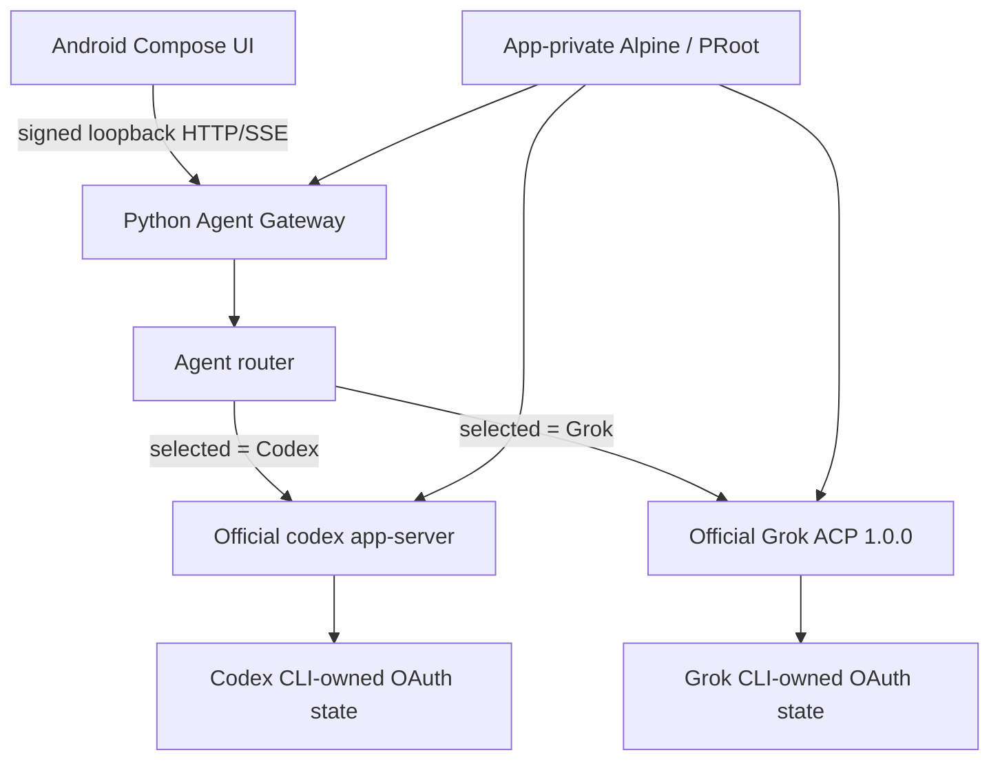

# Architecture

Date: `2026-08-14 KST`

## Runtime topology



Android never calls an OpenAI or xAI inference endpoint. It sends a normalized request to the
loopback Gateway. The Gateway owns one selected typed adapter, and that adapter writes only the
closed protocol methods of the selected official CLI process.

## Module ownership

| Layer | Primary locations | Responsibility |
|---|---|---|
| Compose app | `app/src/main` | Runtime actions, Agent/model selection, OAuth browser handoff, chat and Stop UI |
| Android bridge | `codex-runtime-bridge/src/main` | signed HTTP client, strict JSON/SSE state machine, one-shot Stop control |
| Agent Gateway | `codex_gateway/agents` | Agent-neutral contract, single-flight router/service, normalized HTTP/SSE |
| Codex adapter | `codex_gateway/agents/codex.py` | existing app-server account/model/turn mapping |
| Grok adapter | `codex_gateway/agents/grok.py` | Device OAuth, dynamic model/session binding, stream/retry/Stop mapping |
| Grok ACP | `codex_gateway/grok_acp` | pinned launch policy, strict JSONL, method allowlist, profile-event audit |
| Binary packs | `codex-cli-pack`, `grok-cli-pack` | debug-generated locked official binaries; binaries are not tracked by Git |
| Runtime packs | `alpine-runtime-*` | app-private Alpine installation and bounded lifecycle |

## Lifecycle and invariants

```text
Runtime stopped
  -> Alpine started
  -> Gateway Python prepared
  -> authenticated Gateway started
  -> selected Agent process ready
  -> OAuth/account/model/turn operations
  -> selected Agent stopped
  -> Gateway and Runtime stopped
```

- One Runtime, one Gateway, and at most one selected Agent process are active.
- Login and turn are independently single-flight and block Agent switching.
- Conversation bindings include Agent ID, backend session ID, model ID, and process generation.
- Resume fails before backend I/O when the Agent or process generation does not match.
- Android/Gateway do not retry or replay a prompt and do not fall back to the other Agent.
- Grok's permitted pre-output CLI-internal auth recovery is observed, not initiated by Android.
  Any retry after visible output fails the turn.

## OAuth challenge handoff

Codex와 Grok 모두 공식 CLI가 로그인 challenge를 소유한다. Gateway는 complete HTTPS URL을
메모리에서 Android로 한 번 전달하고 저장하지 않는다. Grok은 `auth.x.ai` OAuth issuer와
`accounts.x.ai` production account UI의 exact 두 host만 허용하며, Android가 같은 allowlist를
다시 검증한 뒤 브라우저 handoff를 발생시킨다.

Grok 로그인 클릭 직후 Android는 challenge 요청이 끝날 때까지 `LOGIN STARTING` 진행 상태를
표시한다. 성공하면 URL은 UI state에 보존하지 않은 채 브라우저를 열고 `LOGIN_PENDING`으로
전환한다. 실패하면 stable content-free error만 표시하며 자동으로 authenticate를 재시작하지 않는다.

## Terminal evidence flow

For Grok only, the adapter attaches a content-free `diagnostics` object to the existing authenticated
terminal SSE event. The Android parser accepts only fixed integer fields and a small retry enum.
`AgentTurnAudit` emits one content-free log line with dispatch, delta, terminal, cancel, retry, and
forbidden-profile counts. Request IDs, conversation IDs, model IDs, URLs, account fields, prompts,
and responses are absent.
