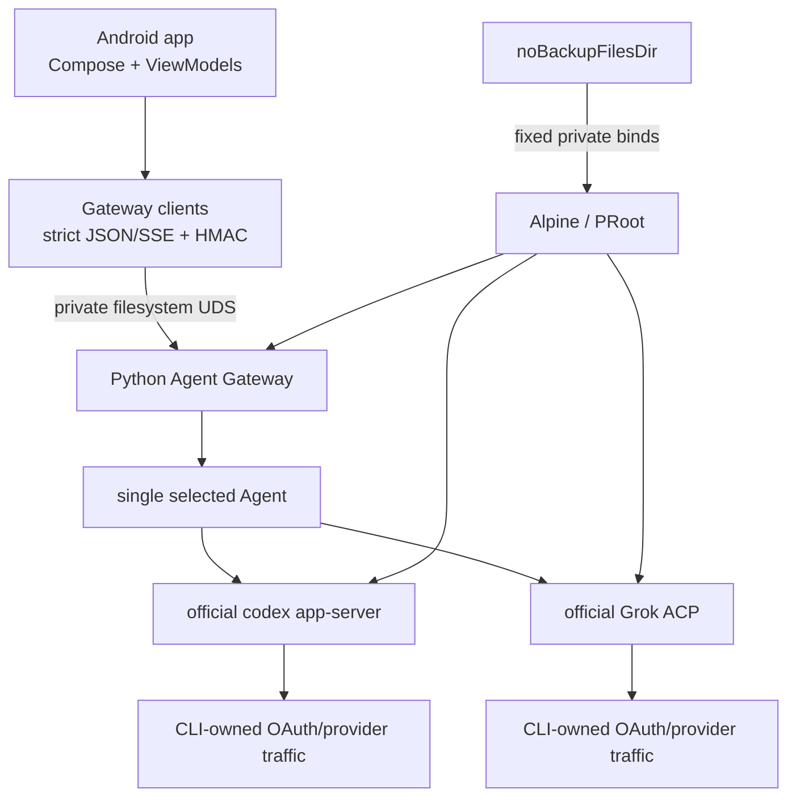

# 프로젝트 개요

기준일: `2026-08-16 KST`
구현 기준선: `e15b808` (`main`)

## 한눈에 보기

Alpine Agent CLI Client는 공식 Codex CLI와 공식 Grok CLI를 Android APK 안의 app-private
Alpine/PRoot 환경에서 실행하고, 하나의 Compose 채팅 UI로 제어하는 공개 배포 목적의 프로젝트다.
핵심 설계는 Provider API를 다시 구현하는 대신 **공식 CLI가 인증과 Provider 통신을 계속 소유**하게
하고, Android에는 계정 상태·모델·turn·Stop만 노출하는 것이다.

| 항목 | 현재 결정 |
|---|---|
| 플랫폼 | Android API 26+, `arm64-v8a` |
| 앱 버전 | version code `2`, version name `0.2.0` |
| Agent | OpenAI Codex CLI `0.147.0`, xAI Grok CLI `1.0.0` |
| 인증 | 공식 CLI Device OAuth; 앱/Gateway의 token·`auth.json` 직접 접근 금지 |
| 앱 내부 전송 | filesystem Unix domain socket + 양방향 peer UID + HMAC/timestamp/nonce |
| Runtime | Alpine `3.21.3`, PRoot, APK 내장 lock/SBOM |
| Python | 별도 APK 내장 Alpine package pack, 런타임 `apk --no-network` 설치 |
| 저장 | Agent OAuth 및 대화 상태는 versioned `noBackupFilesDir` |
| 공개 배포 | production Python pack 준비·실기기 설치 완료, 외부 release signing 입력 대기 |

## 프로젝트가 해결하는 문제

모바일에서 ChatGPT 또는 Grok 구독 기반 CLI 로그인을 활용하려면 보통 다음 중 하나를 선택해야 한다.

1. API key를 Android 앱에 저장하고 Provider REST API를 직접 호출한다.
2. Termux나 별도 서버를 설치하고 앱은 그 서버의 프런트엔드가 된다.
3. CLI 자격 증명 파일을 앱이 읽거나 복사해 자체 Gateway에서 재사용한다.

이 프로젝트는 세 방식 모두를 제품 경계에서 제외한다. APK가 Runtime, CLI, Gateway, Python 실행
입력을 함께 제공하고, OAuth 및 Provider traffic은 공식 CLI에 남긴다. 그 결과 Android 앱은
자격 증명 형식을 알 필요 없이 다음의 좁은 기능만 다룬다.

- Agent 선택
- CLI가 제공한 인증 필요 여부
- Device OAuth 브라우저 handoff
- CLI가 제공한 현재 모델 목록
- 한 번에 하나의 streaming turn
- 해당 turn에 대한 Stop
- 암호화된 Agent별 대화 복구

## 사용자 동작 흐름

```text
앱 실행
  -> 설정된 경우 Runtime/Gateway 복구
  -> Codex 또는 Grok 선택
  -> CLI 계정 상태 확인
  -> 필요할 때만 공식 Device OAuth 시작
  -> 브라우저에서 사용자가 승인
  -> 앱 복귀/재확인 후 live model 선택
  -> streaming chat
  -> 필요 시 현재 turn만 Stop
```

- OAuth URL은 한 번의 browser handoff를 위해 메모리에만 존재하고 저장하지 않는다.
- 로그인, turn, Agent 전환은 single-flight 상태 기계로 충돌을 막는다.
- 앱은 prompt를 자동 재전송하지 않고 다른 Agent로 자동 fallback하지 않는다.
- Grok은 출력 전 CLI 내부 auth recovery만 제한적으로 관찰하며, 출력 뒤 retry는 실패 처리한다.

## 실행 경계



Gateway가 전달하는 HTTP 모양은 앱 내부의 normalized contract일 뿐 외부 공개 API가 아니다.
socket path, executable, arguments, environment, ACP method와 OAuth host는 모두 고정되거나 엄격히
검증된다.

## 모듈 구성

### Android/Gradle 14개 모듈

| 모듈 | 책임 |
|---|---|
| `app` | Compose 화면, Agent/ViewModel 상태, OAuth browser handoff, Keystore, UDS transport, 복구 orchestration |
| `alpine-runtime-api` | Runtime 상태·artifact·session 공개 계약 |
| `alpine-runtime-android` | rootfs 설치, PRoot 실행, bind 검증, Python 준비, 2-slot rollback |
| `alpine-runtime-host` | Runtime session 수명과 start/stop 조정 |
| `alpine-runtime-background-android` | Android background Runtime 서비스/수명 연결 |
| `alpine-runtime-ui-compose` | Runtime 상태용 Compose UI 구성요소 |
| `alpine-runtime-pack-bundled` | Alpine rootfs, PRoot/loader, runtime lock와 SPDX 제공 |
| `alpine-python-pack-bundled` | 로컬 Python `.apk` pack 검증, asset 생성과 Android staging |
| `alpine-workspace-api` | workspace 경로 및 파일 작업 계약 |
| `alpine-workspace-android` | app-private workspace Android 구현 |
| `codex-cli-pack` | 공식 Codex CLI lock, 생성 asset과 runtime hash 검증 |
| `grok-cli-pack` | 공식 Grok CLI lock, chat-only profile과 runtime hash 검증 |
| `codex-gateway-pack-bundled` | `codex_gateway` Python source manifest와 APK asset 패키징 |
| `codex-runtime-bridge` | Agent-neutral client, request signing, normalized DTO와 SSE parser |

### 비 Gradle 핵심 디렉터리

| 경로 | 책임 |
|---|---|
| `codex_gateway` | Python entrypoint, 보안 verifier, Agent router/service, Codex adapter, Grok ACP supervisor |
| `scripts` | CLI/Runtime/Python/Gradle/release/evidence/reference 검증기 |
| `tests` | Python 단위·통합·적대적 fixture 테스트 |
| `security` | 현재 Runtime hash에 고정된 vulnerability snapshot |
| `docs` | 현재 설계, 배포, 공급망, 실기기 evidence와 역사적 분석 |
| `dev-plan` | 단계별 구현 계획과 의사결정 기록 |

## 데이터와 복구

| Host 위치 | 역할 | 백업 |
|---|---|---:|
| `noBackupFilesDir/alpine-codex-home-v1` | 공식 Codex HOME/OAuth | 제외 |
| `noBackupFilesDir/alpine-grok-home-v1` | 공식 Grok HOME/OAuth 및 bounded binding | 제외 |
| `noBackupFilesDir/alpine-gateway-handoff-v1` | 1회용 capability 전달 | 제외 |
| `noBackupFilesDir/alpine-gateway-wrapped-v1` | Keystore-wrapped Gateway secret | 제외 |
| `noBackupFilesDir/alpine-conversation-state-v1` | Keystore AES-GCM 대화 envelope | 제외 |
| `filesDir/alpine-codex-runtime/rootfs` | 활성 Alpine generation | 앱 데이터 |
| `filesDir/alpine-codex-runtime/rootfs.previous` | 직전 검증 generation | 앱 데이터 |
| `filesDir/alpine-codex-runtime/workspace` | CLI/Gateway staging, cache, work, UDS | 앱 데이터 |

Migration은 symlink를 따르지 않고 type/mode/UID/GID/크기/hash와 용량 상한을 검증한 뒤 stage,
atomic rename, fsync, commit marker 순서로 수행한다. 기존 데이터는 먼저 삭제하지 않고 rollback
영역으로 이동한다.

## 보안 원칙

1. **Credential 최소 노출**: CLI-owned credential 파일은 앱 비즈니스 로직의 입력이 아니다.
2. **Private carrier**: TCP loopback을 제품 경로에서 제거하고 app-private UDS와 peer UID를 사용한다.
3. **Closed protocol**: Android 값이 raw app-server/ACP method, executable 또는 argument를 선택할 수 없다.
4. **Fail closed**: lock, hash, profile, manifest, request shape, signing 입력이 불완전하면 실행/배포하지 않는다.
5. **No implicit egress**: Codex/Grok OAuth와 사용자가 시작한 Agent traffic 외 backup, sync, analytics,
   telemetry, package repository 다운로드를 추가하지 않는다.
6. **No replay**: 앱 재생성이나 오류 복구가 사용자 prompt를 자동으로 다시 보내지 않는다.
7. **Content-free audit**: 보안 로그에는 고정 상태와 카운터만 남기고 URL, 계정, 모델, prompt, 응답을 남기지 않는다.

Codex/Grok HOME은 같은 Android UID 안의 **논리적 분리**다. 정상 프로세스 간 오염은 막지만 손상된
동일-UID native process를 막는 커널 sandbox는 아니며, 이 잔여 위험은 공개적으로 문서화한다.

## Build variant와 배포

| Variant | ID | OAuth | 서명 | 사용 목적 |
|---|---|---:|---|---|
| `debug` | `dev.alpine.codexclient.labdebug` | 차단 | debug | credential-free 개발 |
| `secureDebug` | `dev.alpine.codexclient.debug` | 허용 | debug | non-debuggable 실기기 검증 |
| `release` | `dev.alpine.codexclient` | 허용 | 외부 입력 필수 | 공개 APK/AAB |

release packaging은 production Python package pack과 네 개의 외부 signing 입력이 모두 있을 때만
가능하다. 현재 작업 환경에는 Git-ignored production pack이 준비되어 있고 새 checkout에서는 같은
로컬 입력을 다시 제공해야 한다. 최종 artifact verifier는 package/version/debuggable/backup/signature, 두 CLI, Grok
profile, Gateway source manifest, Runtime, Python pack, SBOM/component inventory와 금지 byte를 다시
검사한다.

Codex/Grok executable은 Git에 저장하지 않는다. build는 `CODEX_CLI_ARCHIVE_PATH`와
`GROK_CLI_BINARY_PATH`의 검증된 로컬 입력을 우선하고, 없으면 각 lock의 exact official URL에서만
받아 Gradle user cache에 저장한 뒤 size/hash/ELF를 확인한다. 이 build-time 준비와 달리 설치된
Android Runtime에는 CLI/Python repository download 경로가 없다.

## 검증 기준선

`scripts/verify-secure-debug-milestone.sh`가 credential-free 통합 gate다. 구현 기준선 `e15b808`에서
최종 실행된 결과는 다음과 같다.

| 검증 | 결과 |
|---|---|
| Python 단위·통합·보안 회귀 | PASS — 160 tests |
| Gradle 단위·lint·debug/secureDebug/release 구성 | PASS — 884 tasks |
| Codex fixture, Grok CLI/profile/ACP | PASS |
| private UDS/HMAC, backup migration/policy | PASS |
| Runtime/Gradle/Python/release 공급망 정책 | PASS |
| debug/secure APK clean-room 및 sensitive evidence | PASS |
| reference source와 Runtime manifest drift | PASS |

위 기준선 실행 당시 production Python pack이 없는 상태에서 release **패키징** gate가 실패한 것은
의도된 정책이었다. 현재는 21-package production pack 검증과 `debug`/`secureDebug` packaging이
추가로 통과했으며 release compile/lint/asset 구조 검증도 유지된다.

## 실기기 검증 상태

- Samsung `SM-S931N`, `arm64-v8a`에서 공식 Grok OAuth, live model, 실제 streaming turn과 Stop 완료
- force-stop 2회와 background/foreground 후 Runtime/Gateway/Grok 및 대화/composer 복구 완료
- Codex readiness 확인 후 Grok 재선택과 단일 process cardinality 확인
- private UDS, peer UID, HMAC, TCP-negative 및 민감 상태 migration의 별도 Samsung gate 완료
- 최신 APK 내장 offline Python production pack을 적용한 별도 `labdebug` 최초 설치, Python Gateway
  기동과 force-stop 복구 완료
- 같은 pack의 current-source `secureDebug` APK 빌드·정적 audit 완료; 기존 실계정 앱에는 아직 설치하지 않음
- 외부 서명된 최종 release 후보 E2E는 미완료

실제 값은 저장하지 않고 redacted Boolean/counter만 보존한다. 세부 evidence는
[`docs/README.md`](README.md)의 실기기 검증 섹션에서 찾을 수 있다.

## 현재 남은 작업

1. 외부 release keystore와 예상 certificate SHA-256 제공
2. 서명 release APK 생성 후 `verify-release-artifact.py` 통과
3. offline Python pack을 포함한 최종 Samsung release APK 설치 smoke
4. APK 파일과 SHA-256을 배포 채널에 게시

patched rootfs 전체 교체, 완전한 온라인 취약점 DB, 별도 UID broker는 현재 사용자가 정한 공개 배포
필수 조건이 아니다. 대신 exact artifact lock, package-level SPDX, 잔여 위험 문서화와 fail-closed
검증을 유지한다.

## 문서 우선순위

현재 제품 상태는 다음 순서로 해석한다.

1. `README.md`와 이 문서
2. `docs/architecture.md`, `docs/security-model.md`, `docs/public-release.md`
3. 공급망 및 회귀 문서
4. 날짜가 명시된 Samsung evidence
5. `dev-plan/`과 Phase 문서 — 구현 과정의 역사적 기록

역사적 evidence의 APK hash나 테스트 수치는 당시 artifact에만 적용되며 최신 source gate 수치로
자동 대체하지 않는다.
